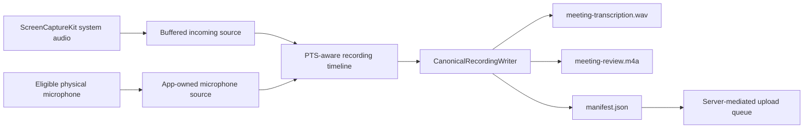

# PRD: 2brain Rec self-hosted meeting capture with macOS system audio capture

Date: 2026-06-04
Status: Final baseline after 5-agent review, updated with current implementation status
Owner: Product/Engineering

## 1. Summary

`2brain Rec` is a self-hosted desktop capture layer for organizations that need botless meeting capture, transcription, and AI meeting notes while keeping meeting data inside customer-controlled infrastructure.

The core MVP product is a macOS desktop app that captures local microphone
audio and incoming/system audio without requiring meeting apps to select
virtual 2brain Rec audio devices. New recordings preserve both sources on one
shared timeline and finalize one canonical WAV for transcription plus one M4A
for playback. `2brain Rec` uploads that package to the customer-controlled
server, sends only the canonical WAV to MediaScribe through the server boundary,
and exposes recordings/transcripts/notes in a web dashboard.

The product may faithfully reproduce the observable Krisp UX/UI/IA, including
screen composition, navigation, interaction states, control placement and
visible wording. Functional UI labels and interaction microcopy may be
reproduced literally without a brand-distance rewrite. Implementation code
remains independent and uses public OS APIs, licensed SDKs, approved
open-source or commercial models, and GRAF-owned or properly licensed assets.
Competitor source, extracted assets, binaries, private APIs/protocols, secrets,
private content and model behavior are not reused.

## 1A. Current Implementation Status

Current accepted local baseline:

- macOS remains the MVP platform.
- Feature `025-system-audio-capture-pivot` changes the MVP capture strategy to
  system-audio-first after `019` validation showed CoreAudio/HAL CPU runaway
  risk.
- Feature `102-remove-legacy-audio-driver` removes the superseded separate
  routing implementation from source, packaging, runtime, tests, QA, and active
  documentation. It is not an available fallback.
- Manual `Record`/`Stop` exists with visible local recording state and
  one-action stop.
- Local recording persistence is accepted for manual recordings.
- Feature `106-mixed-wav-recording` supersedes the active recording-package
  slice for new captures. Its local candidate finalizes `manifest.json`,
  `meeting-transcription.wav` (PCM s16le mono 16 kHz, only ASR input), and
  `meeting-review.m4a` (AAC mono 48 kHz, playback only). It is not a release or
  production-acceptance claim until its high-risk evidence is complete.
- Feature `177-webrtc-aec3-recording` adds mandatory local WebRTC AEC3 before
  the existing canonical mix. It processes the aligned system reference before
  each matching microphone block, leaves system audio unchanged, disables
  HPF/NS/AGC/VAD/gates, and fails closed without a raw-microphone fallback.
  Synthetic and local packaging evidence are required in this slice; controlled
  two-Mac hardware acceptance and public release remain separate gates.
- The current MediaScribe integration contract is the v5 single-WAV section in
  `docs/integrations/mediascribe-dual-track-api.md`; the dual endpoint there is
  retained solely for immutable v3/v4 compatibility records.
- Feature `012-server-ingest-foundation` is implemented in-repository as the
  first backend foundation: FastAPI ingest API, local/prod Docker Compose
  scaffolds with Rec-owned Postgres/MinIO, Alembic schema models,
  server-mediated upload/session endpoints, resumable/idempotent part
  handling, tenant/device API boundary checks, metadata-only audit/logging,
  status contracts, and inert processing placeholders. Local validation on
  2026-06-04 passed the server test suite, Ruff, compileall, and compose
  configuration checks after final review remediation for persistence/storage,
  forged auth, missing ranges, and readiness.
- A second five-round review hackathon on 2026-06-04 found additional PR
  blockers. Phase 11 remediation for tasks T119-T180 and GitHub issues
  #112-#124 has now been completed locally and recorded in the feature
  quickstart/tasks evidence. The accepted product status for `012` remains
  "implemented locally, not production-deployed"; before PR/deployment-plan
  handoff, the repository still needs a final full sanity run, dirty-worktree
  review, and explicit commit/PR decision.
- Feature `013-federated-auth-foundation` is implemented as the backend identity
  foundation: provider-based login, workspace-scoped policy, account linking,
  workspace membership/session continuity, and registered-device scaffolding.
- Feature `021-production-deployment-plan` adds the remote-first deployment
  readiness runbook for `2brain.dev` and `/opt/projects/2brain-rec`: hardened
  Compose layout, env/secret template, backup/migration/restore rehearsal,
  rollback/halt decisions, internal smoke identity, first-smoke evidence,
  cleanup accounting, and forbidden-content scans. Its highest allowed
  successful status is `infra_smoke_ready`; it does not approve production
  rollout, internal pilot users, desktop upload, transcription, dashboard,
  retention, or deletion execution.
- ADR `001-local-trust-shell-and-server-dashboard` is accepted: active capture
  UI remains local/native; post-meeting/admin surfaces live in the server web
  dashboard.

Current non-accepted product areas:

- Desktop upload queue integration, Temporal workflows, MediaScribe processing,
  dashboard notes, server retention, deletion, and user rollout are not accepted
  yet.
- Feature `011-assisted-auto-recording` remains a broad historical proposal;
  its generalized auto-record and routed-audio assumptions are not accepted.
  The narrower verified-native-target workflow is owned by Feature
  `124-restore-automatic-recording`: `Автозапись` settings, per-app opt-in,
  eight-second prompt countdown, automatic start on expiry, immediate start,
  and `Пропустить` are protected behavior and must remain behind the existing
  capture gates.
- Feature `022-meeting-mute-truth` is a backlog privacy slice only. It must
  resolve canonical meeting-app mute truth, unsupported-target behavior, muted
  interval artifact truth, user-facing limitation copy, and QA target evidence
  before broader recording acceptance can claim privacy-correct behavior when a
  user mutes inside Zoom/browser targets.
- Signed/notarized production installer evidence remains separate from local
  ad-hoc development package evidence.

Current backend boundary:

- `012-server-ingest-foundation` remains server-mediated and records successful
  ingest as `ingested_pending_processing` with inert processing placeholders.
  It does not start Temporal workflows, call MediaScribe, implement production
  desktop upload queue UI, expose dashboard/share/download/delete surfaces, or
  execute retention/deletion jobs.

Reserved follow-up slices:

The next unstarted product slice is `014-desktop-upload-queue`.
`014-desktop-upload-queue` depends on the identity/device foundation from `013`
unless a future approved spec explicitly accepts a narrower temporary identity
path.

- `014-desktop-upload-queue`: macOS app sends accepted local recording packages
  to the `012` server ingest API using the `013` user/device identity and shows
  pending/uploading/retrying/uploaded status.
- `015-mediascribe-processing-pipeline`: server-side workers submit finalized
  v5 canonical WAV artifacts to MediaScribe, poll processing, and import
  transcript/diarization/summary results. Historic accepted revisions retain a
  bounded dual compatibility branch. This slice owns starting durable processing
  workflows after ingest finalization, using internal identifiers such as
  `meeting_id`, `upload_session_id`, and `artifact_id`; desktop clients never
  start workflows directly.
- `016-meeting-dashboard-review`: server web dashboard shows uploaded meetings,
  processing state, transcript, notes, playback, and review surfaces.
- `017-access-sharing-downloads`: role-based meeting access, team visibility,
  download/export permissions for audio/transcript/summary, login-required
  share links, optional public-link policy, and share-page lifecycle/audit for
  viral distribution.
- `018-retention-deletion-execution`: server-side retention jobs, deletion
  workflows, deletion verification reports, local desktop purge coordination,
  backup expiry accounting, and MediaScribe/Langfuse/external dependency
  deletion truth.
- `022-meeting-mute-truth`: future privacy slice for respecting meeting-app mute
  state. This supersedes the old `009-respect-meeting-mute` draft branch as the
  canonical backlog record and authorizes no implementation until clarification
  and planning are complete.
- `direct-object-upload`: future upload optimization where desktop clients may
  receive narrowly scoped object-storage upload URLs only after a separate
  security, lifecycle, deletion, and credential-boundary review. `012` remains
  server-mediated.

## 2. Positioning

Primary wedge:

- Universal desktop meeting capture with customer-controlled data boundaries.

Primary promise:

- Capture meetings from the user's computer across meeting apps while keeping audio, transcripts, and notes inside owner-controlled storage and explicitly configured processing dependencies by default.

Differentiation:

- Unlike bot-based note takers, `2brain Rec` captures audio from the user's own desktop across conferencing apps.
- Unlike cloud-only meeting assistants, `2brain Rec` is deployed into the customer's environment with admin-controlled storage, retention, access, and processing policies.
- Unlike generic recorders, `2brain Rec` provides separate local/incoming audio
  tracks, durable upload, transcript-linked playback, AI notes, and admin
  governance through an app-owned system-audio-first capture flow.

## 3. Target Customer

Primary ICP for MVP:

- The owner's own team first, then privacy-conscious teams of 10-500 knowledge workers with an IT/security owner and a strong need to control meeting recordings, transcripts, AI processing, retention, and access.

Best-fit early adopters:

- Founder-led B2B teams handling sensitive customer calls.
- Security-conscious sales, customer success, recruiting, consulting, product, and executive teams.
- Organizations that rejected cloud-only AI note takers because of data retention, vendor risk, or bot visibility concerns.
- Teams willing to install a desktop app and self-host a server in exchange for stronger control.

Primary buyer:

- Head of IT, Security, Operations, Engineering, or founder/COO in smaller companies.

Primary end user:

- Knowledge worker who joins frequent Zoom, Teams, Meet, Slack, Discord, Webex, or softphone calls and wants meeting notes without inviting a bot.

Not the initial ICP:

- Individual consumers without self-hosting capacity.
- Large regulated enterprises requiring full SSO, SCIM, eDiscovery, and regional compliance before pilot.
- Call centers requiring real-time agent coaching, QA scoring, or full speech analytics.
- Mobile-first users.

## 4. MVP Thesis

MVP objective:

- Prove that `2brain Rec` can reliably capture local microphone and incoming
  meeting/system audio from macOS desktop calls through app-owned sources,
  upload audio to owner-controlled infrastructure, and produce useful post-call
  transcripts and notes through MediaScribe.

Required MVP:

- macOS system-audio-first MVP with explicit microphone capture and
  screen/system-audio capture.

Advanced-routing policy:

- The former separate routing implementation is removed legacy and must not be
  packaged, started, repaired, or used as a fallback.
- Any future advanced-routing product requires a new Spec Kit slice,
  architecture, safety case, packaging model, rollback plan, and long-duration
  validation.

MVP includes:

- First platform: macOS.
- Windows support follows after macOS launch as the next platform phase.
- Desktop app connected to a self-hosted server.
- System-audio capture mode for incoming/remote audio.
- Explicit microphone capture for local speaker audio.
- Manual recording start/stop.
- Automatic start for the internal MVP is controlled by a local per-application
  preference and limited to approved meeting targets or explicit user-selected
  capture scopes. General workspace recording and consent restrictions still
  apply, but no server assisted-auto-start permission or acknowledgement is
  required.
- Target-scoped automatic recording for verified native meeting apps: the
  `Автозапись` settings page exposes the complete prompt-capable registry and
  the local `Всегда`, `Спрашивать`, `Никогда` choice for each app, defaulting to
  `Спрашивать` on a new installation. The prompt offers `Записать`, `Не
  записывать`, `Запомнить выбор`, and an eight-second countdown that starts the
  current capture on expiry. This is not an arbitrary-audio mode.
- Auto-stop configurable in settings; default auto-stop after 10 minutes of no routed meeting audio.
- Audio recording mode.
- Transcript-only mode.
- Default mode stores audio and transcript.
- Visible local recording/transcription indicator.
- Encrypted local buffering during network outage.
- Resumable upload to the self-hosted `2brain.dev` server.
- Audio storage in a dedicated `2brain_rec` MinIO deployment controlled by the owner.
- STT integration with `https://mediascribe.2brain.pro`.
- Meeting list and meeting detail page.
- Audio playback linked to transcript timestamps.
- Post-call transcription.
- Basic diarization: reliable `You` vs remote track, best-effort remote speaker labels.
- Basic AI notes: summary, decisions, action items, follow-ups.
- Provider-neutral user authentication and account/session management, with
  initial provider scope defined by `013-federated-auth-foundation`.
- Seed admin username: `yshishenya`; password must be supplied as a deployment secret and not stored in the repository or PRD.
- Basic admin settings for retention, recording mode, consent, downloads, and sharing.
- MVP audit events.
- Docker Compose deployment profile.
- Light and dark themes.

### 4.x Platform and Technology Strategy

- macOS is the first platform and is implemented as a native stack:
  - macOS desktop app: Swift (SwiftUI for UI and app logic where applicable).
  - MVP capture layer: native macOS microphone capture plus native
    Screen/System Audio capture for incoming audio.
  - Installer and packaging lifecycle: native macOS signing/notarization workflows.
- The MVP capture plane is intentionally not a single Dart/Flutter/Electron
  runtime, because capture permissions and local recording truth must stay
  native to the OS integration layer.
- Windows, Linux, iOS, and Android are future platform phases and must be delivered through
  separate architecture slices with their own native stack and distribution model after macOS
  launch criteria are met.
- Cross-platform frameworks can be considered only for non-capture surfaces
  that do not own audio capture, permission, or installer runtime behavior.

### 4.y UI Authority And Multiplatform Surface Strategy

`2brain Rec` uses a hybrid UI authority model:

- Capture-critical desktop trust surfaces are local/native and remain usable
  without server-rendered UI.
- Post-meeting review, transcript, notes, search, sharing, admin policy,
  retention, deletion, audit, and device-fleet views live primarily in the
  server web dashboard.
- Cross-platform reuse comes from shared state contracts, design tokens,
  localization keys, and policy schemas, not from server control of active
  capture UI.

Local/native desktop surfaces are authoritative for:

- active capture state;
- persistent local visible indicator;
- one-action stop;
- tray/menu and floating widget state;
- recording, pause/resume, and stop commands;
- capture readiness and audio health;
- capture permission and source eligibility state;
- local buffer and disk safety;
- local recording artifact truth;
- offline pending recordings;
- diagnostics export and local degraded states.

Server-provided general workspace policy, feature flags, approved targets,
naming policy, consent/legal profile, localization, and non-critical help
content may constrain or annotate the desktop UI, but MUST NOT be required to
display active capture truth or to stop active capture. If policy is stale or
the server is unreachable, the desktop app must keep active capture stoppable,
show a truthful
offline or policy-stale state, and preserve the last valid general workspace
recording/consent restriction. The server does not own or authorize the local
per-application `Всегда`, `Спрашивать`, `Никогда` preference.

Server-driven UI or WebView-rendered remote UI MUST NOT own:

- active recording indicator visibility;
- Stop availability;
- capture state truth;
- local route health truth;
- local storage safety;
- permission and capture-source recovery truth;
- authorization gates for capture-critical actions.

Server-driven schemas may be considered for non-critical settings, help content,
onboarding copy, and admin-constrained forms only when the local app validates
schema version, has safe cached fallback, and rejects unknown or unsafe actions.

MVP excludes:

- Mobile app.
- Screen/video recording.
- Bot joining meetings.
- CRM integrations.
- Live agent assist.
- Real-time accent conversion.
- Call-center analytics.
- Perfect speaker identification.
- Public-link sharing by default.
- SSO/SCIM/eDiscovery/legal hold unless pulled into enterprise pilot scope.
- Local-only transcription package unless separately selected.
- Alternate audio-routing architectures.
- General-purpose meeting detection across arbitrary apps.
- Auto-start from arbitrary system audio, media playback, notification sounds, music, videos, or non-approved apps.
- Calendar-driven auto-start.
- Calendar, vocabulary, integrations, AI chat, public links, advanced search, full export workflows, unless separately pulled into MVP.
- Competitor source code, extracted assets, binaries, private APIs/protocols,
  secrets, private content or proprietary model behavior. Observable Krisp
  UX/UI/IA reproduction is explicitly allowed.

## 5. User Promises

- Start recording with microphone and Screen/System Audio permissions; supported
  desktop meetings can be captured without reconfiguring meeting-app audio
  devices.
- Meeting audio, transcripts, notes, and indexes remain in customer-controlled infrastructure by default.
- No bot is required for audio recording.
- Every transcript segment links back to the corresponding audio time when audio is retained.
- Admins control retention, sharing, downloads, external egress, device policy, and auditability.

## 6. Core Modules

- Desktop app.
- System-audio capture layer.
- Microphone capture layer.
- Local recorder and encrypted buffer.
- Resumable uploader.
- Self-hosted backend.
- Ingest and processing workflows.
- STT and diarization workers.
- AI notes and optional chat.
- Web dashboard.
- Admin console.
- Audit, retention, deletion, and compliance controls.
- Integrations and API, later phase.

## 7. Desktop App

The desktop app is the primary trust surface for capture readiness, recording
state, permission state, and audio health.

Required screens:

- Home: workspace/server connection, capture readiness, recording mode,
  selected microphone, Screen/System Audio permission, current capture state,
  live mic/incoming meters, recent meetings, primary recording controls.
- Live Meeting: title, duration, mode, local buffer/upload state, separate
  mic/incoming activity, live transcript preview if enabled, title edit,
  language, pause/resume, stop.
- Audio Health: microphone, system-audio capture, physical output for playback
  awareness, live meters, readiness verification, permissions, test recording,
  test playback, and diagnostic export.
- Settings: account/workspace, audio capture defaults, recording defaults,
  local cache, upload queue, privacy/consent, and diagnostics.

Settings information architecture:

- Account and workspace: signed-in user, server URL, workspace, sync status, sign out.
- Audio devices: physical microphone, system-audio capture permission, physical
  speaker/headphones for playback awareness, route/capture test.
- Recording defaults: default mode, language, manual start behavior, title defaults.
- Auto-start and auto-stop: local three-state choice per eligible app, bulk
  application of the same choice, general workspace restriction status and
  auto-stop duration.
- Privacy and retention: local buffer retention, transcript-only behavior, deletion policy summary, consent policy summary.
- Local buffer and upload queue: disk usage, queued meetings, retry failed upload, purge eligible local cache.
- Capture and diagnostics: permission status, source eligibility, current
  capture health, and diagnostic export.

Settings policy conflict UX:

- When local user preference conflicts with workspace policy, workspace policy wins.
- The affected control is disabled or constrained, explains the controlling policy, and shows whether the user can request a change if that workflow exists.
- Policy constraints are not treated as errors.

Canonical desktop states:

- `idle`
- `detecting`
- `ready`
- `recording`
- `transcript_only`
- `paused`
- `buffered_locally`
- `uploading`
- `upload_failed`
- `processing`
- `complete`
- `policy_blocked`
- `degraded`
- `error`

Each state must define visible label, icon, color token, screen reader label, allowed actions, and recovery action.

## 8. Onboarding

Onboarding must verify capture readiness, not merely collect settings.

Required steps:

1. Welcome: one-sentence value, no exaggerated privacy claims.
2. Server connection: server URL, workspace, browser/device-code login, TLS/certificate error handling, connection test.
3. Permission setup: explain microphone and Screen/System Audio permissions,
   request or guide the user to grant them, and show platform-specific recovery.
4. Microphone setup: select physical mic, live meter, test recording,
   muted/silent/noisy warnings.
5. System-audio setup: verify incoming/system audio capture with a controlled
   source and show silent/blocked/protected-source states truthfully.
6. Meeting app setup: guide browser-based meetings and approved apps without
   requiring audio-device reconfiguration.
7. Capture verification: verify mic path and incoming/system audio path. Do not
   show fully ready unless both are validated or the missing track is explicitly
   degraded.
8. Consent and policy: show workspace recording, retention, sharing, deletion, local buffer, and visible indicator policy. Require acceptance.

Acceptance criteria:

- Onboarding cannot complete as fully ready unless both mic and incoming/system
  audio capture paths are validated.
- Failed permission, server, and capture states provide specific
  recovery steps.
- User can resume onboarding after closing the app.
- Setup distinguishes permission failure, capture failure, device failure,
  protected/blocked audio, and server failure.

Required onboarding failure artifacts:

- Server unavailable.
- TLS/certificate problem.
- Login failed.
- Restart required.
- Microphone permission denied.
- System audio permission denied where applicable.
- Physical microphone silent/noisy.
- System-audio capture denied, silent, protected, or blocked.
- Physical speaker test failed for playback awareness.
- Capture verification failed.
- Policy/consent not accepted.

Each failure screen must show issue, affected path, recovery action, and whether setup can continue in degraded mode.

## 9. Tray/Menu And Floating Widget

Tray/menu and floating widget are MVP trust surfaces, not Phase 2 polish.

Tray/menu bar required actions:

- Show current state and workspace.
- Show microphone/system-audio source status.
- Start recording.
- Start transcript-only.
- Pause/resume.
- Stop.
- Open floating widget.
- Open live transcript if available.
- Open desktop app.
- Open Audio Health.
- Retry upload when failed.
- Quit.

Tray states:

- `disconnected`
- `capture_issue`
- `ready`
- `detecting`
- `recording`
- `auto_recording`
- `transcript_only`
- `paused`
- `buffered_locally`
- `uploading`
- `upload_failed`
- `degraded`
- `policy_blocked`
- `error`

Each state must define visible label, icon, non-color visual cue, color token, screen reader label, available actions, disabled actions and reason, primary recovery action, and audit behavior where applicable.

Floating widget modes:

- Compact: state, timer, mic/speaker activity, pause/resume, stop.
- Expanded: compact controls plus optional transcript preview and upload/buffer state.
- Detecting: detected source/app, capture readiness, start, suppress where policy allows, open settings.
- Error/degraded: concise issue, affected path, recovery action.
- Policy blocked: unavailable action and policy reason.

Widget requirements:

- Visible during active capture unless admin policy allows hiding the floating widget and another persistent visible capture indicator remains active in the tray/menu bar or desktop shell.
- Every active capture session must have at least one persistent local visible indicator.
- At least one visible local surface must allow the user to stop active capture in one interaction.
- The product must not provide an admin or user setting that makes active capture invisible.
- Draggable and position-persistent.
- Multi-monitor aware.
- Avoids screen edges, taskbar, menu bar, and primary meeting controls where possible.
- Keyboard accessible.
- Does not rely on color alone.
- Does not imitate OS mic indicators or Krisp assets.

Acceptance criteria:

- User can identify recording state from tray without opening the app.
- User can stop active capture from tray or widget in one interaction.
- Auto-started recording is visibly distinguishable from manually started recording.
- Widget shows when only mic or only speaker audio is being captured.
- Invisible-recording defects are release-blocking for pilot rollout and external/customer rollout.

## 10. App-Owned Audio Capture Layer

The supported macOS capture flow uses two app-owned sources and one canonical
recording timeline:

- `SystemAudioCaptureService` captures incoming/system audio through
  ScreenCaptureKit and exposes a buffered recording sample source.
- `MicrophoneCaptureService` captures the eligible physical microphone and
  exposes the microphone recording sample source.
- The composition root explicitly injects both sources into
  `LocalRecordingWriter`.

Logical capture graph:



Track requirements:

- `meeting-transcription.wav`: one PCM s16le mono 16 kHz canonical mix and the
  only ASR input for a new recording.
- `meeting-review.m4a`: one AAC mono 48 kHz rendering of the same canonical
  timeline for playback only.
- `manifest.json`: source roles, timing, artifact readiness, degraded/failure
  truth, and metadata-only evidence.
- The two files are required v5 final members. No new writer creates per-source
  WAV artifacts or merges two transcripts. Before this unchanged mix, Feature
  177 removes the aligned system echo only from the microphone component.

Frame/chunk metadata:

- Session ID.
- Track ID and source role.
- Monotonic and wall-clock timestamps.
- Sample rate and channel count.
- Sequence number and dropout/discontinuity markers.
- Codec, byte size, checksum, and encryption metadata where applicable.

Safety and acceptance:

- Recording starts only after policy, both permissions, storage, visible
  indicator, and source eligibility pass.
- Recording starts within 2 seconds after user action in the named reference
  environment.
- Upload, transcription, and server connectivity never block local capture or
  one-action stop.
- Source PTS, discontinuities, and route changes remain explicit in the
  canonical timeline; no unexplained gap or drift is accepted.
- Missing, empty, corrupt, or unavailable canonical WAV/M4A members are
  degraded or failed truthfully.
- The review M4A never becomes a fallback ASR source.

## 11. macOS Capture And Application Packaging Requirements

macOS:

- macOS 14.5+.
- Apple Silicon and Intel Mac support are required.
- Public macOS distribution uses one universal installer containing `arm64` and
  `x86_64` app slices; architecture-specific public packages are not exposed.
- Native Swift/SwiftUI application.
- ScreenCaptureKit for incoming/system audio.
- Native microphone capture for the local microphone track.
- Microphone and Screen & System Audio Recording permissions.
- Guided remediation for missing or revoked permissions.
- Generic fail-closed rejection of unsupported, unknown, or unavailable
  microphone-input classes.

Packaging:

- Signed and notarized application installer for public release.
- The distribution contains one desktop application component.
- Normal build, install, update, and uninstall paths contain no privileged
  audio component, lifecycle sidecar, or Core Audio service mutation.
- Release candidates pass installer QA on macOS 14.5 and the latest stable
  supported macOS.
- Updates do not interrupt active capture and are deferred while recording.
- Failed updates roll back the application package truthfully.
- Permission denied/revoked flows never claim capture is ready.
- Install/update/uninstall diagnostics contain metadata only.
- A previously installed experimental proof component is separate host state;
  cleanup is deliberate, exact-path-only operator work and never a build/test
  side effect.

Future platforms:

- Windows and other platforms require independent capture architecture,
  distribution, safety, permission, and QA decisions after macOS launch.
- A future platform must not inherit the removed macOS implementation by
  default.

## 12. Capture Composition And Process Boundaries

Required components:

- User-space desktop app.
- App-owned system-audio and microphone capture services.
- Local recorder/buffer.
- Server-mediated uploader.
- Metadata-only diagnostics collector.

Control and data boundaries:

- Control: source eligibility, recording start/stop/pause, policy, permission,
  indicator, storage, and update state.
- Health: permissions, capture-session state, source availability,
  buffer/dropout counters, and crash/restart events.
- Recording data: the two sample sources flow only into the local writer during
  capture; desktop code does not send audio directly to MediaScribe.
- Upload metadata: session, track, format, timestamps, checksums, sequence,
  dropout markers, and upload cursor.

Requirements:

- Source injection is explicit; there is no hidden incoming-audio fallback.
- Queues are bounded and apply backpressure without blocking capture-critical
  callbacks.
- App restart finalizes interrupted artifacts as degraded where possible and
  never invents completion.
- Authorization checks protect commands that start/stop capture, change policy,
  update components, or export diagnostics.
- Local recording and one-action stop do not depend on network availability.

Acceptance criteria:

- A clean application build has no separate audio component dependency.
- Current system-audio, microphone, writer, manifest, permission, indicator,
  redaction, and package tests pass together.
- App quit releases current capture resources and leaves metadata-only
  resource evidence.

## 13. Diagnostics And Degraded Modes

Diagnostics view must show:

- App and capture-service status and versions.
- Microphone and system-audio source availability.
- Selected physical microphone and current capture scope.
- Current capture graph.
- Permissions.
- Recording mode.
- Upload/buffer state.
- Local disk buffer usage.
- Audio format.
- Dropout/underrun counters.
- Last crash/restart.
- Server connection.

Support bundle must include sanitized logs, route changes, permissions, versions, crash reports, upload retry state, policy snapshot, and session IDs. It must exclude raw audio/transcripts by default unless user/admin explicitly includes them.

Diagnostics privacy requirements:

- Diagnostic bundles have a short workspace-configurable TTL.
- Including raw audio, transcript text, or sensitive meeting metadata requires explicit user/admin consent.
- Every diagnostic export creates an audit event.
- Redaction tests must verify that default bundles exclude meeting content, secrets, device tokens, and raw credentials.

Degraded scenarios:

- Network/server unavailable.
- Upload backlog too large.
- Local disk buffer near full.
- Capture service or required source unavailable.
- Permission revoked.
- Mic/output disconnected.
- Bluetooth reconnect/profile switch.
- Audio service restart.
- App restart.
- Sleep/wake.
- Sample-rate mismatch.
- Exclusive-mode behavior.

Recovery requirements:

- Local recording continues during network/server outages.
- Recording continues locally during network/server outages.
- Upload resumes from last acknowledged chunk.
- Missing audio uses dropout markers.
- User sees current capture health.
- App must never claim recording is complete when chunks are missing or unfinalized.

Local buffer policy:

- Default local encrypted buffer retention: 7 days.
- Default maximum local encrypted buffer size: 5 GB per device for internal MVP, configurable by admin.
- Warning threshold: 80% of local buffer cap.
- Critical threshold: 95% of local buffer cap or OS low-disk risk.
- Minimum free disk reserve: 10 GB or 10% of disk capacity, whichever is smaller.
- Admin/user settings may reduce the retention window.
- When the buffer reaches warning threshold, the desktop app must show a warning before capture is at risk.
- When the buffer is full or reserve would be violated, the app must block new capture or mark capture degraded before recording begins rather than silently dropping audio.
- Audio must never be silently dropped.

## 14. Backend Architecture

Core services:

- API gateway and auth.
- Desktop device service.
- Meeting ingest service.
- Upload/session reconciliation.
- Durable workflow orchestration.
- STT workers.
- Diarization workers.
- Notes/AI workers.
- Search and embedding workers.
- Export workers.
- Retention/deletion workers.
- Observability/admin health.

Infrastructure:

- Dedicated Postgres container for `2brain_rec` metadata.
- Dedicated MinIO container/bucket/credentials for `2brain_rec` audio and object storage.
- Temporal selected as the MVP durable workflow engine.
- Redis or NATS only for transient live state, presence, and live transcript fanout.
- Postgres full-text search is deferred unless explicitly pulled into MVP.
- Export workers, embedding workers, pgvector/vector search, and cross-meeting retrieval are deferred from MVP unless their feature is enabled.
- All `2brain_rec`-owned infrastructure components must run in Docker containers for MVP deployment.
- Target deployment host: `2brain.dev`.
- MinIO must be provisioned as part of the `2brain_rec` Docker deployment.
- Public web/API domain: `https://rec.2brain.pro`.
- Canonical API URL: same origin under `https://rec.2brain.pro/api/...`.
- Desktop app must use `https://rec.2brain.pro/api/...` rather than a separate API subdomain unless a later architecture decision requires separation.
- Auth uses email/password.

Docker Compose MVP topology:

- `reverse-proxy`: terminates TLS for `rec.2brain.pro`, routes web/API traffic, exposes only `80` and `443`, and documents certificate renewal.
- `app`: serves the web dashboard and API under `/api/...`; runs explicit migration commands rather than implicit migrations on every request.
- `worker`: handles upload finalization, audio normalization, MediaScribe submit/poll/result import, notes generation, retention, deletion, and local purge fanout.
- `temporal`: runs durable workflows for ingest, processing, retention, and deletion.
- `temporal-postgres` or a separate Temporal-owned schema/database in Postgres: stores Temporal persistence.
- `postgres`: dedicated `2brain_rec` metadata database.
- `minio`: dedicated `2brain_rec` object storage with dedicated buckets and credentials.
- `redis` or `nats`: optional transient live state/fanout only; not a source of truth.

Required buckets:

- `2brain-rec-raw`
- `2brain-rec-processed`
- `2brain-rec-exports`
- `2brain-rec-temp`

Docker operations baseline:

- Production images must be pinned by version or digest.
- Containers must run as non-root where supported.
- Containers should use read-only filesystems where practical, with explicit writable mounts for data and temp paths.
- Secrets must be mounted as Docker secrets or provided by an approved secrets manager, not baked into images or frontend bundles.
- Compose must define health checks, restart policies, resource limits, and log rotation.
- Services must use scoped networks with only required ports exposed.
- Persistent volumes must define ownership, backup inclusion/exclusion, encryption expectations, and disk-full behavior.
- Database migrations must have forward, rollback, and backup-before-migration procedures.
- Production logs must exclude raw audio, transcript text, credentials, tokens, signed URLs, and sensitive meeting metadata by default.
- Deployment must fail closed if required secrets are missing.

Approved external dependencies:

- MediaScribe at `https://mediascribe.2brain.pro`.
- A private Langfuse Cloud EU project at `https://cloud.langfuse.com`, with
  public trace publishing disabled, for approved content-bearing model-call
  observations and prompt control.

These external dependencies must have health checks, server-side secrets, timeout policies, audit events, and documented degraded behavior, but they are not deployed inside the `2brain_rec` Docker Compose profile unless a later architecture decision changes this.

Source of truth:

- Uploaded chunks and/or desktop recording files are source artifacts.
- Transcripts, notes, summaries, embeddings, exports, and indexes are derived artifacts and must be reproducible or versioned.

Temporal workflow requirements:

- Required workflows: ingest finalization, MediaScribe transcription, notes generation, retention, and deletion.
- Workflow payloads must store IDs, object keys, artifact references, checksums, and state, not raw audio bytes.
- Outcome-generation history must contain the complete canonical transcript in
  plaintext for internal-MVP debugging. Exact full request/response/result
  retention belongs to Langfuse and the retained Generation Call ledger rather
  than being deliberately duplicated into Temporal History.
- Deterministic plaintext chunks may be used to stay below Temporal's request,
  transaction, and History limits. Do not add a transcript PayloadCodec,
  application-layer encryption, masking, redaction, or GRAF-managed History
  deletion. Search Attributes and Memo remain bounded operational indexes.
- Meeting content should live in `2brain_rec` artifact storage and database tables where deletion can be tracked.
- Workflow history retention must be configured and documented.
- Deletion reports must state that Temporal History is retained according to
  operator-managed namespace retention and is not deleted with the meeting.

## 15. Ingest Protocol

Desktop clients must upload audio through an authenticated, resumable ingest protocol. MVP may use HTTPS multipart/resumable upload; live mode may additionally use WebSocket. Both paths must share chunk identity and acknowledgement semantics.

Upload session fields:

- `organization_id`
- `workspace_id`
- `meeting_id`
- `upload_session_id`
- `device_id`
- `desktop_app_version`
- `capture_architecture`
- `recording_mode`
- `source_app`
- `started_at_wall_clock`
- `started_at_monotonic_ms`
- `timezone`
- `policy_snapshot_id`

Chunk fields:

- `chunk_id`
- `upload_session_id`
- `meeting_id`
- `track_id`
- `sequence_number`
- `monotonic_start_ms`
- `monotonic_end_ms`
- `wall_clock_start`
- `duration_ms`
- `codec`
- `sample_rate`
- `channel_count`
- `byte_size`
- `sha256`
- `encryption_metadata`
- `dropout_markers`
- `client_retry_count`

Protocol rules:

- Upload sessions are server-minted and bound to organization, workspace, device, user, policy snapshot, meeting, and recording mode.
- Desktop upload uses short-lived scoped upload tokens, session nonce, and expiry.
- Each chunk must be authorized for the active upload session and rejected if replayed across another meeting, device, workspace, or expired session.
- Server acknowledgement means metadata is committed and bytes are durably stored.
- Idempotent by `(track_id, sequence_number, sha256)`.
- Duplicate chunks do not create duplicate processing work.
- Server detects missing, duplicated, corrupt, and out-of-order chunks.
- Client resumes after network, app, or server interruption.
- Server exposes missing chunk ranges for reupload.
- Finalization waits until required tracks are complete or intentionally unavailable.

Required tracks by mode:

- Audio recording, system-audio-first mode: local mic track and
  incoming/system audio track are required unless an unavailable reason is
  recorded.
- Transcript-only, system-audio-first mode: local mic track and incoming/system
  audio track are required for full-meeting transcript; missing incoming audio
  must be user-visible before finalization.
- System-audio-first capture is the MVP path, not a fallback. If a track is
  unavailable, the meeting is marked degraded rather than silently producing an
  incomplete normal recording.
- Degraded mode: missing tracks require an unavailable reason such as
  `incoming_audio_not_validated`, `permission_denied`, `user_disabled_track`,
  `device_failure`, `protected_audio_blocked`, `capture_unavailable`, or
  `policy_blocked`.

Required auth/device endpoints:

- `POST /api/auth/login`
- `POST /api/auth/refresh`
- `POST /api/auth/logout`
- `GET /api/auth/me`
- `POST /api/devices/register`
- `POST /api/devices/{device_id}/rotate-token`
- `POST /api/devices/{device_id}/revoke`
- `POST /api/devices/{device_id}/heartbeat`
- `GET /api/devices/{device_id}/local-purge-tasks`
- `POST /api/devices/{device_id}/local-purge-tasks/{task_id}/ack`

Required upload endpoints:

- `POST /api/meetings`
- `POST /api/meetings/{meeting_id}/upload-sessions`
- `POST /api/upload-sessions/{upload_session_id}/tokens`
- `PUT /api/upload-sessions/{upload_session_id}/chunks/{track_id}/{sequence_number}`
- `GET /api/upload-sessions/{upload_session_id}/missing-ranges`
- `POST /api/upload-sessions/{upload_session_id}/finalize`
- `POST /api/upload-sessions/{upload_session_id}/abort`
- `GET /api/upload-sessions/{upload_session_id}`

Upload finalization must not start MediaScribe until required tracks are complete or explicitly marked unavailable with a valid degraded reason.

Local automatic-start and upload contract:

- Automatic start creates and durably identifies a local desktop capture
  session before any server work.
- Server meeting creation happens only after normal auth and general workspace
  ingest requirements are satisfied; it does not evaluate the local
  per-application choice.
- Desktop may begin local buffering when automatic start triggers.
- If authenticated and online, desktop creates a server `Meeting` and `UploadSession` immediately.
- If offline or temporarily unauthenticated, desktop stores a local pending meeting record and uploads after re-authentication.
- A failure to create or complete the upload leaves the local recording visible
  in the common meeting list with automatic retry and an `Отправить` action.
- An unrecoverable local artifact remains visible as `Запись повреждена` and is
  deletable, but offers no upload action.
- Auto-start-created meetings must have `start_trigger=assisted_auto_start`.
- Auto-start trigger, source app, device ID, and user ID must be audit logged
  without copying the local three-state preference to the server.
- If upload never occurs and local retention expires, desktop purges the local pending meeting and records a local diagnostic event.

## 16. State Machines

Meeting states:

- `created`
- `detecting`
- `recording`
- `paused`
- `uploading`
- `upload_interrupted`
- `uploaded`
- `processing`
- `partial_ready`
- `ready`
- `failed_retryable`
- `failed_terminal`
- `deleting`
- `purged`

Chunk states:

- `pending_local`
- `uploading`
- `received`
- `stored`
- `missing`
- `corrupt`
- `queued_for_processing`
- `processed`
- `expired`
- `purged`

Processing stage states:

- `pending`
- `running`
- `succeeded`
- `failed_retryable`
- `failed_terminal`
- `cancelled`
- `skipped`

All state transitions must be timestamped. Audit-relevant transitions create audit events.

Allowed-transition and mapping requirements:

- Implementation must define an explicit allowed-transition table before Phase 1.
- Terminal states are `ready`, `failed_terminal`, and `purged`; reopening or regeneration must create a new workflow/version rather than mutating terminal history silently.
- Retry transitions are allowed only from `upload_interrupted`, `failed_retryable`, `missing`, `corrupt`, and failed processing stages.
- Desktop, tray/widget, dashboard, admin, and support tools must use a single mapping from backend state to user-facing state.

Cross-surface state mapping:

| Backend/ingest state | Desktop/tray state | Dashboard state | User meaning |
|---|---|---|---|
| `created` | `idle` or `ready` | Not shown or scheduled | Session exists but capture has not started |
| `detecting` | `detecting` | Detecting | Meeting/audio activity detected |
| `recording` | `recording` or `transcript_only` | Capturing | Audio is actively captured |
| `paused` | `paused` | Paused | Capture is intentionally paused |
| `uploading` | `uploading` | Uploading | Chunks are being sent to server |
| `upload_interrupted` | `buffered_locally` or `upload_failed` | Upload interrupted | Audio exists locally and needs retry |
| `uploaded` | `complete` | Uploaded | Required chunks are durably stored |
| `processing` | `processing` | Processing | STT/notes/indexing is running |
| `partial_ready` | `processing` | Partial ready | Some artifacts are usable; processing continues |
| `ready` | `complete` | Ready | Meeting artifacts are available |
| `failed_retryable` | `degraded` or `error` | Retryable failure | User/admin can retry or repair |
| `failed_terminal` | `error` | Failed | Manual intervention or new capture needed |
| `deleting` | `deleting` | Deleting | Deletion cascade is running |
| `purged` | `purged` or `not_applicable` | Purged | Server-side artifacts are removed; local purge state is tracked separately for registered devices |

Purged meetings are hidden from normal lists by default unless the user is viewing audit, deletion history, or admin lifecycle views.

## 17. Data Model

Core entities:

- `Organization`
- `Workspace`
- `User`
- `Role`
- `AuthSession`
- `RefreshToken`
- `Device`
- `DeviceToken`
- `DesktopInstallation`
- `DeviceHealthReport`
- `PolicySnapshot`
- `Meeting`
- `UploadSession`
- `UploadTokenGrant`
- `MeetingTrack`
- `AudioChunk`
- `RecordingAsset`
- `Artifact`
- `ProcessingWorkflow`
- `ProcessingJob`
- `MediaScribeJob`
- `Transcript`
- `TranscriptVersion`
- `TranscriptSegment`
- `Speaker`
- `SpeakerEdit`
- `Summary`
- `ActionItem`
- `AIChatThread`
- `AIChatMessage`
- `ModelRun`
- `LangfuseTraceRef`
- `Embedding`
- `VocabularyTerm`
- `ShareGrant`
- `ConsentEvent`
- `DeletionRequest`
- `DeletionArtifact`
- `LocalPurgeTask`
- `IntegrationConnection`
- `AuditEvent`
- `RetentionPolicy`

Requirements:

- All tenant-owned rows include `organization_id` and `workspace_id`.
- Application APIs must enforce tenant isolation from authenticated membership,
  registered device identity, and server-minted session state; client-supplied
  tenant identifiers are not trusted by themselves.
- `RLS-hardening`: PostgreSQL Row-Level Security is a tracked hardening gate for
  tenant-owned tables. If a slice defers RLS, its plan/tasks must include
  compensating application-level authorization checks and a traceable follow-up
  task or GitHub issue candidate.
- `AudioChunk` unique by `(track_id, sequence_number)`.
- `AuthSession` and `RefreshToken` support revocation and rotation.
- `DeviceToken` is scoped to device and workspace and can be revoked.
- `UploadTokenGrant` is scoped to one upload session and expires.
- `TranscriptSegment` has stable IDs for citations.
- Transcript edits create versions or auditable edit records.
- AI outputs reference input artifact versions.
- `ModelRun` stores provider, model, prompt/template version, input artifacts, output artifacts, token counts, latency, status, and trigger.
- `ConsentEvent` stores policy, user action, timestamp, source app if known, and recording mode.
- `DeletionRequest` tracks cascade status across metadata, object storage, search, vector index, caches, exports, and backup expiry.
- `DeletionArtifact` tracks per-artifact deletion state and failure reason.
- `MediaScribeJob` stores external job ID, status, submitted artifact ID, imported artifact IDs, retry count, and external retention/deletion state.
- `LangfuseTraceRef` stores trace IDs without storing secrets or raw meeting content.

## 18. Object Lifecycle

Object storage layout:

```text
org/{organization_id}/workspace/{workspace_id}/meetings/{meeting_id}/tracks/{track_id}/chunks/{sequence_number}.opus
org/{organization_id}/workspace/{workspace_id}/meetings/{meeting_id}/assets/{asset_id}.{ext}
org/{organization_id}/workspace/{workspace_id}/meetings/{meeting_id}/exports/{export_id}.{ext}
```

Artifact classes:

- Raw uploaded chunks.
- Normalized audio.
- Mixed playback audio.
- Track-specific playback audio.
- Transcript JSON.
- VTT/SRT captions.
- AI notes JSON/Markdown.
- Exported PDF/DOCX/TXT/JSON.
- Embeddings.
- Search index records.
- Workflow payloads and logs.

Retention rules:

- Transcript-only mode purges temporary audio after successful transcript finalization or terminal failure, subject to legal hold.
- Audio recording mode retains raw chunks, normalized audio, and/or mixed playback according to policy.
- Deletion cascades across Postgres, object storage, search, vector index, caches, generated exports, and integration delivery queues.
- Outcome workflow histories and payloads retain the complete plaintext meeting
  transcript, plus any other content naturally required by execution/failures,
  under operator-managed Temporal retention and do not participate in meeting
  deletion. Exact full model-call content remains guaranteed in Langfuse and the
  Generation Call ledger. Worker temp files and pre-egress retry queues remain
  GRAF lifecycle artifacts and are purged with the meeting.
- Backups have documented expiry.
- Legal hold blocks destructive purge.
- Purge completion is auditable.

Local buffer purge requirements:

- Server deletion must create a desktop purge task for any registered device that may still hold local chunks.
- Desktop reports local purge states: `not_applicable`, `pending`, `purged`, `client_unreachable`, `expired_unverified`, `failed_retryable`, `failed_terminal`.
- Admin deletion status distinguishes `server_purged`, `client_acknowledged_local_purge`, and `client_unreachable`.
- Device revocation must prevent future upload and request local purge on next check-in.

## 19. Workflow Orchestration

Use a durable workflow engine for:

- Upload reconciliation.
- Post-call transcript.
- Live transcript finalization.
- Diarization.
- Notes generation.
- Search indexing.
- Embedding generation.
- Export generation.
- Retention/deletion.
- Transcript regeneration.

Each workflow stage defines inputs, outputs, artifact versions, retry policy, timeout, cancellation behavior, idempotency key, worker image/version, resource class, and user-visible status.

Processing must be replayable without duplicating artifacts or corrupting meeting state.

Workflow start boundary:

- Desktop clients never start Temporal or other durable workflows directly.
- Ingest finalization may create durable metadata and processing placeholders,
  but `012-server-ingest-foundation` does not enqueue MediaScribe, notes,
  retention, deletion, or indexing work.
- `015-mediascribe-processing-pipeline` owns the first processing workflow
  start after a finalized ingest, with an idempotent workflow identifier derived
  from the internal meeting record rather than client-supplied titles or file
  names.

## 20. STT And Diarization

MVP STT:

- Server-side MediaScribe integration at `https://mediascribe.2brain.pro`.
- Post-call transcription required.
- Live transcription optional after ingest reliability is proven.
- Supported MVP languages: Russian and English.
- Language selected before, during, or after recording.
- Automatic language detection optional.
- Segment timestamps required.
- Word timestamps preferred where performance allows.

STT output:

- Segment ID.
- Start/end timestamp.
- Text.
- Track source.
- Speaker label if available.
- Confidence where available.
- Language.
- STT model/version.
- Processing run ID.

Diarization:

- Local user separated from remote participants by track.
- Remote speakers labeled `Speaker 1`, `Speaker 2`, etc.
- Remote diarization is best-effort and marked provisional.
- Manual speaker merge/split/rename in V1.
- Speaker embeddings and calendar/contact name suggestions require explicit consent and later-phase implementation.

## 21. AI Notes And Chat

MVP notes:

- Executive summary.
- Key discussion points.
- Decisions.
- Action items with owner and due date only when each field is explicitly
  supported by source evidence; otherwise the field remains unknown.
- Follow-up questions.
- Risks/blockers.
- Important timestamped quotes.
- Summary/action-item generation is required in MVP and should use MediaScribe summary output when available; otherwise use the `2brain_rec` LLM pipeline.

Quality rules:

- Important claims cite transcript segment IDs and timestamps.
- AI must not invent owners, dates, commitments, or attendees.
- Regeneration creates a new `ModelRun` and preserves prior output history.
- Admins configure allowed model providers and routes in LiteLLM; product owners
  select the route and all request-level model settings through a promoted,
  versioned Langfuse Prompt Config.
- GRAF sends content-bearing notes-generation requests only to an
  owner-controlled, explicitly allowlisted LiteLLM gateway using its
  OpenAI-compatible API. GRAF does not store upstream provider credentials or
  call upstream providers directly.
- Each outcome format resolves its promoted Langfuse prompt version. That
  version atomically contains prompt text, selected LiteLLM model route,
  allowlisted generation parameters, and strict response schema. The initial
  selected route is private `gpt-5.6-luna`; a later promoted Langfuse version
  may select another approved route without changing GRAF workflow code.
  LiteLLM may remap the selected route to another approved upstream provider,
  and each generation records both the selected route and actual
  provider/model provenance returned by the gateway when available.
- Every LiteLLM route allowed to receive meeting content must document its
  destination, data classes, retention/deletion limits, and rollback before it
  is enabled.
- MediaScribe is the default transcription backend. If MediaScribe uses external model providers internally, that is treated as part of the owner's controlled backend and must be documented in the deployment/security notes.
- A private Langfuse Cloud EU project at `https://cloud.langfuse.com`, with
  public trace publishing disabled, is used for prompt control and one
  content-bearing `generation` observation per completed model call whose
  response reaches durable GRAF storage.
- That generation contains the exact compiled logical request, full pinned canonical
  transcript, raw model response, and validated result. Related AI workflow
  observations may contain the same plaintext content when useful for debugging.
  GRAF does not redact, mask, truncate, encrypt, or delete Langfuse content.
- Raw audio and runtime credentials are not deliberately attached as
  observability attributes. Credential-like meeting speech remains unchanged
  inside the canonical transcript without a masking pipeline.
- One sole publisher keeps Langfuse export durably pending until confirmation
  with deterministic trace/observation identity, even after meeting deletion,
  and retries without repeating the model call. A tracing outage does not block
  a generated candidate, recording, or transcription. Prompt
  resolution may continue only from an integrity-checked last-known-good export
  of the exact promoted Langfuse version; without either source, recording and
  transcription continue while notes generation reports a bounded dependency
  wait instead of silently using code-owned model settings.
- GEPA prompt optimization runs as offline durable work over versioned
  synthetic datasets, publishes exact numeric candidate prompt versions without
  manually assigned deployment labels, never auto-promotes production, and
  requires held-out evaluation plus explicit
  deployment-operator promotion, expected-source verification, and rollback
  evidence. Langfuse labels are not assumed to provide native expected-source
  CAS: one authorized deployment writer/lock performs expected-root read/compare,
  validates an immutable candidate-root qualification, performs protected-label
  movement and exact read-back, then persists an immutable promotion event and
  complete typed binding. Runtime/model/publication paths re-fetch/re-hash that
  binding; a bare event digest or current label is non-authorizing, and the
  event remains outside the root/activation hashes to avoid a cycle. Automated promotion also
  requires protected-label capability and a sole deployment-service mutation
  credential; otherwise it remains disabled and runtime uses last-known-good.
  Workspace admins cannot change the project-global production label. Real
  transcript/output/feedback optimization remains out of scope for this first
  synthetic-only optimizer.
- Future regulated deployments may configure LLM generation to fail closed when Langfuse tracing is unavailable.

AI chat, when enabled:

- Answers use authorized meeting artifacts only.
- Answers cite transcript timestamps.
- Chat stored separately from canonical notes.
- Retrieval scope respects permissions and shares.
- Embeddings deleted when source transcripts are deleted.
- Transcript text, meeting notes, and user messages must be treated as untrusted data.
- AI chat must not execute tools, modify records, export data, or call integrations unless explicitly designed and permissioned in a later PRD.
- Cross-meeting retrieval is disabled unless user/admin explicitly selects an authorized corpus.
- Prompt-injection attempts found in transcript content must not override system, policy, data-boundary, or access-control instructions.

## 21A. MediaScribe API Integration

MediaScribe is the existing STT backend for MVP.

Current `2brain Rec` integration contract:

- The canonical contract is the v5 active section of
  `docs/integrations/mediascribe-dual-track-api.md`.
- For `initial_mixed_recording`, `2brain Rec` submits exactly one
  `meeting-transcription.wav` as `audio/wav` to
  `POST /v1/audio/transcriptions`.
- `meeting-review.m4a` stays a playback artifact and is never sent to
  MediaScribe.
- The dual endpoint is retained only for immutable `initial_recording` v3/v4
  compatibility packages; no new desktop writer or upload session may select it.

Base URL:

- `https://mediascribe.2brain.pro`

Swagger/OpenAPI discovery status:

- Standard public paths checked on 2026-05-27: `/openapi.json`, `/swagger.json`, `/docs`, `/redoc`, `/api/docs`, `/api/openapi.json`, `/api/swagger.json`, `/swagger`, `/swagger-ui`, `/swagger-ui.html`, `/v1/openapi.json`, `/v1/docs`, `/api/v1/openapi.json`, `/api/v1/docs`.
- No public OpenAPI document was found. Some paths return the SPA shell.
- The public frontend bundle exposes the API shape below; this must be confirmed against backend docs or authenticated tests.

Observed API contract from frontend:

- `POST /auth/login`
  - JSON body: `{ "email": string, "password": string }`
  - Response: `{ "access_token": string, "token_type": "bearer", "user": { "id": string, "email": string, "role": "user" | "admin" } }`

- `GET /auth/me`
  - Auth: `Authorization: Bearer <token>`
  - Response: current user object.

- `POST /jobs`
  - Auth: bearer token.
  - Body: `multipart/form-data`
  - Fields:
    - `file`: audio/video file.
    - `diarize`: boolean string.
    - `summarize`: boolean string.
    - `num_speakers`: optional integer.
  - Response: job object.

- `GET /jobs?q=<query>`
  - Auth: bearer token.
  - Response: job list.

- `GET /jobs/{job_id}`
  - Auth: bearer token.
  - Response: job object.

- `DELETE /jobs/{job_id}`
  - Auth: bearer token.
  - Response: job object.

- `GET /jobs/{job_id}/result`
  - Auth: bearer token.
  - Response: job result with transcript, optional diarization, optional summary, downloads map.

- Downloads:
  - `GET /jobs/{job_id}/downloads/archive`
  - `GET /jobs/{job_id}/downloads/transcript`
  - `GET /jobs/{job_id}/downloads/diarization`
  - `GET /jobs/{job_id}/downloads/summary`

Observed job object:

- `id`
- `source_filename`
- `content_type`
- `diarization_enabled`
- `summary_enabled`
- `num_speakers`
- `status`
- `queue_position`
- `error_message`
- `result_available`
- `created_at`
- `updated_at`

Observed result object:

- `job`
- `transcript`: array of `{ start, end, text }`
- `diarization`: optional array of `{ start, end, text, speaker }`
- `summary`: optional `{ status, content, error_message, model, updated_at }`
- `downloads`: map of download names to URLs.

Integration requirements:

- `2brain_rec` server uploads a finalized v5 media object from MinIO to
  MediaScribe as one `file` multipart part using
  `POST /v1/audio/transcriptions`.
- Desktop local buffers must upload to `2brain_rec` first and must never call
  MediaScribe directly.
- The v5 multipart filename is the fixed non-user-derived
  `meeting-transcription.wav` with content type `audio/wav`; no playback file
  or per-source dual field is present.
- `diarize=true` and `summarize=true` by default.
- `2brain_rec` stores the MediaScribe job ID on the meeting.
- `2brain_rec` polls job status until `status=ready` or terminal failure.
- Transcript, diarization, summary, and download URLs are normalized into the `2brain_rec` meeting model.
- MediaScribe auth credentials must be stored server-side, never in the desktop app.
- Existing MediaScribe credential material must be imported through a one-time
  secret migration into Docker secrets or an approved secrets manager without
  committing, printing, or logging it.
- The imported credential should be rotated after migration where operationally possible.
- Health checks and errors must not echo credentials, request headers, signed URLs, raw transcript content, or uploaded file names containing sensitive meeting data.
- If MediaScribe supports direct object storage ingest later, prefer server-to-server object reference over reuploading large files.

Historical single-file service API observation from Hermes:

This observation is retained for audit context only. It is not the accepted
`2brain Rec` integration contract after feature `010-recording-artifact-format`.

- `POST /v1/audio/transcriptions`
  - Auth: `X-API-Key: <MEDIASCRIBE_API_KEY>`
  - Body: `multipart/form-data`
  - Fields: `file`, `diarize`, `summarize`, optional `num_speakers`.
  - Response: job object with `id`.

- `GET /jobs/{job_id}`
  - Auth: `X-API-Key: <MEDIASCRIBE_API_KEY>`
  - Response: job object.

- `GET /jobs/{job_id}/result`
  - Auth: `X-API-Key: <MEDIASCRIBE_API_KEY>`
  - Response: result object.
  - `409` means result is not ready yet.

MediaScribe data-boundary decision:

- For internal MVP, MediaScribe is an owner-controlled internal processing dependency and is allowed by default.
- Internal MVP audio may be sent from the `2brain_rec` server to MediaScribe for transcription, diarization, and summary generation.
- For customer/self-hosted deployments, MediaScribe or any external STT/LLM provider must be explicitly configured, disclosed, and represented in admin data-boundary settings.
- The product must not claim that no processing egress occurs when MediaScribe is enabled.

MediaScribe locked-contract gate:

- Authenticated contract tests are required before implementation relies on the observed API contract.
- Required confirmations: accepted codecs/containers, max file size, max duration, concurrency, queue timeout, processing timeout, retryable error classes, terminal error classes, and result durability.
- Default polling: 10 seconds initial interval, exponential backoff to 60 seconds maximum.
- Default processing deadline: 60 minutes for a 30-minute meeting unless capacity testing sets a different value.
- `409` from result endpoint is treated as retryable/not-ready, not as terminal error.

MediaScribe retention and deletion gate:

- Before Phase 1 implementation, MediaScribe must provide a confirmed retention/deletion statement or API contract.
- Required confirmation: whether submitted audio, transcripts, diarization, summaries, logs, and downloads are retained after processing; default retention period; whether a delete endpoint exists; and whether deletion covers uploaded media, generated artifacts, logs, and downloadable archives.
- `2brain_rec` deletion reports must include `mediascribe_dependency_state`: `not_submitted`, `submitted_delete_supported`, `delete_requested`, `delete_confirmed`, `retention_window_pending`, `delete_not_supported`, or `unknown`.
- If MediaScribe deletion is unsupported or unconfirmed, `2brain_rec` must not claim full end-to-end purge.

## 22. Web Dashboard

MVP navigation by role:

- Regular user: Meetings, Settings.
- Admin user: Meetings, Admin, Settings.

Hidden until implemented or feature-flagged:

- Calendar.
- Vocabulary.
- Integrations.
- Team.
- AI chat.

Admin-only pages must never appear as empty inaccessible sections to regular users.

Meetings list:

- Table-first layout with persistent filters.
- Search is deferred unless explicitly pulled into MVP.
- Filters: date range, owner, source app, language, recording mode, processing state, shared with me, has action items.
- Row fields: title, date/time, duration, owner, source app, mode, language, processing state, share state, retention state, storage size.
- Bulk actions only when permitted.

List states:

- Empty workspace.
- No search results.
- Loading.
- Server unavailable.
- Permission denied.
- Processing delayed.
- Partial data due to failed artifact.

## 23. Meeting Detail

Required regions:

- Header: editable title, time, duration, owner, source app, language, mode, share, export, delete/archive.
- Player: waveform, play/pause, seek, speed, timestamp, track selector.
- Transcript: speaker labels, timestamps, search, segment seek, speaker edit, transcript edit with audit trail, copy segment.
- Notes: summary, decisions, action items, follow-ups, risks, questions, timestamped quotes.
- AI chat, later or optional: answers cite transcript timestamps.
- Activity: viewed, shared, downloaded, edited, deleted, restored, regenerated.
- Lifecycle panel: audio retained/deleted, transcript retained, notes retained, retention date, legal hold, deletion progress.

Meeting detail states:

- Capturing.
- Uploading.
- Upload failed.
- Processing.
- Transcript ready.
- Summary ready.
- Partial transcript.
- STT failed.
- Diarization failed.
- Notes failed.
- Audio deleted by policy.
- User lacks audio permission.
- User lacks transcript permission.
- Meeting deleted/restorable.
- Permanently deleted.
- Legal hold.

Deletion behavior:

- In MVP, user deletion deletes the whole meeting, including audio, transcript, summary, diarization, derived artifacts, and search/index entries.
- Partial deletion, such as deleting only audio or only transcript, is not required for MVP.
- MVP deletion scope applies only to artifacts created by MVP: local chunks, uploaded chunks, retained audio, transcripts, diarization, summaries/notes/action items, processing temp files, relevant cache entries, and audit-visible deletion state.
- Deferred artifact classes such as AI chat, embeddings, integrations, public links, advanced exports, and legal hold apply only when those features are enabled.
- Do not use absolute phrases such as "delete forever everywhere" or "remove all copies."
- Preferred copy: "Delete this meeting everywhere 2brain Rec controls."
- The confirmation dialog must state that downloaded files and data already sent to approved external integrations cannot be revoked by `2brain Rec`.
- After confirmation, the meeting enters `deleting` state until completion or failure.
- Completion state shows a deletion report with artifact classes covered,
  backup expiry status, local-device purge status, MediaScribe dependency state,
  and outstanding failures. It also states that the GRAF Generation Call
  ledger, Langfuse observations, and Temporal History remain as observability
  copies.
- Server-side purge completion does not imply desktop local buffer purge.

Acceptance criteria:

- Detail page remains useful when audio, transcript, notes, or diarization are missing.
- User sees why an artifact is unavailable.
- Transcript timestamps seek playback when audio is available.
- Retention/deletion status is visible where relevant.

## 24. Admin Console

Required screens:

- Overview: storage, processing health, fleet health, failed uploads, policy violations, active users.
- Policies: recording modes, consent, retention, sharing, downloads, auto-start, local buffering, transcript-only behavior.
- Users and Roles: invite, deactivate, basic admin/non-admin role assignment, permission review.
- Device Fleet: user, device, OS, app version, capture architecture, last
  check-in, permission/source health, policy assignment, and recent errors.
- Audit Logs: searchable/filterable event list, event detail, export where permitted.
- Storage and Processing: object storage status, queue/workflow health, model/provider status, retention/deletion jobs.
- Data Boundary: MediaScribe and Langfuse status, provider allowlist, blocked egress attempts.

Deferred enterprise/admin controls:

- SSO/OIDC/SAML.
- SCIM.
- MFA enforcement beyond basic auth hardening.
- Advanced RBAC.
- SIEM export.
- Legal hold.
- eDiscovery.
- Managed fleet deployment and policy enforcement.
- IP allowlists.
- Customer-managed keys.
- Data residency controls beyond documented deployment location.
- Integrations admin for calendar, Slack, webhooks, CRM connectors.

Acceptance criteria:

- Admin can determine whether capture failures are caused by permissions,
  capture source, device, network, policy, or processing.
- Admin can verify retention and deletion jobs.
- Admin actions affecting recording, retention, sharing, or deletion are audit logged.

## 25. Security, Privacy, Legal, And Compliance

Consent policy modes:

- User responsible.
- Pre-meeting confirmation.
- Visible notice required.
- Audible notice required.
- Recording disabled.

MVP capture start policy:

- Manual start/stop is the default behavior and is always available when workspace policy permits recording.
- Automatic start is controlled by the local per-application choice; no server
  assisted-auto-start policy or acknowledgement is required.
- New installations set every known application to `Спрашивать`.
- Assisted auto-start may trigger only for locked MVP approved meeting targets.
- Assisted auto-start must require an approved meeting target or explicit
  user-confirmed capture scope, current recording prerequisites, satisfied
  consent policy, and immediate visible local capture indication.
- For `Спрашивать`, the prompt remains visible during the eight-second
  countdown; `Записать` starts immediately, `Не записывать` suppresses this
  meeting, and timeout starts the current recording. `Запомнить выбор` maps the
  two explicit actions to `Всегда` and `Никогда`; timeout never changes the
  saved setting.
- `Всегда` bypasses the prompt, while `Никогда` neither records nor prompts.
- Assisted auto-start must never trigger from arbitrary system audio, media playback, notification sounds, music, videos, or non-approved apps.
- If meeting-like activity is uncertain, the product must remain in `detecting` or ask the user; it must not silently start capture.
- For MVP, automatic start must use the Feature-214 three-state contract for a
  verified target; `Всегда` may bypass a new prompt, but never bypasses general
  workspace consent, prerequisite, visibility, and Stop gates.
- User-controlled private/do-not-record mode must suppress assisted auto-start.
- Participant-facing notice is not required for internal-team MVP.
- Silent recording must not be used as a product term or default behavior.

Each meeting stores consent evidence:

- Workspace consent policy version.
- Recording mode.
- User who started or authorized capture.
- Start/stop timestamps.
- Source app if detected.
- Notice method used.
- Whether auto-start was used.
- Automatic-start trigger reason, target validation state, visible-indicator
  state and device ID. The local three-state preference is not server evidence.
- Whether participant-facing notice was unavailable.

Participant notice requirements:

- Internal-team MVP does not notify remote participants.
- No external/customer workspace may enable recording, transcript-only capture, or assisted auto-start until workspace setup selects a jurisdiction/notice policy profile or custom legal policy.
- If participant-facing notice is required for a later customer deployment but unavailable in botless mode, recording must be blocked or require an admin-approved exception flow.
- Exception flows record reason, approver, policy version, source app, meeting, user, timestamp, recording mode, whether assisted auto-start was used, and whether participant-facing notice was unavailable.
- External/customer alpha cannot ship with unresolved consent-gate, participant-notice, invisible-recording, deletion-verification, or secret-handling P0 defects.
- Where supported in later phases, the product may guide users to add a meeting title suffix, chat notice, calendar notice, or audible tone.

Data boundary default:

- Self-hosted mode blocks external STT, LLM, embedding, analytics, telemetry, crash reporting, webhook, and integration egress unless explicitly configured by admin.
- For the internal MVP, `https://mediascribe.2brain.pro` remains an
  owner-controlled service dependency; `https://cloud.langfuse.com` is approved
  third-party SaaS egress for prompt control and the narrowly defined
  content-bearing generation observation.
- The internal `2brain.dev` deployment allows MediaScribe for STT job
  submission, polling, and result retrieval, and allows Langfuse Cloud only for
  approved prompt definitions, generation content, and bounded metadata.
- For future customer self-hosted deployments, MediaScribe and Langfuse must be represented as configurable external dependencies with explicit admin allowlist, data-retention notes, and fail-open/fail-closed policy.
- The product must not claim that no processing egress occurs when MediaScribe is enabled.
- Admins can allowlist providers and destinations.
- Each transcript, summary, and AI answer records model/provider provenance.
- Egress controls must be enforced at the application layer and, where deployable, through network/domain allowlists.
- Blocked external egress attempts must create audit events with destination, actor/service, reason, and policy version.

Deletion must remove or make unrecoverable:

- Raw local chunks.
- Uploaded chunks.
- Full recordings.
- Transcript segments.
- Summaries, notes, action items, AI chat.
- Embeddings/vector indexes.
- Search indexes.
- Server-generated exports.
- Temporary processing files.
- Queue/retry state.
- Workflow histories/payloads are retained observability copies under
  operator-managed Temporal retention and are not deletion targets.
- Cached model prompts/responses.
- Langfuse observations are retained observability copies under operator-managed
  Langfuse retention and are not deletion targets.
- MediaScribe retained jobs/downloads where deletion is supported, or documented external dependency limits where unsupported.
- Diagnostic attachments containing meeting metadata.
- Backup copies according to expiry or crypto-erasure policy.

Deletion SLA and limits:

- Each deletion request must expose per-artifact completion state and failure reason.
- MVP target: server-side active storage purge completes within 24 hours for eligible artifacts.
- Backup expiry window must be documented per deployment.
- Downloaded exports and payloads already delivered to external integrations cannot be technically revoked by `2brain_rec`; they must be audited and shown as post-egress limits.
- Deletion verification reports must list artifact classes covered, outstanding
  failures, backup expiry status, local desktop purge state, and MediaScribe
  dependency state, plus disclose retained Langfuse and Temporal observability
  copies without treating them as failed purge artifacts.
- Deletion status must distinguish complete, in progress, failed retryable, failed terminal, blocked by legal hold, pending backup expiry, post-egress limit, and client unreachable.
- If a desktop device is unreachable, server deletion may complete but local purge remains unverified until the device acknowledges purge or the local buffer expiry window passes.
- Crypto-erasure may satisfy backup deletion only when key scope and key destruction are documented.

Encryption requirements:

- TLS 1.2+ for all network traffic; TLS 1.3 preferred.
- Encrypted local buffers.
- Server-side encryption for object storage.
- Database encryption at rest where deployment supports it.
- Encrypted backups.
- Signed installers and application updates.
- Scoped, revocable, rotated device tokens.

Backup, restore, and deletion verification:

- Each deployment must define RPO, RTO, backup schedule, backup storage location, encryption method, encryption key owner, retention period, and restore test cadence.
- Restore tests must verify meetings, artifacts, audit logs, consent evidence, deletion states, and retention policies.
- Deletion requests must expose per-artifact status for Postgres rows, MinIO
  objects, local desktop buffers, worker temp files, retry queues, exports,
  search indexes, vector indexes, model prompts/responses, diagnostic
  attachments, MediaScribe dependency state, and backup expiry. Langfuse
  observations and Temporal histories are disclosed as retained observability,
  not deletion targets.
- Backup access, restore execution, and backup deletion must create audit events where supported.

Diagnostics privacy:

- Diagnostic bundles must exclude raw audio, transcript text, AI outputs, credentials, tokens, signed URLs, device tokens, and sensitive meeting metadata by default.
- Including raw audio, transcript text, AI outputs, or sensitive meeting metadata requires explicit user/admin consent.
- Diagnostic bundles must have a workspace-configurable TTL with a documented maximum.
- Diagnostic bundles must be stored in a documented location with access limited by RBAC.
- Diagnostic bundle creation, view, download, export, and deletion must create audit events.
- Diagnostic attachments containing meeting metadata must participate in meeting deletion workflows.

Enterprise options:

- Customer-managed keys.
- Per-workspace keys.
- Key rotation and crypto-erasure.
- mTLS.
- Certificate pinning where supported.

## 26. Auditability

Audit logs must be tamper-evident or append-only.

Audit integrity requirements:

- Enterprise deployments must support WORM/append-only storage or hash chaining/equivalent tamper evidence.
- Audit retention is configurable but cannot be shorter than the workspace's compliance minimum.
- Privileged admin and break-glass actions must be separately flagged and searchable.
- Audit log exports must use documented schemas suitable for SIEM ingestion.
- Admins must not be able to silently alter or delete audit history through normal product UI.

Required audit events:

- Login/logout/session creation.
- Failed authentication.
- Device registration/revocation.
- Desktop application installed/uninstalled/updated.
- Recording/transcription started, paused, resumed, stopped.
- Auto-start triggered.
- Upload started/completed/failed.
- Transcript generated/regenerated.
- Summary/AI notes generated/regenerated.
- Model/provider used.
- Meeting viewed.
- Search performed.
- Meeting shared/revoked.
- Public link created/disabled.
- Download/export performed.
- Integration/webhook payload sent.
- Transcript or speaker label edited.
- Meeting deleted/restored/permanently deleted.
- Retention policy applied.
- Legal hold applied/released.
- Admin setting changed.
- Consent policy changed.
- Role/permission changed.

Audit fields:

- Event ID.
- Timestamp.
- Actor ID and role.
- Workspace/org ID.
- Device ID where applicable.
- Source IP/user agent where applicable.
- Object type and object ID.
- Before/after values for policy changes.
- Consent policy version where applicable.
- Model/provider version where applicable.
- Outcome and failure reason.

## 27. Threat Model And Abuse Cases

Threat categories:

- Compromised desktop capture client or update path.
- Malicious or compromised desktop client.
- Stolen device token.
- Upload replay or chunk tampering.
- Network interception.
- Malicious insider or admin overreach.
- Public/shared link leakage.
- Rogue integration or webhook exfiltration.
- External AI provider data exposure.
- Prompt injection through transcript content.
- Cross-workspace data access.
- Search/vector index leakage.
- Backup exposure.
- Supply-chain/update compromise.
- Diagnostic log leakage.

Abuse cases:

- User records without required participant consent.
- Auto-start captures non-meeting/private audio.
- User records legal, medical, HR, or interview conversations outside policy.
- User exports confidential meeting data externally.
- Admin bulk-downloads recordings outside business need.
- Integration sends transcript data to unapproved destination.
- Attacker replays old audio chunks into a meeting session.
- Stolen laptop uploads buffered recordings.
- Transcript prompt injection causes AI chat leakage.
- Public link is forwarded beyond intended recipients.
- Deletion is requested while legal hold applies.

## 28. Enterprise Controls

Enterprise deployments require:

- SSO via SAML/OIDC.
- SCIM provisioning/deprovisioning.
- MFA support or SSO-enforced MFA.
- RBAC with least-privilege defaults.
- Device fleet management.
- Device revocation.
- IP allowlists.
- Admin-configurable recording modes.
- Admin-configurable retention.
- Legal hold.
- Download/export restrictions.
- Public-link disablement.
- Integration allowlists.
- External AI provider allowlists.
- Audit log export/SIEM.
- Data residency controls where deployment supports them.
- Customer-managed keys where required.
- Policy assignment by user/group.

Privileged admin abuse controls:

- The following actions require elevated admin permission: bulk export, audit log export, permanent deletion, retention shortening, legal hold release, public-link enablement, external provider allowlisting, webhook/integration destination approval, participant-notice exception approval, secret rotation, and break-glass access.
- For external/customer deployments, high-risk privileged actions should support dual-control approval.
- High-risk privileged actions must record actor, approver where applicable, before/after values, reason, object scope, timestamp, source IP/user agent where available, and outcome.
- Bulk download/export activity must be threshold-alerted or rate-limited where supported.
- Admins must not be able to silently alter or delete audit history through normal product UI.

MVP internal admin controls:

- Email/password authentication.
- Seed admin user `yshishenya`, with password supplied as a deployment secret.
- Basic user management for the internal team.
- Basic admin vs non-admin role separation only where required for sensitive actions.
- Recording mode policy.
- General recording and consent policy; per-application automatic-recording
  preferences remain local to the desktop client.
- Consent policy.
- Retention policy.
- Download/share disablement or basic controls if those features remain enabled.
- Device registration, last-seen status, and basic device health.
- Basic audit logs for sensitive MVP actions.
- Admin-visible data-boundary status, including whether MediaScribe and Langfuse are enabled.

Deferred enterprise controls:

- SSO/OIDC/SAML.
- SCIM.
- MFA enforcement beyond basic auth hardening.
- Advanced RBAC.
- SIEM export.
- Legal hold.
- eDiscovery.
- Managed fleet deployment and policy enforcement.
- IP allowlists.
- Customer-managed keys.

## 29. Design System And Accessibility

Design principles:

- Dense but calm.
- Operational and trust-forward.
- Clear state hierarchy.
- No marketing hero layouts inside product.
- No card-within-card compositions.
- Follow the approved Krisp reference closely unless a documented GRAF gate
  requires a deviation.

Reference-fidelity approval gate:

- UI implementation tickets for the approved Krisp-parity surfaces must link
  the exact reference screen/state and identify any deliberate deviation.
- Review covers layout, palette, typography, icon treatment, meters, widget
  shape, navigation, copy, loading/error/empty states and interaction timing.
- Deviations are required for known defects, misleading state, accessibility,
  localization, privacy, security, consent or deletion-truth conflicts.
- Private screenshots remain outside git. They may guide implementation but
  may not ship as assets or appear in public evidence.
- Independently recreated visual treatment and independently obtained licensed
  equivalents are allowed. Assets extracted from a competitor application are
  never reused.

Required components:

- App shell.
- Tray state menu.
- Floating widget.
- Status badge.
- Audio meter.
- Device selector.
- Route diagram.
- Capture health card.
- Waveform player.
- Transcript segment.
- Speaker label editor.
- Processing timeline.
- Policy banner.
- Share dialog.
- Export menu.
- Audit event row.
- Empty/error/loading states.
- Destructive confirmation dialog.
- Theme switcher.

Theme tokens:

- Background: app, panel, elevated surface, overlay.
- Text: primary, secondary, muted, inverse, destructive.
- Border: default, strong, focus, destructive.
- Controls: default, hover, active, disabled, selected.
- Status: ready, detecting, recording, auto-recording, transcript-only, paused, uploading, buffered, failed, degraded, policy-blocked, deleting, purged.
- Audio: mic meter, speaker meter, clipping, silence, waveform played, waveform unplayed, transcript highlight.
- Data lifecycle: retained, temporary, deleting, deleted, legal hold, backup expiry.
- Focus: keyboard focus ring for desktop, widget, web dashboard, player, transcript, and admin tables.

Theme requirements:

- Theme follows system preference by default.
- User can override theme in settings.
- Both themes must meet WCAG 2.2 AA contrast and focus requirements for text, controls, tables, badges, meters, destructive dialogs, and widget states.
- Manual recording and auto-started recording must use distinct text labels and iconography. They may share the same base recording color only if the state remains distinguishable without color.

Accessibility:

- WCAG 2.2 AA target for web dashboard.
- Equivalent native accessibility standards for desktop.
- Full keyboard navigation for desktop, tray, widget, dashboard, player, transcript, admin tables.
- Visible focus states.
- Screen reader labels for recording state, timers, meters, upload, processing, deletion.
- Recording state must not rely on color alone.
- Audio meters must have non-visual state labels: silent, active, clipping, unavailable.
- Recording timer must be available to screen readers without excessive live-region announcements.
- State changes into recording, paused, stopped, degraded, upload failed, or policy-blocked must be announced once.
- Stop recording must be keyboard reachable and must not require pointer-only interaction.
- Compact widget controls must meet minimum target size and visible focus requirements.
- Reduced motion support.
- Accessible player controls and transcript navigation.

Theme requirements:

- Light theme and dark theme are required for MVP.
- Theme follows system preference by default.
- User can override theme in settings.
- Both themes must pass contrast requirements.

Localization:

- UI locale, transcript language, and notes output language are separate.
- Locale-aware dates, times, durations, numbers, and time zones.
- Long translated strings must not clip critical controls.
- Consent and retention copy is workspace-configurable and localizable.

Accessibility/localization acceptance criteria:

- Keyboard-only users can start, pause, stop, and review a meeting without a mouse.
- Screen reader users can identify recording, buffering, upload, processing, deletion, and policy-blocked states.
- Recording state is identifiable without color.
- UI locale can differ from transcript language and notes output language.
- Long localized labels do not clip critical tray, widget, button, table, or dialog controls.

Required UX artifacts before pilot rollout:

- Desktop Home.
- Onboarding flow and onboarding failure matrix.
- Audio Health.
- Settings.
- Tray/menu state matrix.
- Floating widget compact, expanded, detecting, degraded/error, and policy-blocked modes.
- Web dashboard meetings list.
- Meeting detail.
- Delete confirmation dialog.
- Deletion progress/status view.
- Admin overview.
- Admin policies.
- Admin device fleet.
- Admin audit logs.

Each artifact must define layout hierarchy, primary and secondary actions, empty/loading/error states, permission and policy-blocked states, light and dark theme behavior, keyboard navigation, screen reader labels for critical controls, responsive behavior where applicable, and acceptance criteria.

## 30. Reference Fidelity And Independent Implementation Rules

Copy rules:

- Observable functional Krisp UI labels and interaction microcopy may be
  reproduced literally when they are part of the approved reference; they do
  not require paraphrasing for brand distance. Product names, logos,
  trademarks, slogans and marketing claims require separate documented rights.
- Do not describe GRAF as Krisp or imply affiliation in user-facing surfaces.
- Use "records from your computer using selected audio devices" in user-facing consent and onboarding copy.
- Avoid relying on "botless" as a trust claim in consent-critical UI. It may appear in positioning, but recording notices must plainly explain what is captured.
- Avoid absolute claims unless guaranteed.
- Clearly distinguish audio buffered locally, uploaded to workspace server, retained, deleted after processing, transcript retained, and AI-generated notes.
- Error copy must name the issue and next action.
- Policy-blocked copy must explain workspace policy or permission reason.

Independent-implementation and rights rules:

- Observable layouts, interaction patterns, color/typography treatment and UI
  wording may be reproduced under the approved reference-fidelity decision.
- Do not reuse competitor source, extracted assets, binaries, system
  components, protocols, private APIs, secrets, private content or model
  behavior. Do not decompile or circumvent protections.
- Use public OS APIs, independently written code, licensed SDKs and approved
  open-source components.
- Verify rights for logos, trademarks, fonts, icons, illustrations, screenshots,
  slogans and marketing assets before shipping them.
- Legal notices, consent/privacy statements, plan or pricing terms and marketing
  claims must be independently true and applicable to GRAF even when the
  surrounding functional UI matches Krisp literally.
- Review STT, diarization, embedding, LLM, and capture SDK licenses before use.

Acceptance criteria:

- Design review includes reference-fidelity, accessibility, deviation and asset-
  provenance checks.
- Legal/license review complete before shipping third-party model or SDK.
- No unlicensed third-party asset, logo or trademark appears in product, docs,
  marketing or onboarding.

## 31. Observability

Required metrics:

- Ingest requests by status.
- Chunk durability latency.
- Missing/corrupt chunk count.
- Upload retry rate.
- Upload backlog by device.
- Workflow depth and failure rate.
- STT duration per audio minute.
- MediaScribe queue depth and processing latency.
- Diarization duration per audio minute.
- Notes generation latency.
- Search indexing latency.
- Transcript completion rate.
- Deletion completion rate.
- Object storage failures.
- Postgres latency and error rate.

Tracing:

- Use OpenTelemetry or equivalent.
- Trace ingest through object write, workflow creation, STT, diarization, notes, indexing, and notification.
- Correlate by `meeting_id`, `upload_session_id`, and `workflow_id`.

Admin health:

- API.
- Postgres.
- Object storage.
- Workflow engine.
- Workers.
- MediaScribe integration health.
- Storage usage.
- Stuck jobs.
- Recent failure classes.

## 32. Deployment Profiles

Internal MVP deployment:

- Server target: `2brain.dev`.
- Public URL: `https://rec.2brain.pro`.
- API URL: `https://rec.2brain.pro/api`.
- Audio/object storage: dedicated MinIO for `2brain_rec`.
- Metadata database: dedicated Postgres for `2brain_rec`.
- STT: MediaScribe API at `https://mediascribe.2brain.pro`.
- Langfuse project: `2brain_rec`.
- 1-10 internal users.
- Post-call transcription only.
- No live STT SLA.
- No local STT GPU worker required in `2brain_rec` MVP.

Single-server team:

- 10-100 users.
- Practical post-call transcription turnaround.
- Optional limited live transcription.
- MinIO/Postgres on same host or small cluster.
- MediaScribe remains the STT worker unless later replaced.

Enterprise/private-cloud later:

- 100+ users.
- Parallel post-call processing.
- Live transcription support.
- Separate API, workflow, storage, DB, and worker nodes.
- Kubernetes/Helm preferred.
- Central observability required.

Capacity planning must document audio storage per hour, MediaScribe processing time per audio hour, concurrent upload/processing limits, object storage growth, backup size, and recommended DB/storage/worker sizing.

Reference performance profile:

- The Phase 1 transcript-ready target must be measured against a named reference deployment before pilot rollout.
- Reference deployment must specify CPU, RAM, storage type, MediaScribe account/API configuration, audio codec, average meeting duration, and concurrent processing jobs.
- If MediaScribe capacity is shared with other workloads, MVP must define queue timeout and retry behavior.

Deployment runbook acceptance on `2brain.dev`:

- DNS for `rec.2brain.pro` resolves to the deployment host and serves valid TLS.
- `GET /api/health/live` succeeds.
- For the `021` infrastructure smoke, `GET /api/v1/health/ready` succeeds only
  when Rec API, Postgres, MinIO, bucket/init state, ingest config, and required
  secrets are available. Temporal, MediaScribe, and Langfuse are recorded as
  degraded-awareness boundaries until their later processing slices own them.
- Seed admin login works with deployment-secret password and first-login rotation.
- Device registration works.
- Upload session creation works.
- A fixed small test audio file uploads in chunks, finalizes, and creates MinIO artifacts.
- Temporal starts MediaScribe and later retention/deletion workflows in the
  backend processing slices; this is not an acceptance requirement for
  `012-server-ingest-foundation`.
- MediaScribe submit/poll/result import succeeds with the configured API key without logging the key.
- Notes generation either succeeds with Langfuse trace reference or reports configured Langfuse degraded behavior.
- Deletion of the test meeting produces a deletion verification report.
- Postgres backup completes.
- MinIO backup or snapshot procedure completes.
- Restore drill is documented with expected RPO/RTO.
- Rollback procedure is documented for app image, worker image, and database migration.
- Logs can be inspected without exposing secrets, upload tokens, raw audio, or full transcript content by default.

## 33A. Desktop Recording QA Matrix

The recording QA matrix is a Phase 0/Phase 1 requirement, not a later polish
item.

MVP approved app list must be locked before Phase 0 exit. System-audio capture
is application-independent where macOS permits it, but QA still needs
representative targets. Default target list:

- Google Meet in Chrome.
- Browser-based meetings in Chrome.
- Browser-based meetings in Opera.
- Browser-based meetings in Yandex Browser, if available on test machines.
- Yandex Telemost in browser.
- Other targets remain best-effort until a current-build recording smoke is
  accepted for them.

OS and architecture coverage:

- Selected MVP OS version baseline.
- Latest supported OS major version.
- macOS Apple Silicon if macOS is selected.
- macOS Intel only if supported.
- Windows x64 if Windows is selected.
- Windows ARM only if explicitly supported.

Device coverage:

- Built-in mic/speakers.
- Wired headset.
- USB microphone.
- USB headset.
- Bluetooth headset.
- AirPods or equivalent Bluetooth device.
- External monitor audio.
- Docking station audio.

Scenario coverage:

- Fresh install.
- Upgrade.
- Failed update rollback.
- Active-recording update deferral.
- Uninstall.
- Silent enterprise install if enterprise pilot is in scope.
- Permission denied.
- Permission revoked mid-session.
- Meeting app restart.
- Desktop app restart.
- OS audio service restart.
- Sleep/wake.
- Network outage.
- Server outage.
- Local disk near full/full.
- Physical mic switch.
- Physical output switch.
- Bluetooth reconnect/profile switch.
- Sample-rate mismatch.
- Unsupported/unknown microphone input rejected fail-closed.
- 30-minute call.
- 60-minute call.
- Transcript-only mode.
- Audio-recording mode.

Pass/fail requirements:

- Wired 60-minute test must meet p95 latency targets and stay below 0.1% dropped frames.
- Bluetooth 60-minute test must stay below 0.5% dropped frames or document unsupported profile limitations in-product.
- Degraded scenarios must produce expected user-visible state, dropout markers where applicable, and backend finalization behavior.
- Release candidates cannot ship with unresolved current capture, recording
  integrity, app packaging, permission, indicator, or rollback regressions.

## 33. Roadmap

Phase 0: Feasibility and architecture gates.

- Select first platform.
- Prototype app-owned microphone and system-audio capture.
- Validate separate local/remote tracks.
- Validate install, uninstall, permissions, restart behavior.
- Benchmark STT and deployment requirements.
- Define ingest protocol, state machines, object lifecycle.
- Define consent, deletion, and data-boundary policies.

Phase 1: Pilot rollout MVP.

- Desktop app for selected platform.
- System-audio-first capture based on ScreenCaptureKit plus app-owned
  microphone capture.
- Assisted auto-start and configurable auto-stop, with manual record/stop override.
- Tray/menu bar state, persistent capture indicator, and one-action stop.
- Floating widget during active capture unless workspace policy allows hiding it and another persistent local capture indicator remains visible.
- Transcript-only and audio recording modes.
- Local buffering and resumable upload.
- Self-hosted server deployment.
- Meeting list/detail.
- Audio playback with transcript timestamps.
- Post-call STT, basic diarization, summary, action items.
- Basic admin policy, retention, audit.

Phase 2: Reliability and workflow expansion.

- Expanded tray/widget reliability polish.
- Generalized meeting detection beyond locked MVP targets.
- Calendar integration.
- Search.
- Login-required sharing.
- Exports.
- Custom vocabulary.
- Speaker label editing.
- Expanded admin dashboard.
- Expanded QA matrix.
- Windows discovery/architecture track after macOS launch.

Phase 3: Enterprise readiness.

- SSO/OIDC/SAML.
- SCIM.
- Fleet management.
- Advanced RBAC.
- Retention enforcement dashboard.
- Client-side encryption option.
- Legal hold if required.
- Data-boundary reporting.
- Advanced audit.
- Admin deployment tooling.

Phase 4: Advanced capture and intelligence.

- Live transcription.
- Bot mode.
- Screen/video recording.
- CRM integrations.
- AI chat over meetings.
- Local-only transcription package.
- Noise suppression/voice isolation.
- Separately approved advanced-routing research only if a new product need and
  safety case justify it.
- Windows implementation if Phase 2 discovery is complete.

## 34. Phase Gates

Phase 0 capture gates:

- Target platform selected: macOS.
- App-owned microphone and ScreenCaptureKit system-audio architecture accepted.
- Microphone and Screen & System Audio Recording permission flows validated.
- Mic and incoming/system audio captured as separate tracks.
- Persistent local indicator and one-action stop validated.
- 30-minute and 60-minute call tests completed.
- Latency/dropout/alignment targets measured.
- Sleep/wake, device switch, app restart, network outage, and server outage
  tested.
- App-only installer/uninstaller path validated.
- Diagnostic bundle captures permission, source, artifact, and app failures
  without content or secrets.

Platform-specific Phase 0 gates:

- macOS: signed/notarized application installer proof, required permission
  flow proof, current capture resource-release proof, and clean app uninstall
  proof.
- Windows: deferred until after macOS launch. Windows must not be represented as supported during MVP.

Phase 1 pilot rollout gate:

- End-to-end meeting flow works from desktop recording to dashboard notes.
- Self-hosted deployment works from documented steps.
- Retention and deletion behavior works for MVP artifacts.
- MVP audit events recorded.
- Recording indicator cannot be disabled by end user.
- No critical data-loss, invisible-recording, or deletion-failure bugs.

Phase 2 daily-use gate:

- Expanded tray/widget reliability polish completed.
- Generalized meeting detection reliable enough beyond locked MVP targets.
- Search, exports, and sharing meet policy requirements.
- Support diagnostics available for failed recordings.
- Capture reliability and transcript completion meet thresholds.

Phase 3 enterprise gate:

- Enterprise auth path implemented.
- Fleet visibility available.
- Advanced audit and retention reporting available.
- Security review package includes data-boundary matrix, threat model, deletion semantics, deployment architecture.
- Admin policy enforcement tested on managed devices.

## 35. Success Metrics

Activation:

- 80%+ of invited pilot users install and connect desktop app.
- 70%+ complete successful test recording during onboarding.
- Median time from invite to first successful recording under 20 minutes.

Recording reliability:

- 90%+ of manually started meetings complete without unrecovered capture failure.
- Audio dropout under 0.5% of total recorded duration in normal conditions.
- Local buffering survives at least 5 minutes of network outage.
- Upload recovery success after outage: 95%+.
- Capture/app crash rate under 1 per 100 recording hours.

Processing:

- Transcript completion rate: 90%+ for successfully uploaded meetings.
- Summary generation rate: 90%+ for completed transcripts.
- 30-minute meeting transcript ready within 10 minutes on reference deployment.
- 30-minute meeting notes ready within 15 minutes on reference deployment.
- Usable timestamps for 95%+ of transcript duration.

Quality:

- Local user separated from remote audio in 95%+ of completed meetings.
- Remote speaker diarization marked best-effort.
- User-reported note usefulness 4.0/5+ in pilot.
- Fewer than 15% of meetings require transcript regeneration.

Trust/admin:

- 100% of capture sessions have visible local indicator events.
- 100% of sensitive MVP actions generate audit events.
- Retention deletion job success 99%+ for eligible objects.
- No meeting audio leaves configured infrastructure unless external provider is explicitly enabled.

Engagement:

- 50%+ weekly active users record at least 2 meetings/week.
- 40%+ processed meetings opened in dashboard.
- 25%+ processed meetings have transcript search, playback, export, or share action.

## 36. Acceptance Criteria

Desktop capture:

- Manual recording uses the app-owned microphone and system-audio sources.
- Both current permissions are enforced truthfully.
- Separate mic and incoming/system-audio tracks are recorded.
- Local recording and one-action stop continue when server/upload fails.
- Unsupported microphone inputs are rejected fail-closed.
- App install/update/uninstall does not mutate privileged audio components.

Ingest/recovery:

- 30-minute two-track meeting uploads with ordered checksummed chunks.
- Duplicate chunks do not duplicate data or work.
- Server detects and reports missing chunk ranges.
- Client resumes after 5-minute network outage.
- Corrupt chunks are rejected and requested again.

Processing:

- Post-call STT produces timestamped transcript segments.
- Retryable STT/diarization/notes failures can be retried.
- Transcript regeneration preserves prior versions.
- Notes cite transcript timestamps.
- Model runs record provider/model/prompt/input/output provenance.

Dashboard:

- User can list meetings.
- User can open a meeting detail page.
- User can play retained audio when authorized.
- User can view transcript, summary, decisions, action items, and follow-ups when available.
- User can delete a whole meeting when authorized.
- Meeting detail shows transcript, summary, action items, playback, activity, lifecycle status.
- Missing artifacts show reason and recovery path.

Security/privacy:

- Recording cannot start until active workspace consent policy is satisfied.
- Every capture session has visible local indicator.
- Local buffers are encrypted.
- External egress is blocked by default except explicitly configured approved
  dependencies for internal MVP, including MediaScribe and the governed
  Langfuse content-bearing generation contract.
- Permanent deletion cascades across metadata, object storage, indexes, exports, caches, and queues.
- Audit logs are tamper-evident or append-only.

Self-hosting:

- MVP deploys with Docker Compose.
- All audio/transcripts/notes remain in configured infrastructure by default.
- Admin can configure object storage, retention, data boundary, and external provider allowlist.

## 37. Decision Log

Required decisions:

1. macOS app-owned microphone/system-audio capture approach (decided by ADR
   002 and ADR 004).
2. App-only installer/signing/notarization approach.
3. Default mode: audio plus transcript retained.
4. Retention UX for full-meeting deletion and keep/delete controls.
5. MediaScribe authenticated single-WAV job API contract using `X-API-Key`; historic dual-track jobs remain readable only until their documented drain condition is met.
6. MediaScribe processing capacity, timeout, and retry policy.
7. Langfuse tracing keys/project setup for project `2brain_rec`.
8. Consent default for internal team and later customer use.
9. Sharing default.
10. Audit scope.
11. Deployment profile: Docker containers on `2brain.dev`, web/API on `rec.2brain.pro`, dedicated Postgres and MinIO.
12. Legal/compliance posture.
13. Pricing/package assumption.
14. Support posture.
15. Windows follow-up trigger after macOS launch.
16. Native-per-platform technology strategy for capture and application
    installer lifecycle.

Decision criteria:

- Each decision has owner, date, selected option, rationale, and revisit trigger.
- No Phase 0 capture implementation starts until decisions 1-2 are resolved.
- No Phase 1 implementation starts until decisions 1-16 are resolved and MediaScribe retention/deletion behavior is documented.
- Any decision affecting data boundaries must be reflected in admin settings, onboarding copy, and audit behavior.

## 38. Open Risks

- Application signing/notarization or permission-retention gaps delay release.
- OS updates change ScreenCaptureKit or microphone-capture behavior.
- Bluetooth routing and profile changes degrade quality.
- Botless recording creates trust/legal concerns.
- MediaScribe processing capacity may become the bottleneck for transcript turnaround.
- Diarization quality may disappoint if oversold.
- Deletion must cover derived artifacts, indexes, backups, and exports.
- External providers/integrations can undermine self-hosting promise if not tightly controlled.
- Copyright, trademark, trade-dress and license risk remains until every copied
  third-party asset, logo, trademark and protected visual element in the
  approved Krisp reference scope has documented clearance or an independently
  created substitute. Literal functional UI labels and interaction microcopy
  are an approved product target, not a required brand-distance rewrite.

## 39. Canonical Status

This document is the canonical product baseline for `2brain Rec` until a
Spec Kit feature specification supersedes a specific slice of it.
