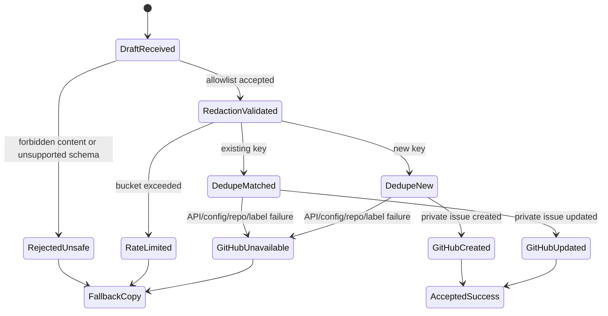

# Data Model: Support Incident Reporting

## Entity: SupportIncidentReport

Metadata-only payload assembled by the desktop for a custody blocker and sent
to the backend. The server must treat it as untrusted input.

Required safe fields, when available:

- `schema_version`
- `app_name`, `bundle_id`, `app_version`, `build_version`
- `macos_version`, `architecture`, `locale`, `timezone`
- `environment_base_url_identity`
- `workspace_fingerprint`, `user_fingerprint`, `device_fingerprint`
- `safe_device_identifier`
- `safe_recording_identity`
- `local_recording_id_fingerprint`
- `server_meeting_fingerprint`, `server_media_revision_fingerprint`
- `server_meeting_present`, `server_media_revision_present`
- `custody_lifecycle_state`
- `upload_queue_item_state`
- `retry_class`, `retry_mode`
- `normal_user_action`
- `failure_category`
- `problem_code`
- `sync_conflict_state`
- `created_at`, `updated_at`, `retention_deadline`
- `server_identity_present`
- `local_media_retained`
- `data_loss_risk`, `server_copy_known`
- `upload_attempt_count`, `last_attempt_at`, `next_retry_at`
- `last_safe_http_status`, `last_safe_problem_code`
- `upload_session_present`, `upload_session_fingerprint`
- `expected_parts_count`, `uploaded_parts_count`
- `range_mismatch_metadata`
- `local_file_completeness_profile`
- `local_purge_state`, `local_purge_tasks`, `local_purge_ack_state`
- `processing_status`
- `app_queue_schema_version`, `ledger_schema_version`
- `redaction_state`

Validation rules:

- `schema_version` must be supported.
- `redaction_state` must be `metadata_only`.
- Stable codes must match safe code syntax: lowercase/uppercase letters,
  digits, dot, underscore, and hyphen, with bounded length.
- URL-like values must be reduced to safe base identity without query strings,
  fragments, signed parameters, credentials, or path-bearing private content.
- Missing safe values become `unknown` or `not_applicable`; removed unsafe
  values become `redacted_metadata`.
- Human names, email addresses, account labels, meeting titles, raw file names,
  and other user-identifying display strings are forbidden in v1 even if the
  desktop marks them safe.
- Unknown top-level fields are ignored for issue generation unless explicitly
  promoted into the allowlist in a later spec revision.
- Any forbidden content signal blocks issue creation until the server-redacted
  object is safe by construction.
- `local_file_completeness_profile` may include booleans, counts, manifest
  schema, missing/corrupt flags, and size/duration buckets. It must not include
  exact byte sizes, exact durations, raw file names, or raw paths.

## Entity: ServerRedactedSupportReport

Canonical, deterministic report object generated by the backend after
validation. This is the only object that may be persisted in full or rendered
inside the private GitHub issue.

Fields:

- All allowlisted report fields above in stable snake_case order.
- `received_at`
- `server_redaction_version`
- `redaction_result`: `accepted`, `accepted_with_redactions`, or `rejected`
- `forbidden_field_count`
- `safe_report_fingerprint`
- `dedupe_key`
- `affected_identity_fingerprint`

Validation rules:

- Must serialize deterministically for diffing and duplicate comparison.
- Must contain no forbidden content after redaction.
- Must keep required keys present even when values are `unknown`,
  `not_applicable`, or `redacted_metadata`.

## Entity: SupportIncident

Persisted aggregate support incident for one safe root cause.

Fields:

- `id`
- `workspace_id`
- `reporter_user_id`
- `device_id`
- `incident_number`: `CUST-{github_issue_number}` after GitHub success
- `dedupe_key`
- `problem_code`
- `failure_category`
- `retry_class`
- `status`: `pending_github`, `open`, `github_unavailable`,
  `rate_limited`, `rejected_unsafe`, `configuration_invalid`, `closed`
- `affected_count`
- `safe_affected_identities`: bounded list, maximum 5
- `latest_safe_report_json`
- `latest_safe_report_fingerprint`
- `first_received_at`
- `last_received_at`
- `last_duplicate_received_at`
- `created_at`
- `updated_at`
- `redaction_result`
- `github_repo`: must be `yshishenya/crisp`
- `github_issue_number`
- `github_issue_url`
- `github_issue_state`
- `github_last_synced_at`
- `github_failure_code`

Validation rules:

- Unique constraint on `(workspace_id, dedupe_key)`.
- `incident_number` is absent until GitHub create/update succeeds.
- `affected_count` may exceed `safe_affected_identities.count`.
- `safe_affected_identities` must never exceed 5 values.
- Stored report JSON is always server-redacted metadata-only JSON.
- Rate-limit state for incident submissions is persisted in
  `SupportIncidentRateLimitBucket`, not hidden inside the latest report JSON.

## Entity: PrivateGitHubIssue

External private support/developer ticket created or updated by the server.

Fields:

- `repo_owner`: `yshishenya`
- `repo_name`: `crisp`
- `repo_private`: `true`
- `issue_number`
- `issue_url`
- `title`
- `body`
- `labels`
- `state`
- `created_at`
- `updated_at`

Validation rules:

- Repository owner/name must match `yshishenya/crisp`.
- Repository must be confirmed private before any issue mutation.
- Required labels must exist before issue mutation.
- Title and body must follow `spec.md` issue format.
- Body must include the full `ServerRedactedSupportReport` in a fenced JSON
  block and the required human-readable sections in canonical order.

## Entity: SupportIncidentDedupeKey

Stable safe key used to aggregate repeated reports.

Inputs:

- `problem_code`
- `failure_category`
- `retry_class`
- `sync_conflict_state`
- `workspace_fingerprint` or workspace scope
- `device_fingerprint`
- app `build_version`
- safe root-cause fingerprint from local/server custody state

Rules:

- No raw local recording ids, raw server ids, paths, names, emails, account
  labels, URLs with queries, or private meeting content may participate
  directly.
- Hash/fingerprint output must be deterministic and safe to store in GitHub.
- Implementation must avoid concurrent mutative GitHub requests for the same
  key.

## Entity: SupportIncidentRateLimitBucket

Server-side limit bucket for support incident submission attempts.

Fields:

- `workspace_id`
- `reporter_user_id`
- `device_id`
- `dedupe_key`
- `window_started_at`
- `attempt_count`
- `last_attempt_at`
- `blocked_until`

Rules:

- Rate limit applies before external GitHub mutation.
- Rate-limited responses return a user fallback state and must not claim
  success.
- Rate limiting must not delete the existing local safe report or custody item.

## Entity: ReportSubmissionState

Native desktop state attached to a custody item or aggregate group.

States:

- `not_sent`
- `sending`
- `sent`
- `failed_with_copy_fallback`
- `unavailable`

Fields:

- `local_report_fingerprint`
- `dedupe_key`
- `incident_number`
- `github_issue_number`
- `last_submission_attempt_at`
- `last_failure_category`
- `last_failure_code`
- `copy_fallback_available`
- `accessibility_label`

Rules:

- `sent` requires `incident_number` in `CUST-{github_issue_number}` format.
- State must persist across app refresh/restart while the custody item remains.
- Failure state must show `Скопировать отчет`.
- Accessible labels must use the same Russian status meaning as visible copy
  and must not expose enum codes as the primary explanation.

## State Transitions

