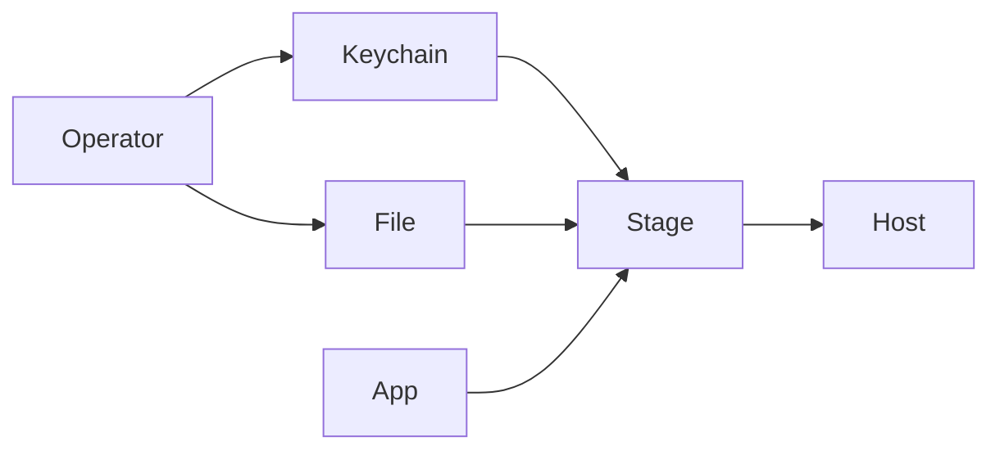
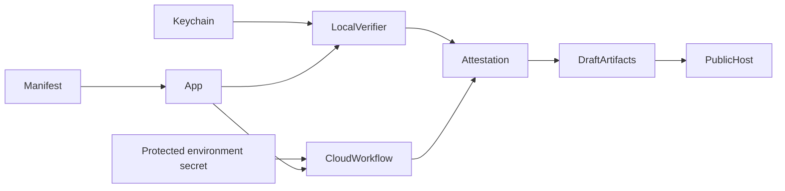

# Security Hardening Proposal: protected dual custody for Sparkle signing

> Historical proposal for Sparkle trust custody. Any Apple app/package signing
> examples are non-operative; current public macOS publication is Developer
> ID-only under Feature 130.

## Decision

We need a release boundary that owns both signer availability and signer-to-app
verification.  The current code owns the latter for the one selected signer, but
not the former across a loss event.  This proposal evaluates the current local
model, a protected dual-custody model, and a future external-KMS/public-signing
migration.  It recommends the dual-custody model for feature 109.

## Executive Recommendation

Option 1, **retain local Keychain/file custody**, preserves today's behavior but
does not remove the single-copy loss condition.  Option 2, **protected GitHub
environment signer plus Keychain recovery signer**, adds two independently
controlled protected channels and safe equality proof while preserving the
existing app trust model.  Option 3, **external KMS/HSM with public signing**,
may be stronger in a future public distribution program but couples this urgent
recovery problem to a much larger identity migration.

I recommend Option 2.  We can correct the actual failure without treating a
lost key as recoverable, and we can keep the current signer validation and
archive-first publication safeguards intact.

## Evidence

I inspected the relevant source at the recorded revision.  The following
evidence most influenced the diagnosis: E001 shows the operational loss; E002
shows the staging helper accepts either a Keychain account or arbitrary local
file; E003 shows normal update continuity is already correctly strict; E004 and
E005 show the missing durable readiness contract and coverage.

| Evidence | Finding or document | What it establishes |
| --- | --- | --- |
| E001 | Historic signer availability incident | The installed line's historic private signer is unavailable; its public verifier remains in clients. |
| E002 | `prepare-app-update.sh` | Staging validates one selected signer but permits a general external private-file path. |
| E003 | `validate-app-updates.sh` | Configured predecessors reject feed/public-key changes in ordinary updates. |
| E004 | Installer README | Operations describe local custody but not independently verifiable redundant custody. |
| E005 | Installer lifecycle tests | Existing source evidence does not cover protected-channel equivalence or degraded readiness. |

## Current Design And Failure Mode

The current design has a good cryptographic choke point: a selected Sparkle
signer must derive to the `SUPublicEDKey` in the candidate app, and the staging
helper validates the result before it creates a signed appcast.  The public
host is intentionally separate, receiving archives before appcast replacement.

The structural weakness is adjacent to that choke point.  The only private
signer may be local, and the file alternative does not make a second protected
channel or prove it matches the first.  When that key is lost, existing clients
cannot accept a new key through the appcast because E003 correctly blocks a
silent verifier replacement.  We should preserve that behavior and move
availability/recovery into a distinct, explicit control.

## Desired Invariants

- Every staging signer derives the active public key before a ZIP or appcast is
  produced.
- The active public key, its safe identifier and trust generation are versioned
  public metadata; no private material is versioned.
- The normal cloud signer and local recovery signer can each prove equality to
  the same candidate app without disclosing a secret.
- Routine readiness reports a missing channel as degraded, and public staging
  fails for a missing/mismatched signer.
- An ordinary update can never rotate the Sparkle feed verifier.  A manual
  bootstrap is the only trust-generation transition.

## Constraints And Non-Goals

The historical proposal retained the owner-only code-signing line and local
package/bootstrap workflow,
existing public host, `pro.2brain.graf`, and macOS permission-continuity
checks.  We do not recover the historic key, add a third-party runtime service,
or switch to Developer ID/notarization. Current Apple publication is now
Developer ID-only under Feature 130. No option may let a pull request,
untrusted ref, public host or app bundle access the private signer.

## Before Architecture

The baseline flow is shown in [the before diagram](../diagrams/protected-dual-custody-before.mmd).
One operator reaches a local Keychain or external file, stages a signed release,
and separately copies it to the public host.  The verifier edge from candidate
app to staging is good; the unowned/optional local signer edges are the
availability and accidental-leak risk.

## Options

### Option 1: Retain local Keychain/file custody with stronger documentation

The strongest case for Option 1 is speed.  It changes almost nothing in a path
that has already demonstrated correct archive, appcast and signature checks.
We could require a written backup procedure and periodic manual drill.  Its
resource cost is neutral, and it does not risk changing any product behavior.

The problem is that it leaves the important boundary as convention.  A backup
can be a second accidental file, can drift from the active signer, or can be
lost together with the first local machine.  It also cannot help a client that
is already bound to the historic unavailable key.  Documentation is useful as
a tactical supplement but not proportionate as the main fix.

The resulting flow is [shown here](../diagrams/protected-dual-custody-current-local-custody-after.mmd).

| Change | Before | After | Security consequence | Cost |
| --- | --- | --- | --- | --- |
| Custody | One local selection | Same local selections plus checklist | Little prevention of loss/leak | Very low |
| Equality proof | Selected signer to app | Same | No independent recovery proof | None |
| Historic trust | Blocked | Blocked | No migration path | None |

Rollback is trivial because only documentation changes, but that is also why
the reliability result is weak.

### Option 2: Protected GitHub environment signer plus Keychain recovery signer

This option keeps the app's verifier where it is and gives the signer one owned
public control plane.  A manifest carries only the active public key, safe
fingerprint and channel names.  The protected workflow receives the private key
only through an environment secret after manual approval, materializes it in a
restricted temporary runner file, derives its public key, and deletes it on
exit.  The Keychain account is the independent recovery signer.  Both report a
safe fingerprint that the local verifier compares to the manifest and candidate
app.

The appealing part is that we do not need to hand cloud infrastructure the app
code-signing certificate.  The workflow signs an already validated draft asset
and uploads only to the draft release; a human still verifies versioned files
before replacing the live appcast.  The residual risk is that both channels can
still be lost or the owner may misconfigure the environment.  The safe
attestation and explicit degraded state make those failures visible before a
release rather than at the point an urgent patch is needed.

The after-state is [shown here](../diagrams/protected-dual-custody-protected-dual-custody-after.mmd).

| Change | Before | After | Security consequence | Cost |
| --- | --- | --- | --- | --- |
| Private custody | Keychain or arbitrary file | Protected environment + named Keychain | Two controlled paths; no general local file input | Workflow/environment setup |
| Trust declaration | App-only implicit public key | Versioned public manifest + app match | Drift is detectable before signing | Public manifest maintenance |
| Cloud operation | None | Manual protected workflow signs draft assets | Secret access is approval-gated; no public-host authority | Release ceremony |
| Recovery | Ad hoc backup | Explicit degraded/fallback procedure | A one-channel loss does not erase release capability | Drill and owner training |
| Historic key | Unusable | Explicit manual bootstrap | Honest migration, no silent feed switch | One manual install |

We can introduce it incrementally: add manifest and source checks first, enroll
the new key through the controlled provisioner, configure the environment,
validate both channels with disposable artifacts, then publish the manual
bootstrap.  If anything fails before appcast replacement, the old public feed
remains intact.  After a client has installed bootstrap, rollback is forward
only through a higher signed update; a lower downgrade is never offered.

### Option 3: Move directly to external KMS/HSM and public signing program

Option 3 has an understandable long-term attraction.  A non-exportable managed
key can give stronger organization-wide access control and audit data, while a
Developer ID/notarized release path would improve public macOS distribution.
It could eventually remove both the login-Keychain recovery concern and the
current owner-only distribution limitation.

However, it makes this recovery work dependent on provider selection, billing,
service availability, certificate custody, notarization and a potentially
different macOS designated requirement. We would still need the same manual
Sparkle bootstrap because no KMS can recreate the historic signer. Apple
Developer ID publication is now handled separately by Feature 130; I would not
combine further Apple identity changes with an update outage repair.

The larger future architecture is [shown here](../diagrams/protected-dual-custody-external-kms-and-public-signing-after.mmd).

| Change | Before | After | Security consequence | Cost |
| --- | --- | --- | --- | --- |
| Sparkle signer | Local custody | Provider-backed KMS/HSM | Potential non-exportability | New vendor/trust boundary |
| App signing | Owner-only local lineage | Developer ID/notarization | Better public distribution potential | High identity/TCC migration risk |
| Recovery | Local process | Provider access/recovery | Better central audit if configured well | Provider outage/account lockout risk |

Option 3 must be a separate feature with an explicit threat model, cost review,
notarization proof and full old-to-new permission-retention matrix.  Its rollback
would keep the Option 2 release line active until the new identity is proven.

## Comparison

| Dimension | Option 1: local custody | Option 2: protected dual custody | Option 3: external KMS/public signing |
| --- | --- | --- | --- |
| Security | Existing verification, weak custody ownership | Stronger authority boundary and no arbitrary local file signer | Potentially strongest, provider-dependent |
| Performance | Neutral | Release-only preflight/workflow cost | Remote-signing latency unknown |
| Memory | Neutral | Temporary runner file only, cleaned on exit | Client neutral |
| Reliability | Single-copy loss persists | One channel can cover the other; degraded state visible | Provider introduces a new availability dependency |
| Operability | Familiar but informal | Moderate approval/attestation process | Highest vendor/certificate/notarization burden |
| Migration | Does not solve historic clients | One manual bootstrap then normal updates | Same bootstrap plus signing identity migration |

## Recommendation

I recommend Option 2.  It directly maps E001--E005 to one owned release
boundary, preserves the strict normal-update rule we already trust, and keeps
the migration scope small enough to verify.  Option 1 remains a useful
documentation fallback only; Option 3 should win if the project explicitly
funds public distribution and managed signing as a separate decision.

## Evidence Coverage And Residual Risk

| Evidence | Option 2 effect | Residual risk / tactical protection |
| --- | --- | --- |
| E001 — Historic signer unavailable | Addresses | One manual bootstrap remains mandatory; no recovery claim. |
| E002 — Local file/Keychain staging | Addresses | CI uses a restrictive temporary file only; local path accepts named Keychain only. |
| E003 — Strict normal key/feed continuity | Addresses | Keep validator strict; bootstrap helper is separately named and cannot stage appcast. |
| E004 — Missing redundancy procedure | Addresses | Periodic safe-attestation drill and owner approval still required. |
| E005 — Missing custody tests | Addresses | Add focused tests plus feature quickstart and repository CI. |

## Migration And Rollout

We first land and validate code without publishing an update.  An approved owner
provisions a new trust generation in the Keychain and protected GitHub
environment, commits its public manifest, and runs both channel checks.  We then
build the next available CalVer as a manually installed bootstrap retaining the
same GRAF application identity.  Only after that package is proven do we stage
a greater version through the protected signer, publish versioned assets before
the feed, and prove a second ordinary update.

If a failure happens before the appcast change, we discard only draft/transient
artifacts and retain the live feed.  After a live client update, we halt the
rollout by restoring the known-good signed feed or issue a higher forward fix;
we never publish an unsigned/lower update.

## Validation Plan

- Verify static workflow triggers, least permissions, no secret-bearing output,
  and no PR-secret path.
- Run local Keychain, missing-key and mismatched-key disposable tests.
- Run protected environment attestation with correct/mismatched/missing secret
  cases and compare safe fingerprints.
- Validate draft release archive, app identity, appcast, signature, version and
  archive-before-feed ordering.
- Prove bootstrap plus two sequential in-app updates and permission retention
  without `tccutil reset` or re-granting permissions.
- Run focused XCTest/shell checks and `infra/scripts/ci-local.sh`.

## Implementation Work Packages

The selected handoff is in
[implementation/protected-dual-custody.md](../implementation/protected-dual-custody.md).
It groups the manifest/custody boundary, protected workflows, staging and
bootstrap guards, documentation, tests and physical-release proof into ordered
packages.  The Spec Kit `tasks.md` will remain the execution source of truth.

## Open Questions

- Which named owners approve the `graf-release-signing` environment is an
  operational configuration decision for the repository owner.
- Developer ID/notarization and a managed KMS remain deliberately deferred to a
  separately approved migration.
