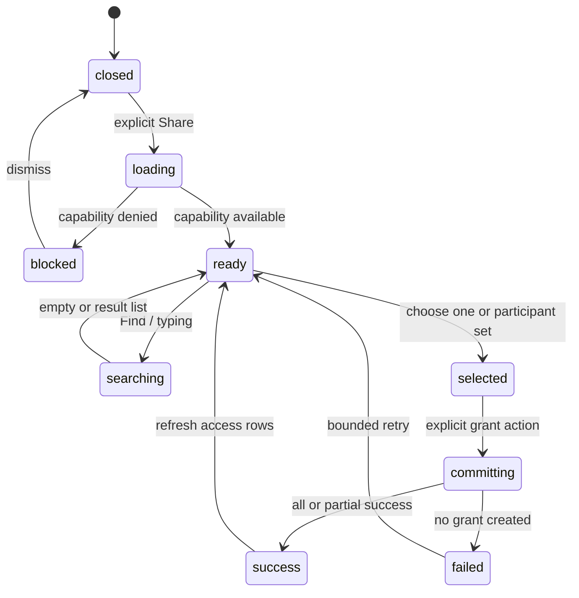
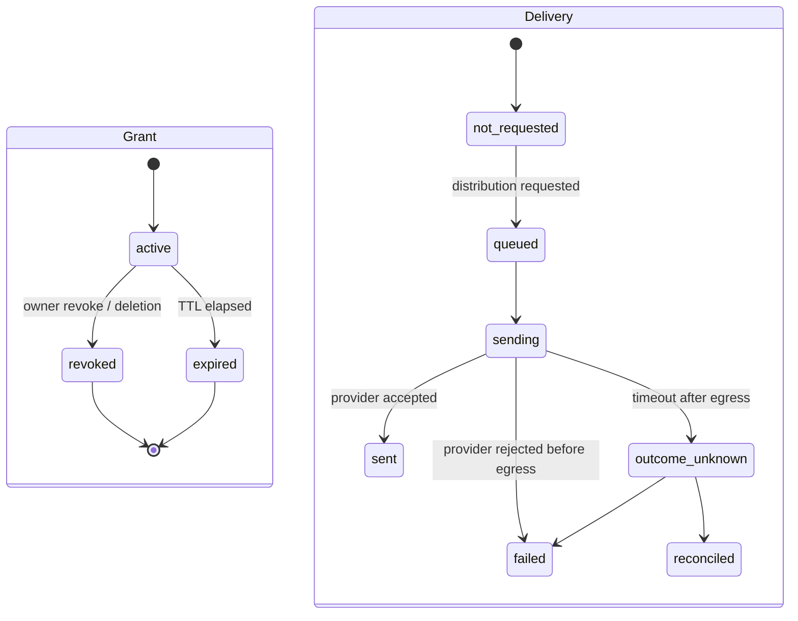
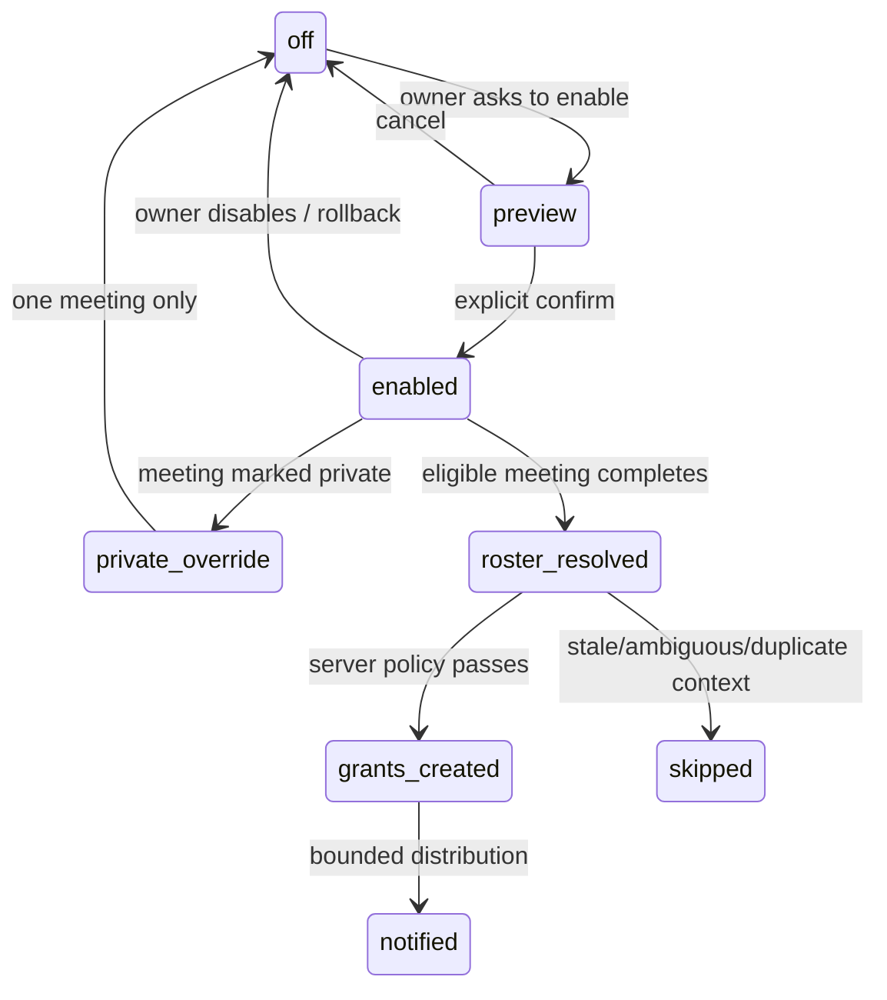

# Сценарии и реализация: Sharing и командное распространение GRAF

**Feature**: [125-meeting-sharing](spec.md)
**Статус**: design review; participant auto-share, pre-read, team access,
channel distribution и external delivery остаются gated
**Назначение**: зафиксировать пользовательские пути, границы доверия и порядок
реализации до следующего code slice.

## 1. Главный продуктовый вывод

Вирусный эффект создаёт не кнопка «пригласить», а повторяющийся полезный
workflow:

```text
один человек записал встречу
        ↓
поделился безопасными итогами с подходящими участниками
        ↓
коллега увидел пользу в Shared with me
        ↓
подключил GRAF к своим встречам
        ↓
его следующая встреча создала новый круг получателей
```

У GRAF должны быть три петли:

1. **Value loop** — один summary приводит следующего пользователя.
2. **Habit loop** — recurring pre-read и action items возвращают участников к
   GRAF перед следующей встречей.
3. **Team loop** — workspace policy и Shared with me делают результат видимым
   команде, но не раскрывают meetings сверх политики.

Ни одна петля не должна зависеть от скрытого создания аккаунта, публичного
доступа, реферальных бонусов или полной выгрузки адресной книги. В invite-flow
аккаунт может быть создан автоматически только как результат явного email или
provider-входа получателя.

## 2. Акторы и поверхности

| Актор | Что ему нужно | Разрешённая поверхность |
|---|---|---|
| Владелец встречи | Быстро выбрать аудиторию и понять последствия | Meeting detail → Share modal |
| Внутренний получатель с GRAF | Сразу найти доступный результат | Shared with me, meeting card, in-app notification |
| Внутренний участник без активной GRAF identity | Понять ценность и добровольно подключиться | Gated onboarding/SSO; не silent join |
| Внешний получатель | Получить только явно разрешённые итоги | Gated email + exact-address acceptance |
| Workspace admin | Управлять командными defaults и rollback | Workspace policy; без broad bypass |
| Calendar provider | Дать context и roster | Current owner-authorized snapshot |
| Channel integration | Доставить ссылку туда, где работает команда | Slack/Teams/calendar pointer; access не расширяется |
| GRAF server/worker | Проверить policy, выдать grant, доставить и отозвать | Domain service, Temporal/email, audit/deletion authorities |

## 3. Термины, которые нельзя смешивать

| Понятие | Ответ на какой вопрос | Пример |
|---|---|---|
| **Capability** | Можно ли выполнить действие сейчас? | `internal_grant=available` |
| **Audience** | Кто потенциально получит доступ? | `user`, `workspace`, future `team` |
| **Content scope** | Что увидит получатель? | `summary_only` |
| **Grant** | Какой конкретный доступ уже выдан? | active user grant, expiry 7 days |
| **Distribution** | Куда доставить уведомление/ссылку? | Shared with me, email, Slack |
| **Identity** | Кому принадлежит доступ? | verified active workspace user |
| **Consent** | Было ли явное действие владельца/получателя? | owner clicked share; recipient chose setup |

Уведомление не является grant. Calendar attendee не является identity и не
является consent. Ссылка не меняет scope. CTA не создаёт аккаунт без явного
email/provider-входа получателя.

## 4. Непробиваемые инварианты

1. Сервер повторно проверяет `meeting_id`, workspace, owner `can_share`,
   deletion state и текущую policy при каждой mutation.
2. P0 выдаёт только individual `summary_only/view_only` grants.
3. Один получатель = один active grant на meeting; повторный batch не вращает
   токен и не создаёт второй grant.
4. Explicit rotation — отдельное действие; retry не является rotation.
5. Batch sharing возвращает результат по каждому кандидату: `granted`,
   `already_access`, `skipped`, `failed`. Общая ошибка без детализации запрещена.
6. Server re-resolves roster на commit; клиентский список кандидатов — только
   preview, не authorization.
7. Owner, declined/hidden, unknown, room/resource и unmatched external attendee
   не попадают в P0 participant share.
8. `Shared with me` показывает только уже активные grants; чтение ленты не
   создаёт доступ и не вызывает email delivery.
9. Grant lifecycle и delivery lifecycle независимы: внутренний in-app grant
   может быть active при неработающем email provider.
10. Доставка `sent` означает принятие provider request, не попадание во входящие.
    Timeout после egress = `outcome_unknown`; автоматический resend запрещён.
11. Deletion/revoke/expiry выигрывают гонку с открытием ссылки и worker retry.
12. Raw token, email, title, transcript, audio, summary text и private contact
    record не попадают в analytics, audit metadata, browser autocapture и
    committed evidence.

## 5. Матрица пользовательских сценариев

### 5.1. Владелец встречи

| ID | Ситуация | UX-результат | Серверный результат |
|---|---|---|---|
| O-01 | Share открывается впервые, календаря нет | Поле поиска + typed path; объяснение «можно выбрать участника workspace» | `share_panel_state` доступен, `recipient_sources=[workspace]` |
| O-02 | Есть 2–5 подходящих внутренних участников | Главная кнопка «Поделиться с участниками (N)»; перед commit виден список | Server строит актуальный roster, создаёт индивидуальные grants |
| O-03 | В roster есть internal, declined, external и неизвестный | Видны только подходящие internal; рядом честно указано, что часть не может быть выбрана | Исключённые identity не раскрываются и не получают side effect |
| O-04 | Владелец хочет только одного человека | Поиск → выбор → «Открыть доступ к итогам» | Один user grant, без batch notification |
| O-05 | Введён внешний email при disabled delivery | Поле сохраняется; UI объясняет блокировку и предлагает workspace search | `share_invitations_disabled`; POST внешнего invite не выполняется |
| O-06 | Владелец ищет `%`, `_`, пробелы или неоднозначное имя | Результат — literal safe search или neutral empty state | Wildcards экранированы, directory enumeration невозможен |
| O-07 | Владелец выбирает себя | «Вы уже владелец этой встречи»; кнопка недоступна | Нет mutation |
| O-08 | У человека уже есть доступ | «Доступ уже открыт» + Copy/Revoke в существующей строке | `already_access`; токен не вращается |
| O-09 | Владелец дважды нажал Share или открыты две вкладки | Одна операция, понятный итог без дублей | Idempotency key + DB unique active-user constraint |
| O-10 | Один из batch recipients исчез до commit | Частичный успех с безопасными причинами и ссылкой на повторный выбор | Каждый recipient rechecked under meeting lock |
| O-11 | Summary ещё обрабатывается | «Доступ создан; итоги появятся после обработки»; нельзя обещать содержимое | Grant может быть active, summary route показывает readiness |
| O-12 | Встреча private/1:1 или owner не разрешил sharing | Share показывает blocked state и объяснение | Mutation возвращает policy denial; обход через API закрыт |
| O-13 | Нужно исправить ошибочный доступ | Владелец видит scope/expiry и может Revoke | На следующем запросе grant ineffective |
| O-14 | Ссылка утекла или нужен новый URL | Явная Rotation; подтверждение инвалидирует старый URL | Новый hash, старый token не разрешается |
| O-15 | Владелец включает auto-share после успешного результата | Preview с условиями и private override; отдельное подтверждение | Сохраняется opt-in policy; будущие meetings only |
| O-16 | Владелец выключает auto-share | Настройка выключается без удаления прошлых grants | Новые distribution runs не создаются, старые grants управляемы |
| O-17 | Recurring meeting изменила roster | Перед следующей инстанцией показан новый preview/результат | Каждая инстанция резолвит roster заново; старые grants не расширяются |
| O-18 | Два пользователя записали одну calendar встречу | Один понятный result path, без двух одинаковых писем | Future dedupe run по calendar snapshot; manual share остаётся возможным |
| O-19 | Владелец удаляет встречу | Перед удалением показана честная область GRAF-controlled revoke | Новые grants/delivery blocked; old links fail on next request |

### 5.2. Получатель

| ID | Ситуация | UX-результат | Серверный результат |
|---|---|---|---|
| R-01 | Уже вошёл в GRAF | Summary появляется в Shared with me; notification не обязательна | Query active grants for `grantee_user_id` |
| R-02 | Открыл ссылку из Shared with me | Сразу открывается разрешённый summary, без повторной регистрации | User/session authorization + grant scope проверены |
| R-03 | Получатель впервые видит GRAF | После полезного результата CTA «Подключить GRAF к моим встречам» | CTA ведёт в explicit setup, capture не стартует сам |
| R-04 | Получатель не хочет новые уведомления | Mute/unsubscribe для distribution channel, не для access | Delivery preference не отзывает grant автоматически |
| R-05 | Ссылка переслана другому человеку | Нейтральный экран недоступности; не подтверждать существование meeting | Exact identity/token check before content |
| R-06 | Ссылка expired/revoked | Понятно «доступ закончился или был отозван» без private metadata | `404/410` privacy-preserving response |
| R-07 | Встреча удалена | Объяснение ограничено GRAF-controlled deletion | Deletion state wins all grant routes |
| R-08 | Пользователь открывает один grant многократно | Контент доступен, CTA не повторяется навязчиво | One bounded attribution, no new grant/account |
| R-09 | Получатель уже сам использует GRAF | CTA заменяется на «Настроить sharing для моих встреч» или исчезает | No duplicate account or referral credit |
| R-10 | Получатель получил два результата одной встречи | Shared with me объединяет только при доказанном canonical identity; иначе показывает два владельца честно | Не склеивать разные recordings без canonical mapping |
| R-11 | Получатель получил только summary | Не показывать controls для transcript/audio/download/export | Backend egress checks scope independently |
| R-12 | Внешний получатель вводит другой email | Повторить вход с приглашённым адресом; meeting existence не раскрывается | Exact verified email required |

### 5.3. Workspace admin и команда

| ID | Ситуация | UX-результат | Policy/technical result |
|---|---|---|---|
| A-01 | Team policy выключена | Никаких скрытых grants; owner share работает индивидуально | `team_access=off` |
| A-02 | Admin включает summary team access | Preview ролей, scope и исключений до сохранения | Separate operator gate; view-only summary |
| A-03 | Admin выбирает manager/member | Ясно, кто увидит и что не сможет сделать | No edit/share/export; canonical team directory required |
| A-04 | Admin хочет применить policy к прошлым meetings | Требуется отдельное подтверждение и bounded preview | No retroactive grants by default |
| A-05 | Team member сменил workspace/role | Access recalculated on next request | Membership/status/role rechecked; no broad bypass |
| A-06 | Admin откатывает rollout | Новые operations остановлены, revoke/deletion продолжают работать | Effective capability false; existing grants remain auditable |
| A-07 | В workspace нет canonical team entity | UI не предлагает team audience | Fail closed; текущий validator уже блокирует team mode |

### 5.4. Calendar, address book и distribution channels

| ID | Ситуация | UX-результат | Technical result |
|---|---|---|---|
| C-01 | Current calendar snapshot доступен | Source badge «Календарь», freshness и понятный roster preview | `RecordingCalendarContextLink` + `CalendarParticipant` |
| C-02 | Snapshot stale | Предупреждение; participant share требует повторного preview | Stale data не является authorization |
| C-03 | Calendar disconnected/denied | Empty/degraded state, typed workspace search остаётся | No provider refresh without explicit consent |
| C-04 | Участник в календаре, но не GRAF identity | Не показывать его как готового internal recipient | Unknown attendee остаётся gated external candidate |
| C-05 | Contacts permission denied | Native picker не блокирует typed path | No full address-book upload |
| C-06 | Contacts limited selection | Используются только выбранные контакты и только для текущего действия | Selected address is ephemeral; no global index |
| C-07 | Calendar pointer включён | В событие добавляется только ссылка/короткий статус | Calendar write does not grant access |
| C-08 | Slack/Teams channel подключён | Пользователь видит destination и scope до отправки | Integration uses existing grants/channel policy; no access bypass |
| C-09 | Channel delivery failed | Grant остаётся управляемым, retry отдельно и bounded | Delivery state separate from grant state |
| C-10 | Несколько каналов/участников получили одну ссылку | Один notification per destination policy, без spam | Delivery dedupe key `(grant, destination, occurrence)` |

### 5.5. Delivery, security и operations

| ID | Ситуация | UX-результат | Technical result |
|---|---|---|---|
| S-01 | Поиск/Share превысил rate limit | Короткое время ожидания без подтверждения identity | Buckets: actor, workspace, meeting, source |
| S-02 | Provider отклонил запрос до egress | «Не отправлено; повторить позже» | Invitation `failed`, safe retry only |
| S-03 | Timeout после egress | «Результат доставки неизвестен; не повторяйте автоматически» | Invitation `outcome_unknown`, reconciliation/manual retry |
| S-04 | Worker retry после revoke | Ничего не отправляется и не восстанавливается | Durable status + meeting→invitation lock order |
| S-05 | Browser back/referrer/autocapture | Token не остаётся в observability surface | no-store/no-referrer/noindex + redaction |
| S-06 | Parallel revoke/rotate/open | Последняя policy truth применяется на запросе | Transaction/row lock + status/expiry recheck |
| S-07 | Observability needs funnel | Только aggregate metadata, без content | Existing analytics allowlist/forbidden fields |
| S-08 | Workspace legal/privacy rollback | New distribution stops immediately | Feature gates independent and reversible |

## 6. Рекомендуемый UX flow

### 6.1. Первый экран Share

Для встречи с подходящими internal participants:

```text
Поделиться встречей
Выберите, кто увидит итоги. Доступ можно отозвать в любой момент.

[ Поделиться с участниками (3) ]

Или найдите конкретного человека
[ Имя или email                         ] [Найти]

Что увидят: только итоги · Просмотр · до 7 дней
Расшифровка, аудио и экспорт не открываются.
```

Правила:

- participant action не должен быть опасным default: перед commit показать
  список и исключения;
- если подходящих участников нет, primary action заменяется на поиск;
- после первого успешного share показать один unobtrusive prompt: «Делиться
  итогами с внутренними участниками автоматически?»;
- не показывать permission matrix, public link и external email рядом с P0;
- Copy link появляется только после успешного grant и копирует URL из ответа;
- focus, Escape, keyboard selection, live region, reduced motion и 320px layout
  сохраняются из текущего Share contract.

### 6.2. Shared with me

Карточка должна отвечать за 3 секунды:

```text
Итоги встречи доступны
От: участник команды · сегодня, 14:26
Только итоги · Просмотр · истекает через 7 дней
[Открыть итоги]
```

CTA после первого полезного просмотра:

```text
Хотите получать такие итоги со своих встреч?
[Подключить GRAF к моим встречам]  [Позже]
```

CTA не должен появляться на каждом открытии. Нужен bounded cooldown и состояние
`dismissed`; повторное предложение допустимо только после нового доказанного
value event.

### 6.3. Уведомления

Порядок каналов:

1. in-app Shared with me — P0, без новой delivery infrastructure;
2. email — только после exact identity/delivery gates;
3. pre-read/action items — после consent и per-channel preferences;
4. Slack/Teams/calendar pointer — отдельные integrations.

Доставка должна быть сгруппирована: несколько grants одному пользователю за
короткое окно дают один digest, а не серию писем. При этом доступ к каждой
встрече остаётся отдельным grant и отдельным revoke.

## 7. State machines

### 7.1. Modal



### 7.2. Access and delivery



Grant and delivery must never be one state machine: Shared with me can work
without email, and a delivery failure must not silently revoke an already
authorized internal viewer.

### 7.3. Auto-share policy



## 8. Минимальная техническая реализация

### 8.1. P0: participant share с отдельным idempotency gate

Переиспользовать:

- `MeetingShareGrant` как единственный источник user access;
- `RecordingCalendarContextLink` и `CalendarParticipant` как roster source;
- `search_share_recipients` и `decide_meeting_access` как existing policy helpers;
- `MeetingEgressAuditEvent` для metadata-only audit;
- текущий `Shared with me` query/list вместо новой notification/inbox таблицы.

В текущем internal-first кандидате этот batch ещё не реализуется. До его
включения нужно либо переиспользовать существующий общий idempotency/run
authority, либо добавить одну узкую bounded operation-модель. Отдельные
notification, outbox и referral таблицы для этого не нужны. Если batch
использует `Shared with me` как основную поверхность, per-recipient bearer URLs
в ответ не возвращаются.

Добавить один batch mutation после live acceptance текущего single-recipient
flow:

```http
POST /api/v1/cabinet/meetings/{meeting_id}/share-participants
Idempotency-Key: opaque-client-request-id
```

```json
{
  "mode": "eligible_internal_participants",
  "recipient_user_ids": [],
  "content_scope": "summary_only",
  "can_download": false,
  "can_export": false,
  "expires_in_seconds": 604800
}
```

`mode=eligible_internal_participants` означает «сервер сам пересчитай roster»;
`recipient_user_ids` используется для явного выбора. Сервер всегда:

1. блокирует meeting в существующем lock order;
2. проверяет owner `can_share`, deletion и current capability;
3. загружает свежий calendar context и активные workspace memberships;
4. исключает owner, declined/hidden/unknown/external и stale-only candidates;
5. дедуплицирует по `user_id`;
6. создаёт или возвращает существующий grant без rotation на retry;
7. пишет bounded audit и возвращает per-recipient result;
8. после commit обновляет Shared with me projection.

Пример ответа без реальных данных:

```json
{
  "status": "partial_success",
  "requested_count": 3,
  "results": [
    {"user_id": "synthetic-user-a", "status": "granted", "grant_id": "..."},
    {"user_id": "synthetic-user-b", "status": "already_access", "grant_id": "..."},
    {"user_id": "synthetic-user-c", "status": "skipped", "reason": "not_eligible"}
  ]
}
```

P0 не должен запускать email, Slack, calendar writeback или referral event.
Это даёт самый важный viral loop без новой внешней поверхности.

### 8.2. P1: owner auto-share и recurring pre-read

Не перегружать `CalendarSettingsPreference`: календарные UI-фильтры и sharing
policy имеют разные владельцы и retention. После отдельного approval добавить
одну узкую preference-модель `(workspace_id, owner_user_id)` с:

- `internal_summary_auto_share`: `off|ask|on`;
- `private_meeting_override`: `always_off|ask`;
- `recurring_pre_read`: `off|summary_link|summary_link_actions`;
- `notification_mode`: `in_app|digest|email` после delivery gate;
- `policy_version`, timestamps и audit reference.

Пока P1 не утверждён, не добавлять эту таблицу. P0 не требует persistence.

Auto-share worker должен иметь durable dedupe по `(workspace, calendar_event,
sharing_policy_version)` или эквивалентный canonical distribution run. Если
в проекте нет подходящего outbox/run authority, добавить одну bounded run-модель,
а не одновременно outbox, notification table и отдельный referral table.

Обязательные проверки:

- текущая инстанция recurring event, не только series key;
- изменившийся roster и membership;
- `summary_ready` перед notification;
- overlap/duplicate recording: один distribution run на canonical event;
- private/1:1/external meeting policy;
- rollback до и после scheduling;
- no retroactive grants by default.

### 8.3. Team access

Текущий код намеренно блокирует `team` audience: нет canonical team directory.
До появления этой authority нельзя моделировать team как `workspace` или
обходить проверку membership.

Минимальный будущий контракт:

- admin policy `off|manager|member`;
- role resolution через canonical team membership;
- grant scope summary/view only;
- `can_share=false`, `can_download=false`, `can_export=false`;
- per-meeting private override;
- explicit preview для retroactive migration;
- audit policy change и rollback.

### 8.4. External, Contacts и integrations

- External email остаётся на существующем invitation/Temporal flow с exact
  verified address, bounded TTL и outcome-unknown.
- Native Contacts возвращает только выбранный контакт в текущий typed flow; не
  создаёт server-side contact index.
- Calendar pointer, Slack и Teams получают только ссылку, уже защищённую
  grant authorization. Channel membership не считается GRAF grant.
- Referral attribution начинается после summary view и setup, а не после click
  или email open; повторная атрибуция идемпотентна.

## 9. Метрики и guardrails

### Основные метрики

1. `eligible_participant → summary_viewed` — первая ценность.
2. `summary_viewed → setup_started` — сила onboarding CTA.
3. `setup_started → first_own_capture` — настоящая активация.
4. `first_owner → unique_internal_viewers_7d` — командное распространение.
5. `recurring_pre_read_opened → next_meeting_value` — habit loop.

Не использовать как north-star: количество email, кликов по токену, открытий
письма или созданных grants без просмотра.

### Stop conditions

Rollout автоматически останавливается при:

- unexpected external/public grant;
- grant без `can_share` владельца;
- росте duplicate delivery выше synthetic baseline;
- raw token/email/content в event payload или logs;
- rate-limit обходе через batch/channel/recurring path;
- revoke/deletion не блокирующем следующий request;
- жалобах на неожиданные notifications или private meeting exposure.

## 10. Acceptance matrix перед реализацией

Минимальный synthetic matrix:

- 0/1/3/20 eligible recipients;
- mixed internal/external/declined/hidden/resource roster;
- no calendar, current, stale, disconnected and ambiguous context;
- single click, double click, two tabs and retry after timeout;
- all success, partial success, all denied;
- active, already access, rotated, revoked, expired and deleting grants;
- summary not ready, processing failed and meeting owner deleted;
- existing recipient, first-time recipient, wrong recipient and forwarded URL;
- private/1:1, recurring roster change, overlapping recording and duplicate run;
- admin policy off/on/rollback and role change;
- Contacts denied/limited, channel disconnected and calendar write denied;
- keyboard-only, screen reader, 320px, reduced motion, light/dark and embedded
  cabinet parity.

Evidence remains synthetic and must not contain real meeting content, addresses,
tokens, private contacts or live provider payloads.

## 11. Решения, которые принимаем сейчас

1. **P0 audience**: only verified active internal workspace identities that are
   currently eligible in the meeting context; not every calendar invitee.
2. **P0 scope**: summary-only/view-only, seven-day bounded expiry, individual
   revoke.
3. **P0 distribution**: Shared with me first; no email or channel dependency.
4. **Auto-share default**: off initially; offer after first successful value
   event with preview and private override.
5. **Retry semantics**: idempotent batch result; retry never rotates a token.
6. **Team access**: blocked until canonical team directory exists.
7. **Address book**: native limited selection later; never full sync.
8. **Analytics**: measure first value and own adoption, not message volume.

## 12. Следующий implementation slice

Следующим кодовым срезом должен быть только P0:

1. contract/schema для batch participant share;
2. domain helper с deterministic eligibility и idempotent result;
3. Share modal preview/confirmation/partial result;
4. Shared with me projection reuse;
5. synthetic tests на roster, retries, duplicates, deletion and privacy;
6. browser/embedded acceptance и rollback evidence.

Auto-share, pre-read, team access, channels, external invite и referral не
включать в тот же diff: у них другие persistence, delivery, privacy и rollout
гейты.

## 13. Независимая проверка и уточнённые решения

### 13.1. Что действительно объясняет распространение Read.ai

Быстрый рост в компании, скорее всего, создаёт не реферальный бонус и не сам
email. Его создаёт комбинация трёх механизмов:

1. **Артефакт встречи становится общим объектом команды.** Участник получает
   полезный recap, а не рекламное приглашение.
2. **Доступ встречается в уже существующем рабочем контексте.** Это `Shared
   with me`, календарный указатель, pre-read или рабочий канал, а не новая
   социальная сеть.
3. **Каждый получатель получает следующий понятный шаг.** После просмотра он
   может настроить GRAF для своих встреч, но не обязан регистрироваться до
   получения пользы.

Официальные материалы Read.ai прямо описывают автоматическое предоставление
отчёта участникам, отдельную настройку Team Report Access, private override и
доставку в Slack. Это сильная референсная механика, но она не доказывает
причинный uplift сама по себе. Для GRAF её следует переносить поэтапно:
сначала individual grants и `Shared with me`, затем личный opt-in, затем
контролируемая командная поверхность.

### 13.2. Shared with me и Team Library — разные продукты

`Shared with me` отвечает на вопрос «какие встречи уже разрешены мне». Team
Library отвечает на вопрос «где команда хранит и находит разрешённые рабочие
итоги». Нельзя сделать Team Library простым алиасом `workspace`-grant:

- у библиотеки должна быть каноническая команда/коллекция и её membership;
- доступ должен быть role-scoped и ограничен summary/view;
- уход из команды должен блокировать доступ на следующем запросе;
- private/1:1 meeting и owner override должны выигрывать над командным
  правилом;
- retroactive migration требует отдельного preview и подтверждения.

Поэтому Team Library — P1 после появления canonical team directory. В P0
используем текущую ленту `Shared with me`; новую таблицу коллекций и новый
workspace-wide grant не добавляем. Такой порядок сохраняет главный viral loop и
не превращает отсутствие team authority в скрытую раздачу всей компании.

### 13.3. Уточнённый UX participant share

Главная кнопка может быть заметной, но не должна быть неявной массовой выдачей:

```text
Поделиться с подходящими участниками (3)
```

После нажатия открывается короткий preview:

```text
Кому откроем итоги
[✓] Анна · в рабочем пространстве
[✓] Борис · в рабочем пространстве
[✓] Светлана · в рабочем пространстве

Только итоги · Просмотр · до 7 дней
[Отмена] [Открыть доступ (3)]
```

Правила:

- «Выбрать всех подходящих» — явное действие, а не скрытый default для
  календарного roster;
- пользователь может снять любого кандидата до commit;
- owner, declined/hidden/external/unknown не показываются как selectable
  users; причина исключения не должна раскрывать лишнюю identity;
- перед commit сервер повторно строит roster, поэтому исчезнувший участник
  даёт `skipped`, а не ошибку всей операции;
- результат показывает `Открыт доступ`, `Уже был доступ`, `Пропущен по
  политике`, `Не удалось`; одна неудача не маскирует частичный успех;
- после первого успешного просмотра показывается один CTA про настройку GRAF,
  а не повторная просьба делиться.

### 13.4. Несколько источников доступа должны быть видны честно

У одного получателя могут одновременно существовать direct grant, team policy
и, в будущем, participant distribution. Effective access — это объединение
разрешённых источников, но каждый источник управляется отдельно.

В строке owner Share нужно показывать, например:

```text
Анна · Только итоги · до 7 дней
Доступ: лично · ещё также через команду
[Управлять] [Отозвать личный доступ]
```

Отзыв direct grant не должен обещать потерю доступа, если team grant всё ещё
активен. Сервер при каждом egress повторно проверяет membership, meeting
policy, scope и expiry. Internal grant требует active workspace membership;
external accepted grant — отдельный `grant_origin`, exact verified identity и
bounded expiry. Потеря membership блокирует internal grant без ожидания
повторной авторизации.

### 13.5. Обязательные технические гейты до participant batch

Независимый security review добавляет следующие требования к следующему
кодовому срезу:

1. **Идемпотентность.** Один `Idempotency-Key` + один fingerprint payload
   возвращают тот же результат; другой payload с тем же ключом даёт `409
   idempotency_conflict`; retry никогда не вращает токен. Для batch нужна одна
   bounded operation/run authority или существующий общий idempotency ledger.
2. **Не возвращать bearer URL там, где он не нужен.** Participant batch должен
   выдавать доступ и обновлять `Shared with me`, а не раздавать отдельный raw
   URL каждому участнику. URL для явного single-recipient Copy/Rotate —
   отдельная операция с безопасным replay semantics.
3. **Доставка — не authorization.** `sent` означает принятие provider request;
   timeout после egress — first-class `outcome_unknown`. Автоматический resend
   запрещён до reconciliation/provider idempotency.
4. **Exact-identity invitation exchange.** Invitation token используется только
   для проверки exact identity; grant получает отдельный token material. Для
   того же verified recipient допускается безопасный replay после потерянного
   ответа, но другой identity не может повторить exchange. Нельзя превращать
   invitation bearer в долговременный grant bearer.
5. **Effective policy в одном месте.** Capability должна учитывать owner
   access, workspace membership, deletion, delivery/Temporal, secret/base URL,
   abuse/rate limits, retention и rollout gates. UI flag не является
   authorization.
6. **Rate limits и quotas.** Отдельные buckets нужны для search, grant,
   rotation, acceptance и distribution; batch/channel пути не должны обходить
   лимит обычного Share.
7. **Calendar source ownership.** Candidate допускается только из active
   calendar source владельца встречи; stale, disconnected, private/free-busy
   и hidden data не превращаются в identity или grant.
8. **Deletion/revoke wins.** Worker перед egress повторно проверяет deleted,
   revoked и expired; deletion отменяет pending delivery и очищает controlled
   token/address material. Уже доставленное письмо нельзя обещать отозвать.

Эти гейты важнее удобства «одним кликом поделиться со всеми». До их выполнения
participant batch остаётся design-only; текущая исправленная модалка отвечает
за безопасный single-recipient internal flow и не является доказательством
готовности массового распространения.

### 13.6. Обновлённая лестница вирусности

| Этап | Механика | Условие включения |
|---|---|---|
| P0 | Явный participant preview → individual summary grants → `Shared with me` | Internal verified identities, idempotent batch, revoke/expiry/deletion tests |
| P1 | Personal auto-share для будущих встреч | Owner opt-in, private override, durable dedupe, rollback |
| P1 | Team Library / Team Report Access | Canonical team directory, role semantics, membership-loss gate |
| P1 | Recurring pre-read и action-item pointer | Existing grant, per-channel preference, no hidden access expansion |
| P2 | Calendar pointer, Slack/Teams | Integration policy, destination membership, delivery reconciliation |
| P2 | Native Contacts limited picker / provider directory | Explicit permission, limited selection, disconnect purge |
| P3 | Soft social proof и referral attribution | Product/privacy/legal approval, metadata-only attribution, anti-abuse |

Нельзя перескакивать к P2/P3, пытаясь компенсировать слабый P0 большим числом
каналов. Главная метрика — `summary_viewed → own GRAF setup → first own
capture`, а не количество отправленных писем.
