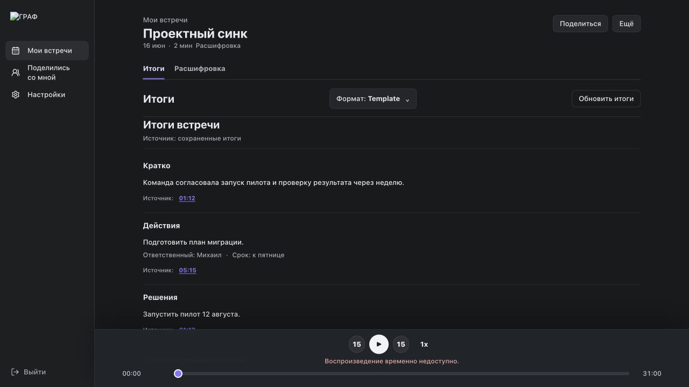
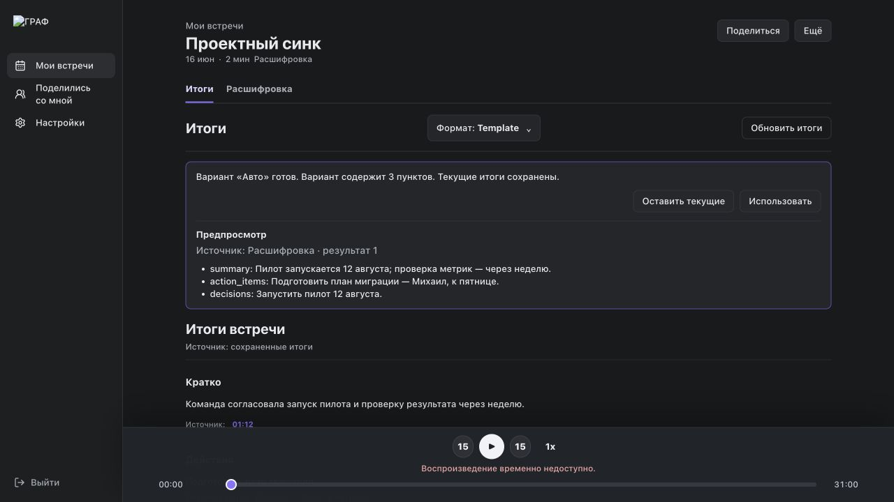

# Design audit: путь до ценности итогов встречи

Дата: 2026-08-04. Audit выполнен на текущем GRAF build и synthetic data.

## Outcome

Feature 138 уже дала правильную визуальную основу: компактные tabs, спокойный
Notes-документ, приоритет «Кратко → Действия → Решения», conditional owner/due,
source timestamps и постоянный player. Redesign не нужен. Feature 139 должна
закрыть pipeline/provenance и одинаково донести этот результат до candidate и
summary-only surfaces.

| Область | Сейчас | Цель |
|---|---:|---:|
| Первые 30 секунд / hierarchy | 4/5 | 5/5 |
| Evidence и доверие | 2/5 | 5/5 |
| Candidate decision | 2/5 | 5/5 |
| States / recovery | 3/5 | 5/5 |
| Shared journey | 2/5 | 4/5 |
| Accessibility | 3/5 | 5/5 |
| Visual restraint / brand distance | 5/5 | 5/5 |

## Current accepted state



Сильные стороны: первый экран сразу отвечает на рабочие вопросы; дополнительные
разделы не конкурируют с primary; источник и player находятся рядом с
результатом. Broken logo в screenshot относится только к synthetic harness,
который не обслуживает static asset, и не является product finding.

## Current candidate state



P1: preview показывает flat список с внутренними `summary`, `action_items`,
`decisions`; owner/due и source destination до «Использовать» отсутствуют. Это
перекладывает проверку на пользователя после принятия, когда ошибка уже могла
попасть в share/export.

## Journey findings

1. **Capture → transcript**: существующие visible capture, stop, processing и
   transcript границы корректны и не меняются.
2. **Transcript → first value**: быстрый deterministic baseline появляется сам,
   но может пересказывать первую реплику. Качественный вариант требует ручного
   запуска — лишний шаг до основной ценности.
3. **AI → trust**: schema допускает пустой source list, а runtime проверяет ID,
   но не semantic support. Prompt получает fake `Speaker N` по номеру сегмента.
4. **Candidate → decision**: preview не позволяет проверить важные поля и
   источник до accept.
5. **Accepted → evidence**: deterministic refs seekable, AI refs теряют
   timestamp при persistence. Кнопка иногда остаётся без доступного player/
   transcript destination; успешный jump не переносит keyboard focus.
6. **Accepted → share**: summary-only route имеет отдельный raw-key renderer и
   browser entry может закончиться JSON. Candidate при этом правильно не
   раскрывается.
7. **Recovery**: transcript/quick baseline переживают AI failure, но три
   одинаковых primary states и optimistic «Готово» создают шум/ложное ожидание.

## Target IA

```text
Встречи
└── title · date · duration · artifact readiness · access when non-owner

Meeting detail
├── h1 + readiness + allowed Share/More actions
├── Итоги
│   ├── один aggregate state, если документ ещё не готов
│   ├── h2 Кратко
│   ├── h2 Действия (owner/due only when stored)
│   ├── h2 Решения
│   ├── Дополнительные разделы
│   └── quality candidate
│       ├── та же локализованная IA
│       ├── source before acceptance
│       └── Оставить текущие / Использовать
└── Расшифровка + focusable exact segment + persistent player
```

Summary-only использует тот же read-only summary projection и никогда не
показывает transcript/candidate content вне разрешения.

## Interaction rules

- Automatic generation не означает automatic acceptance/share.
- Source — button только при доступной цели; иначе plain bounded label.
- Одно действие создаёт один понятный outcome; никаких hidden destructive
  regeneration или неожиданных notifications.
- Ошибка AI не блокирует transcript, playback или текущие итоги.
- Internal keys, JSON, provider/model terminology и free-form technical errors
  не попадают в пользовательскую поверхность.
- 390 CSS px, keyboard, focus, headings и assistive announcement входят в
  acceptance, а не в polish after release.

## Scope discipline

Не добавляются task hub, meeting chatbot, CRM sync, transcript editor, dashboard
widgets или новая visual system. Они увеличили бы surface area, но не закрыли бы
найденный evidence/acceptance разрыв.
