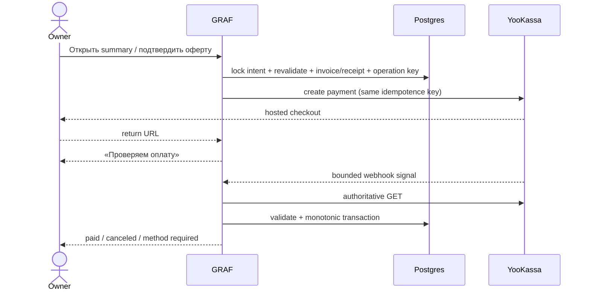

# Contract: billing lifecycle and entitlements

## Authority hierarchy

1. Immutable catalog/config and existing workspace role define eligibility.
2. Confirmed YooKassa GET defines provider payment/refund truth.
3. GRAF invoice/subscription ledger defines commercial truth and schedule.
4. Derived entitlement snapshot defines product access; UI and clients never invent it.

Redirect URL, browser state, client amount, webhook body and email delivery are never authorities.

## Checkout sequence

The primary button is `Оплатить {amount} ₽ в YooKassa`; offer and recurring checkboxes start unchecked. Repeat clicks return the existing operation. Intent expiry before provider mutation creates no invoice. After mutation, pending/unknown invoice and promo stay locked even if UI/hosted URL appears abandoned; new checkout is blocked until authoritative final cancellation. Late success applies to that original invoice. Only then may void/release/supersession occur.

## Subscription behavior

- Cardless trial: current `Free` user explicitly confirms `Начать 7 дней бесплатно`; one atomic activation per verified `UserIdentity` across every workspace/login method/session starts exactly seven days, requires no card/recurring consent, and expiry → `Free` with no automatic charge.
- Paid success: current period activates after GET-confirmed success. `saved=false` produces `method_required` for renewal.
- Cancel: `Отключить автопродление` is directly reachable, reason optional, access continues to exact period end, all future charge jobs are vetoed immediately.
- Resume: requires usable method and exact next amount/date; no hidden immediate charge.
- Plan/cycle change: month↔year applies at next period boundary with no base-plan mid-cycle proration. Trial selects first purchase; cancel-scheduled must resume; renewal unknown blocks a new operation.
- Core use: Trial/`Личный` meetings/minutes/transcription/AI are `unlimited`; Free has 18 000 exact accepted seconds per Moscow calendar month with no rollover or meeting-level rounding. Technical safety/rate/fair-use ceilings remain separate and reviewable. Customer storage counts only normalized playback: Free 250 MB, Trial 500 MB, `Личный` 2 GB or one selected 5/20/100/500 GB total-capacity add-on. At full capacity every plan retains explicit `Обработать без сохранения аудио`; Free consumes accepted seconds, Trial/`Личный` have no commercial counter.
- Storage add-on: initial checkout has base+add-on lines. During a paid interval, mid-cycle increase charges a positive pro-rata difference for remaining billable seconds to the shared renewal anchor; zero-money bonus seconds are excluded. During a bonus interval the change waits until next paid renewal. Decrease/removal waits until renewal. Add-on never survives the final base/bonus cutoff or owns a separate subscription anchor.

## Renewal without grace

There is exactly one automatic renewal operation per period. Authoritative success extends paid term. Final canceled/unusable method causes `Free` at exact `paid_through`; no T+1/+3/+5 charge exists. HTTP timeout/500 remains `unknown`: same body/key GET/recovery continues, but after cutoff access is Free with `renewal_resolution_pending` and no manual pay CTA.

Late success without an effective refusal creates an actual full-duration grant from `access_restored_at` and shifts the anchor. With earlier cancel/payment-data refusal/account close, recurring authority stays off, access remains Free, one internal financial incident is recorded and the verified payer receives the safe support email instruction. GRAF creates neither a refund case nor a user choice/refund workflow. Any later entitlement correction is an explicit audited backoffice decision independent of recurring authority. Invoice keeps planned interval/duration; UI shows actual interval only for an actual grant.

## Referral service time

First eligible monthly payment grants the referrer 7 calendar days; annual grants 30 after 14 calendar days. A security review may pause maturity; a provider-confirmed refund before maturity prevents the grant, while a later confirmed refund follows the bounded append-only reversal policy. A support email alone changes nothing. Active renewal appends a zero-money interval after paid period and shifts next charge. Cancel-scheduled appends the final service/add-on cutoff but creates no renewal job and displays `Следующее списание: не запланировано`. On Free it waits up to 12 months. UI separates `Оплачено до`, `Бонус до` and `Следующее списание`; no payment, receipt, cash balance or negative-time debt. Rolling cap is 180 days/workspace/12 months.

## External refund boundary

Cancel is not refund. Invoice history shows only a configured refund/support email, safe invoice reference, warnings not to send card data/provider ids/meeting content and `Написать письмо`. The user sends the message through an external mail client. GRAF stores no request, basis, correspondence, amount, decision, case, status, timeline or SLA and performs no provider mutation.

Support calculation, approval, communication and manual execution in the YooKassa merchant cabinet are an external merchant-backoffice process. GRAF observes only confirmed provider refund/receipt truth through webhook signal plus GET/list/registry reconciliation. Observation may prevent or reverse a referral reward by immutable policy; any entitlement/add-on correction needs a separate explicit audited authority and never restores recurring consent. No refund outcome is rendered to the user.

## Entitlement decision response

Every protected action receives: `allowed`, `capability`, `source_plan_version`, `limit_mode` (`unlimited|quota`), nullable `used/included/remaining/reset_at`, storage `used/reserved/capacity`, `freshness_at`, and one bounded denial reason (`plan_required`, `free_limit_reached`, `storage_full`, `renewal_unconfirmed`, `usage_stale`, `safety_ceiling`, `fair_use_review`). Paid unlimited dimensions never deny from a commercial remaining counter; failed/canceled Free value releases reservation. `fair_use_review` carries affected capability, reason class and review deadline, never an invented balance.
