# GRAF: исправление светлой темы и повторная проверка

Дата: 2026-09-06. Ветка: `240-cabinet-ux-overhaul`.
PR: [#6560](https://github.com/yshishenya/graf/pull/6560), issue:
[#6561](https://github.com/yshishenya/graf/issues/6561).
Уровень риска: `high-risk-product`; без merge, релиза и развёртывания.

## Результат

Исправлены найденные причины смешения светлой и тёмной тем. В проверенных
видимых состояниях текст и элементы управления читаются, явный выбор темы
имеет приоритет над ОС. Автоматическая и соответствующая явная палитры совпали
во всех шести сочетаниях. Независимые замечания к CSS устранены.

Это приёмка исправлений темы, **не полная приёмка всего F240** и не проверка
установленного macOS-приложения. Предыдущий theme PASS отозван в
[историческом отчёте](design-qa.md). Состояние коммита и точной GitHub-проверки
фиксируется в PR; локальные результаты не заменяют `governance-fast`.

## Что изменено

- Один источник палитры вместо поздних дублей и локальных тёмных переменных.
  Sidebar, меню профиля, основная область и окна наследуют согласованные цвета.
- Цвета текста, поверхностей, полей, подсказок и предупреждений связаны с темой:
  список, фильтры, сортировка, загрузка, вход и код, плеер и спикеры, удаление,
  сообщения общего доступа и экспорта.
- Светлый знак GRAF адаптирован к светлой панели CSS-фильтром; сторонних
  изображений и библиотек не добавлено.
- Разделены акцент для текста и заполненный фон кнопок/переключателей.
  Сохранены различимые наведение, нажатие, фокус и выбранное состояние.
- У сегментов и маркеров спикеров появился контрастный внутренний контур;
  исходные цвета спикеров и размеры элементов сохранены.
- Удалён только доказанный лишний CSS: [реестр](legacy-register.md).

Производственный diff корректирующего прохода — только `cabinet.css`, на 55
строк меньше. JS, шаблоны, маршруты, HTTP-методы, CSRF, поля и обработчики
не менялись. Не изменены запись, обработка, права, вход, удаление, экспорт,
оплата и хранение. Тестовый стенд расширен настоящими render-функциями;
новых производственных маршрутов нет.

## Измеренный контраст

Обычный текст: минимум 4,5:1; значимые графические элементы: 3:1. Реально
отключённые controls не объявлялись нарушениями. Значения «после» ниже взяты
из вычисленных браузером стилей, кроме явно отмеченных проверок исходников.

| Элемент | До | После | Доказательство |
|---|---:|---:|---|
| Значения фильтра | 1,04:1 | 14,23:1 | Открытый фильтр, светлая тема при тёмной ОС |
| Подписи фильтра | 2,21:1 | 6,13:1 | Те же реальные select/label |
| Имя и доступные команды профиля | 1,20:1 | 13,00–15,96:1 | Открытое меню и подменю «Вид» |
| Подсказка поиска | 2,72:1 | 6,13:1 | `::placeholder` |
| «Выбрать» / «Название» в загрузке | 1,11 / 1,58:1 | 15,96:1 | Открытое окно загрузки |
| Крестик загрузки | 1,95:1 | 6,87:1 | Значимая иконка, порог 3:1 |
| Названия встреч | Фиксированный светлый текст | 15,96:1 | Список с тремя синтетическими записями |
| Заголовок / метаданные выбранной строки | — | 12,79 / 5,51:1 | Checkbox и панель «Выбрано: 1» |
| Поля имени спикера / входа | Тёмная локальная подложка | 14,23:1 | Настоящие поля, светлая тема |
| Подсказки полей | 4,11:1 при повторном проходе | 6,13:1 | Общий `input::placeholder`, проверен после исправления |
| Предупреждение удаления | Фиксированный светлый текст | 15,96:1 | Окно открыто и отменено; ничего не удалялось |
| Время / имя спикера | Фиксированные цвета | 6,87 / 15,96:1 | Плеер и расшифровка |
| Выбранная тема в подменю | — | 6,16:1 light / 5,00:1 dark | Оба явных оформления |
| Ошибка кода / успех входа | Фиксированные светлые статусы | 8,25 / 5,83:1 | Синтетические сообщения настоящего шаблона |
| Ошибка ввода получателя | Фиксированный светлый статус | 8,85:1 | «Поделиться» → ввод `а` → «Найти» |
| Основная кнопка при наведении, dark | 4,04:1 | 4,84:1 | Расчёт CSS + контракт + независимое ревью |
| Контур сегмента, light / dark | Слабый контраст жёлтого сегмента | 13,00 / 11,05:1 | CSS-расчёт контура относительно дорожки |

## Метод и повторяемость

Стенд: `http://127.0.0.1:8765`, production Jinja/CSS/JS, только синтетические
имена, адрес `theme@example.test`, текст и сгенерированная тишина. Использована
встроенная браузерная вкладка CUA. Системный экран был заблокирован, но прямой
доступ к тестовой вкладке работал; пароль и системные настройки не трогались.

Контраст рассчитан по относительной яркости sRGB:
`(Lmax + 0,05) / (Lmin + 0,05)`. Учтена альфа-композиция фонов предков,
`rgb()` и вычисленный `color(srgb ...)`; исключены скрытые и закрытые окна.
Замеры не сертифицируют произвольные градиенты, opacity и всю страницу целиком.
Нулевое число найденных компонентов не считается PASS.

Исходный CSS `8eb1bb8078140d51ae910197a613ce0999a98ed9` отклонён новым
контрактом: `Expected one canonical :root palette, got 2`. До исправления
также заново измерен провал фильтров. Тест содержит отрицательные контроли
низкого контраста, локального переопределения и расхождения автоматической темы.

Команды, страницы и последовательность воспроизведения:
[quickstart.md](quickstart.md). Сырые измерения и функция расчёта:
[theme-measurements.json](evidence/theme-fix/theme-measurements.json).
В нём сохранены 104 текстовых замера в 17 состояниях после исправлений:
нарушений выбранного порога не обнаружено. Отдельно записаны 6 сочетаний
темы и ОС, по 7 измеренных элементов в каждом. Это число проверок,
а не число уникальных компонентов и не автоматическая сертификация страницы.

## Браузерная проверка

| Проверка | Результат и границы |
|---|---|
| Идентичность страницы, содержимое, отсутствие аварийного экрана | PASS на проверенных маршрутах списка, detail, входа и кода |
| Console error/warn | Пустой список при последней проверке. Не реализованные API стенда дают ожидаемые сообщения о недоступности вариантов итогов/поиска получателя; это не доказательство рабочего backend |
| Шесть сочетаний light/dark/system × тема ОС | PASS: палитры совпали; в каждом сочетании открыто окно загрузки и проверены 7 видимых текстовых элементов |
| Явная тёмная тема при светлой ОС | Дополнительно проверены плеер и открытое предупреждение удаления; смешения тем нет |
| Фильтр / сортировка / профиль / upload | Открываются; выбранное значение и команды читаются. Действительная загрузка файла не выполнялась |
| Выбор и отмена удаления | Панель показывает одну выбранную запись; предупреждение читается; «Отмена» возвращает фокус на исходное действие |
| Спикер / вкладки / код | Открыто редактирование имени; вкладка расшифровки переключается; одна цифра переводит фокус на следующий слот, вход не отправляется |
| «Поделиться» | Настоящий диалог открыт, локальная ошибка ввода читается, закрытие возвращает фокус на «Поделиться»; доступ не изменяется |
| Плеер | Play меняется на Pause и обратно. Реальную перемотку этот стенд не подтверждает — см. ограничения |
| Reduced motion / hover / pressed | Режимы reduce и no-preference использованы; CSS-защиты сохранены. Точные hover/pressed комбинации проверены контрактом и независимым ревью, не полной мышиной матрицей |

Проверенные **фактические CSS-размеры**, а не только размер снимка:

| Страница | Окно | `scrollWidth` | Ширина main |
|---|---|---:|---:|
| Standalone список, light | 320 × 844 | 320 | 320 |
| Standalone список, light | 390 × 844 | 390 | 390 |
| Standalone список, light | 768 × 900 | 768 | 768 |
| Embedded detail, light, свёрнутая панель | 1024 × 768 | 1024 | 960 |
| Standalone список, light, свёрнутая панель | 1440 × 900 | 1440 | 1376 |

Выполнены также снимки мобильного detail на 390 × 844 и раскрытой боковой
панели. Размеры картинки могут отличаться от CSS viewport из-за масштабирования
панели приложения; это не попиксельное сравнение геометрии с исходным снимком.

## Проверки кода и независимое ревью

Итоговый набор из quickstart: **369 passed**, 2 предупреждения существующих
библиотек, 216,82 с. В него входят новые 34 проверки темы/стенда. Ruff,
`node --check`, `git diff --check` и проверка Spec Kit governance проходят.
Подробности и хронология — [validation.md](validation.md).

Один субагент реализовал только тесты и расширение стенда, второй независимо
проверил требования и CSS, включая реальные места использования цветов и
Ponytail. Замечания к заполненным controls, hover-кнопкам, границам сегментов
и active+hover/pressed исправлены и повторно проверены. Reviewer-owned UX
checklist подтверждает качество требований, а не полную приёмку реализации.

## Что ещё не подтверждено

- Настоящий WKWebView, установленное приложение, VoiceOver, все варианты
  billing/shared/processing/failed и полная исходная матрица F240.
- Успешное предоставление доступа и экспорт: сохранность контрактов и CSS
  проверены, но новая браузерная операция с реальным backend не выполнялась.
- Перемотка тестового WAV: сервер стенда не поддерживает Range,
  `seekable=[[0,0]]`. Поэтому браузерный результат не подменяет прошедшие
  PostgreSQL-backed контракты реального плеера.
- У короткого окна загрузки и закреплённой embedded-панели 320 px есть
  отдельные задачи F244. Новое наблюдение: на 390 px кнопка спикеров частично
  пересекает «Назад 15»; также отмечено примыкание legal footer к низу панели
  входа с длинным сообщением. Передано в параллельную задачу, здесь геометрия
  не менялась. Отсутствие горизонтального overflow не означает отсутствие
  любого локального наложения.
- Сравнение с Krisp использует прежние наблюдаемые паттерны, без нового
  заявления о полной визуальной идентичности. Более контрастные цвета —
  сознательное отличие в пользу доступности; код и ассеты Krisp не копируются.

## Скриншоты

Все изображения ниже — синтетические. Исходное состояние и итоговые состояния
показаны отдельно; старые скриншоты F240 не перезаписаны.

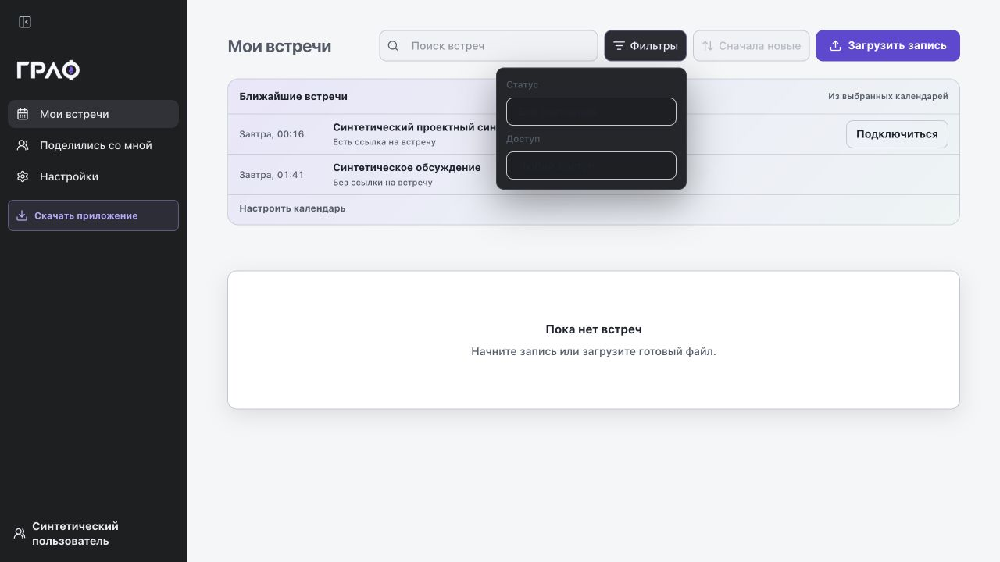
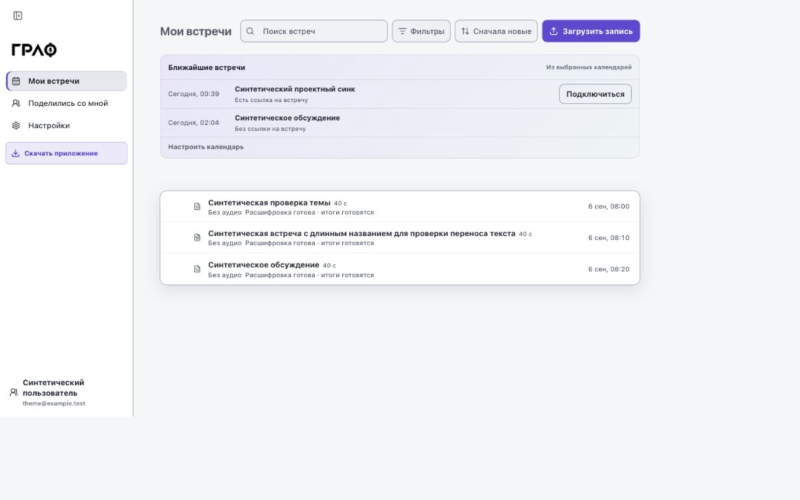
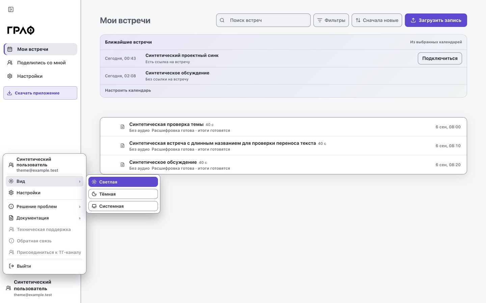
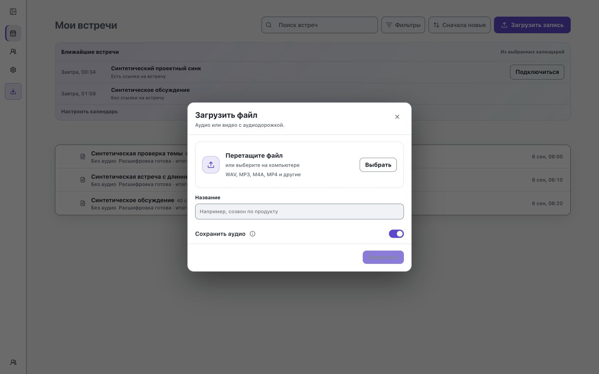
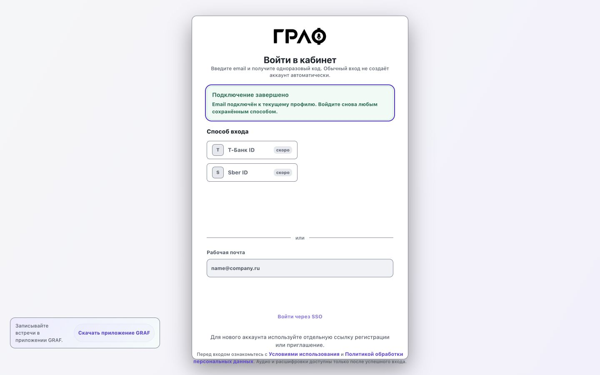
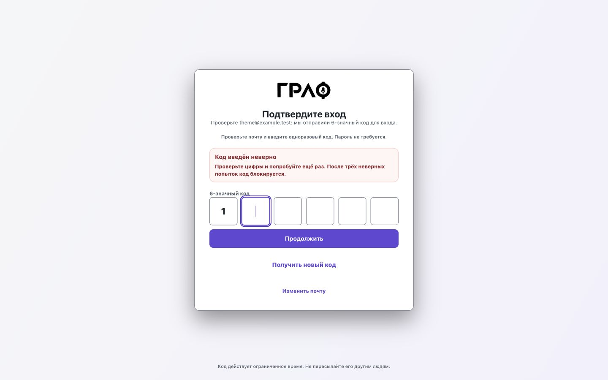
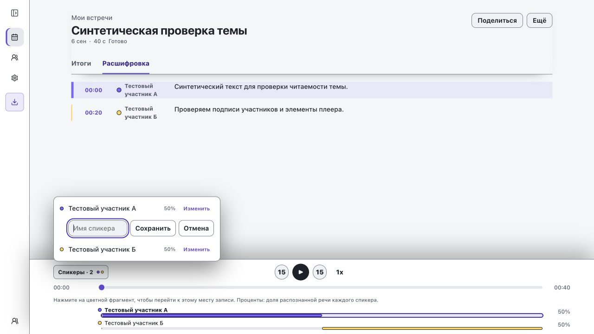
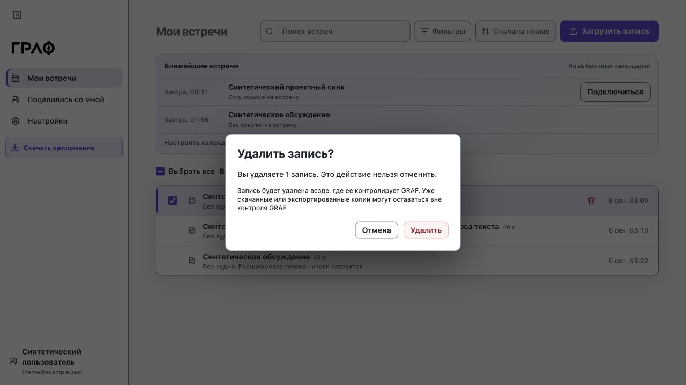
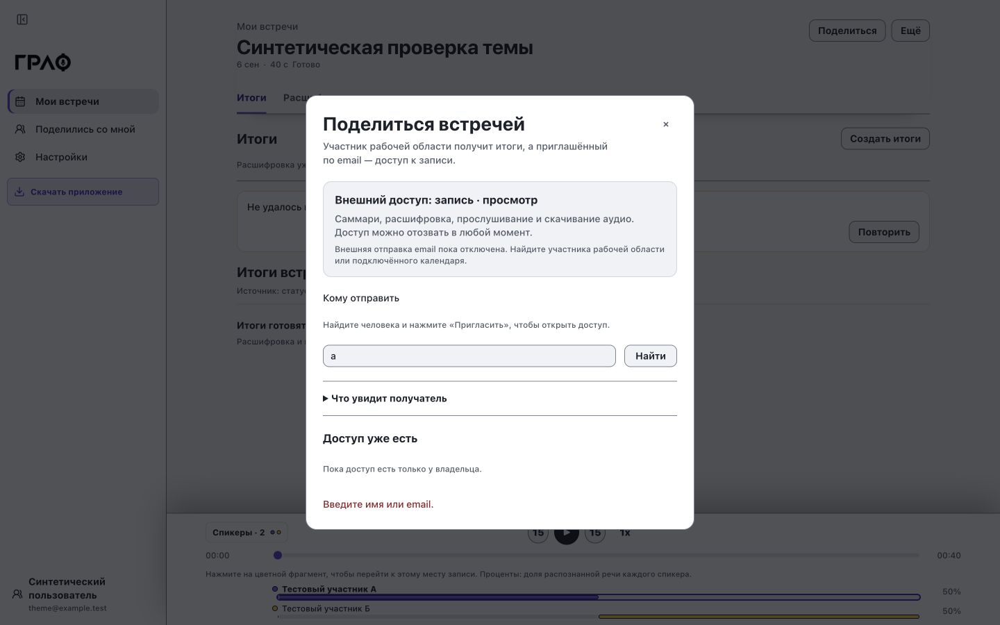
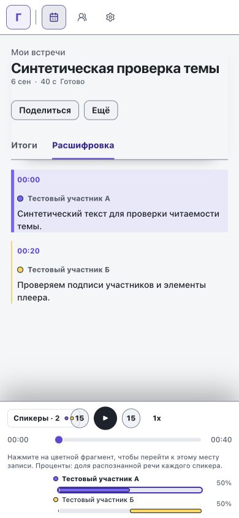
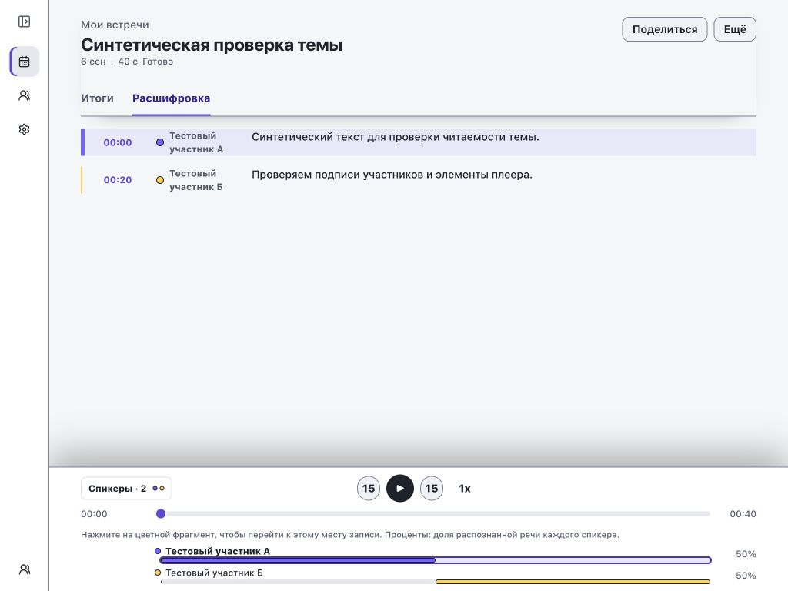
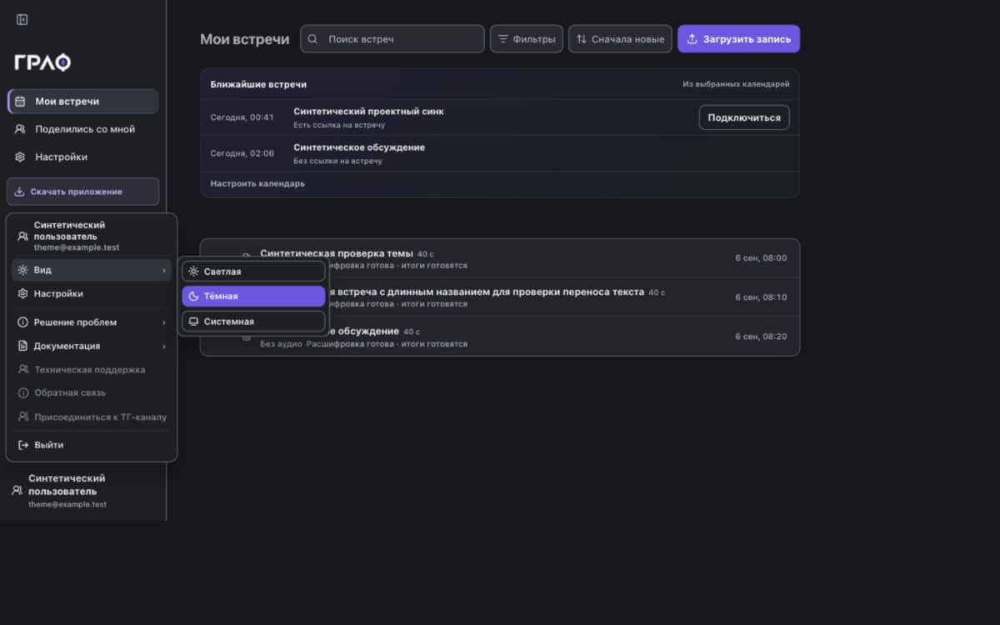
