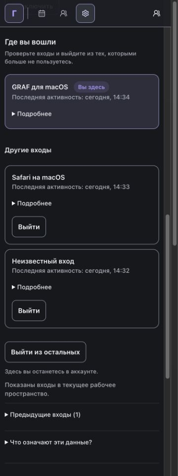
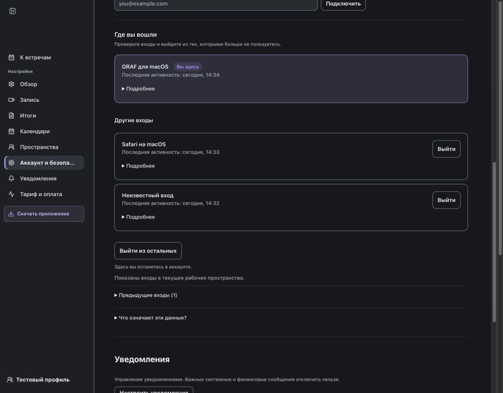

# F248: реализация и проверки

Дата: 2026-09-06. Ветка: `codex/248-trustworthy-account-sessions`.
Исходный HEAD: `6ff8db3ee18dc7faf52fd8a31c8bade97c5ca548`.
Lane: high-risk-product (авторизация, жизненный цикл сеансов, интерфейс).
Итоговый SHA и обязательный GitHub governance-fast фиксируются в PR. Это отчёт об изменениях, а не разрешение на релиз.

## Причины и исправления

1. WKWebView не передавал устойчивый признак GRAF при отправке HTML-форм. Общие регистрации `browser-email` / `browser-login` смешивали независимые входы. Production WKWebView теперь задаёт `applicationNameForUserAgent` до создания; сервер создаёт отдельную `login:<uuid>` регистрацию. Полный User-Agent не сохраняется; ограниченная подпись клиента не участвует в выдаче прав.
2. Название провайдера и статус записи не доказывали тип клиента и действующий доступ. Новый список использует срок, состояние сеанса и согласованную trusted binding; текущий сеанс первый. Неизвестные старые клиенты не переклассифицируются. Законный unbound bootstrap отличим от повреждённой привязки и не получает tenant-доступ.
3. Principal-only API не всегда учитывали отзыв устройства. Общий resolver проверяет owner/workspace/device/binding после правильной смены RLS-контекста. Общий отзыв завершает direct и binding-only сеансы, блокирует bindings и не оживляет терминальные записи.
4. Внешний переход к оплате мог делить токен с приложением. Теперь он создаёт независимый браузерный сеанс со сроком не позже исходного; callback заново проверяет источник, устройство, членство и одноразовый state.
5. Раздел объединён в «Устройства и сеансы». Действующие входы, раскрываемые сведения и история отделены; названы область рабочего пространства и смысл последней связи. Single/bulk действие имеет серверное подтверждение, отмену, защиту текущего сеанса и честный результат ошибки.

## Независимое ревью

Рецензент `references` проверил correctness/security/UX и отдельно Ponytail. Найдены и устранены:

- P1: предварительный `RegisteredDevice FOR UPDATE` в массовом отзыве создавал цикл с обновителем активности. Конкурентный тест на двух транзакциях получил настоящий `DeadlockDetectedError` до исправления. Удалены преждевременные блокировки устройств и несортированная блокировка сеансов; общий helper первым блокирует сеансы в стабильном порядке. Итоговый набор account: 107 passed.
- P2: общий PrincipalDependency обновлял last_seen при выходе. Два теста настоящих POST `/logout` и `/desktop/meetings` воспроизвели ошибку; activity пропускает только эти операции. Проверяются сохранение трёх временных полей и фактический revoke: 2 failed до исправления → 11 passed после в целевом наборе.

Повторное заключение рецензента: APPROVED; новых блокеров нет. Ponytail: новых зависимостей и лишних уровней нет, проверки границ сохранены.

## Проверки

Команды выполняются из корня, кроме явно указанного перехода. PostgreSQL создаётся скриптом в отдельном контейнере и удаляется после проверки; используются только синтетические данные.

```sh
GRAF_TEST_WORKERS=2 apps/server/scripts/run_local_postgres_tests.sh --focused tests/integration/test_account_lifecycle.py tests/contract/test_account_routes.py tests/contract/test_settings_ui_contract.py tests/unit/test_settings_view_models.py
```
Результат: **107 passed**, 30.18 s pytest / 34 s phase. Включены single/bulk, browser/desktop, no-JS server confirmation, отсутствие CSRF, повтор, защита текущего, неизвестная цель, действительность токена до/после отзыва, конкурентные транзакции, состояния и часовой пояс.

```sh
GRAF_TEST_WORKERS=2 apps/server/scripts/run_local_postgres_tests.sh --focused tests/unit/test_auth_session_clients.py tests/unit/test_workspace_onboarding.py tests/contract/test_auth_contracts.py tests/integration/test_web_owner_session_context.py tests/integration/test_rls_stale_session_device_context.py
```
Результат финального повторного прогона: **177 passed**, 172.61 s pytest / 177 s phase. Все исходные три отказа устранены; новые client/revoke/expiry/handoff/logout проверки и затронутые существующие сценарии прошли вместе.

```sh
GRAF_TEST_WORKERS=2 apps/server/scripts/run_local_postgres_tests.sh --focused tests/integration/test_rls_postgres_policies.py -k 'session_client or billing_handoff or email_login or workspace_switch'
swift test --package-path apps/macos --filter DesktopCabinetWorkspaceTests
```
RLS: **2 passed**, 2.90 s / 7 s phase в финальном повторе новых client/activity/revoke и независимого billing callback; ранее ещё проверены email и workspace переходы под ролью приложения (общая группа 4 passed). Swift: **47 passed**. Новый тест использует production EmbeddedCabinetWebView внутри NSHostingView и живой loopback HTTP-сервер: GET → form POST → 303 → GET, во всех запросах WebKit и GRAFDesktop marker. До фикса этот тест дал три ожидаемые ошибки отсутствующего marker.

Ruff по всем изменённым Python файлам: PASS. `git diff --check`: PASS. `python3 scripts/check_spec_kit_governance.py`: PASS; повтор перед PR. Changelog fragment и описание PR проходят штатные валидаторы. Дополнительный `check-development-process.py --pr-body ... --pr-title ...`: PASS после уточнения категории `high-risk-product`, owned_paths и текущего SHA в локальном ignored context; явная классификация Legacy Impact добавлена в spec.

## Интерфейс

Playwright CLI, Chromium и WebKit, реальные production templates/viewmodels/static assets с синтетическим аккаунтом на loopback origin:

- 375 / 768 / 1280 px: горизонтального переполнения нет, текущий сеанс первый.
- «Подробнее» открывается клавишей Enter; фокус видим. История раскрывается.
- Отдельный Chromium context с JavaScript disabled: форма открывает подтверждение с `confirm=1` и ссылкой «Отмена».
- Ошибка отзыва отображается через `role=alert`, без успешного результата.
- Визуально проверены мобильный и широкий списки; снимки содержат только синтетический профиль.

Preview сервер используется только для проверки отображения и навигации: он не доказывает изменение БД. Настоящие CSRF/confirmation/revoke и независимость токенов доказаны PostgreSQL route tests; production WKWebView transport — Swift тестом. Внешние OAuth провайдеры и установленная публичная сборка с приватным аккаунтом не использовались.

## Convergence и границы

FR-001–012, SC-001–004, три пользовательских сценария, решения plan о моделях/сроках/RLS/UI/зависимостях и применимые принципы конституции проверены. Реализация согласована с требованиями; T009 выполнен: PR #6626 создан и governance-fast прошёл на SHA реализации; текущий SHA после документального closeout проверяется отдельно и фиксируется в завершающем комментарии PR. Дополнительные задачи реализации не требуются.

Legacy Impact: untouched; нового legacy path нет. БД, зависимости, секреты, сбор контента/геолокации, capture и локальное удаление не меняются. Публичный релиз, full CI, notarization/stapling/Sparkle и deployment не запускались и остаются отдельными релизными этапами. Для появления новой классификации у пользователя требуются обновлённые сервер/macOS клиент и новый вход; старые сведения остаются честно неопределёнными.

## Первая проверка GitHub

PR: https://github.com/yshishenya/graf/pull/6626.
Запуск https://github.com/yshishenya/graf/actions/runs/34019284631 на `085a8e39ea75d718b2d37186f88ddd4c27a2ca5b`: **FAIL**, не считается обязательным успешным gate.

Прошли 224 governance tests и 1413 fast server tests; в группе изменённых тестов 276 passed, 1 failed. Единственный отказ — новый строгий RLS billing handoff test: `permission denied for table account_merge_intents` при совместном запуске. Причина: предшествующий тест откатывает схему до 0022 и пересоздаёт account_merge_intents, лишая ранее созданную module-scoped тестовую роль grants. Новый тест использует существующий `_exact_app_role_engine` для свежей роли без superuser/BYPASSRLS на текущей схеме. Production grants и политики не менялись. Полный модуль в исходном порядке: 35 passed / 1 failed до исправления → **36 passed**, 10.77 s после. Команда: `apps/server/scripts/run_local_postgres_tests.sh --focused tests/integration/test_rls_postgres_policies.py -q`. Ruff PASS. Отдельный запуск этих RLS тестов ранее проходил.

## Успешная проверка PR

`governance-fast`: **PASS**, https://github.com/yshishenya/graf/actions/runs/34019926551, SHA `49f5293f05c8b43dbd22db9d4e9206d8919fc861`, job 9m30s. Все обязательные шаги, включая тесты и проверку итоговых доказательств, успешны. CodeRabbit: SUCCESS, замечаний к строкам diff нет.

T001–T009 выполнены; каждая строка tasks.md содержит связь с issue. Документальный closeout не меняет production code; новый SHA также обязан получить успешный governance-fast. Итоговый run URL и точный SHA хранятся в завершающем комментарии PR #6626 и комментариях задач. Umbrella #6614 остаётся открытой до отдельного merge closeout; релиз и deployment не входят в запрос.


## Пользовательская подача: T010–T011

Повторные clarify/analyze и независимый UX gate приняты до реализации. Раздел называется «Где вы вошли»: текущая карточка выделена фоном, рамкой и меткой «Вы здесь», остальные входы идут отдельной группой. Короткая последняя активность заменяет повторяющиеся точные даты; календарный день определяется в зоне профиля, будущие значения не выдаются за «сейчас». Точное время, зона, способ и срок входа остаются в native details. Других входов может не быть; неизвестные данные не выдаются за чужой доступ. Кнопка выхода из остальных находится после списка. Подтверждение называет цель и последствия; первоначальный фокус на отмене, включая режим без JavaScript.

Изменения ограничены представлением, formatter и микротекстами. Проверки доступа, CSRF, confirm=1, область пространства, API и БД не меняются. Повторно использованы существующие CSS tokens, Jinja macro, native details и механизм фокуса. Новых зависимостей, активов интерфейса или JavaScript нет.

Локальные проверки продолжения:
- `apps/server/scripts/run_local_postgres_tests.sh --focused tests/integration/test_account_lifecycle.py tests/contract/test_account_routes.py tests/contract/test_settings_ui_contract.py tests/unit/test_settings_view_models.py`: **110 passed**, 31.12 s. Настоящие single/bulk confirmation и сохранение текущего доступа проходят на изолированном PostgreSQL. Новые проверки покрывают календарные дни/переход года/UTC fallback/future/unknown, структуру текущего входа, точные подробности и доступные имена.
- После уточнения подписей раскрытий повторены `tests/contract/test_account_routes.py tests/contract/test_settings_ui_contract.py tests/unit/test_settings_view_models.py` через тот же изолированный runner: **92 passed**, 0.40 s.
- Ruff изменённых Python файлов: **PASS**. `check_spec_kit_governance.py`: **PASS**. `git diff --check`: **PASS**.
- In-app Chromium: 375/768/1280 px без горизонтального переполнения; визуально просмотрены тёмная и светлая темы, текущая карточка, подробности, предыдущие входы, пояснения, подтверждение/отмена с клавиатуры и ошибка через role=alert.
- Повторный WebKit: 375/768/1280 px — currentFirst=true, keyboardDetails=true, overflow=false; подтверждение и фокус отмены PASS. Отдельный context с javaScriptEnabled=false: confirmation=true, cancel=true, safeFocus=true. Проверено на production HTML/CSS с синтетической поверхностью; preview не эмулирует реальные изменения доступа.
- Независимый reviewer: окончательные снимки 375/768/1280, светлая тема, подтверждение и diff — **PASS**; Ponytail: **Lean already. Ship**. Evidence рецензента: `../checklists/ux.md`.




Convergence продолжения: FR-013–016, SC-005–006 и сохранение FR-004/006/007/010–012 проверены; новых пробелов реализации нет. T010/T011 закрываются по локальному результату. Обязательный governance-fast нового SHA — отдельное условие PR, фиксируется в комментарии после push. Релиз, deployment и проверка приватного аккаунта остаются за пределами этого этапа.
