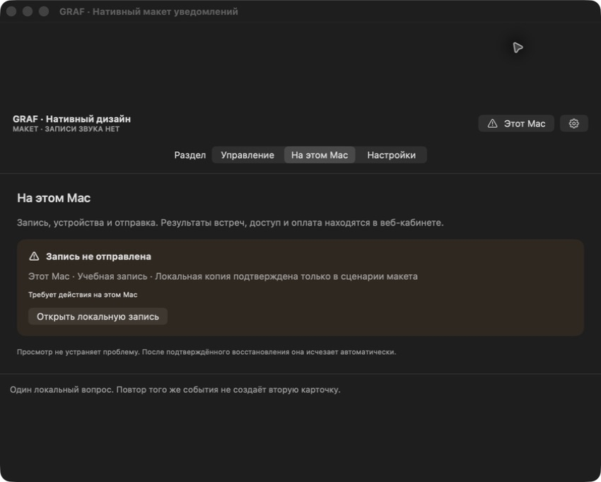
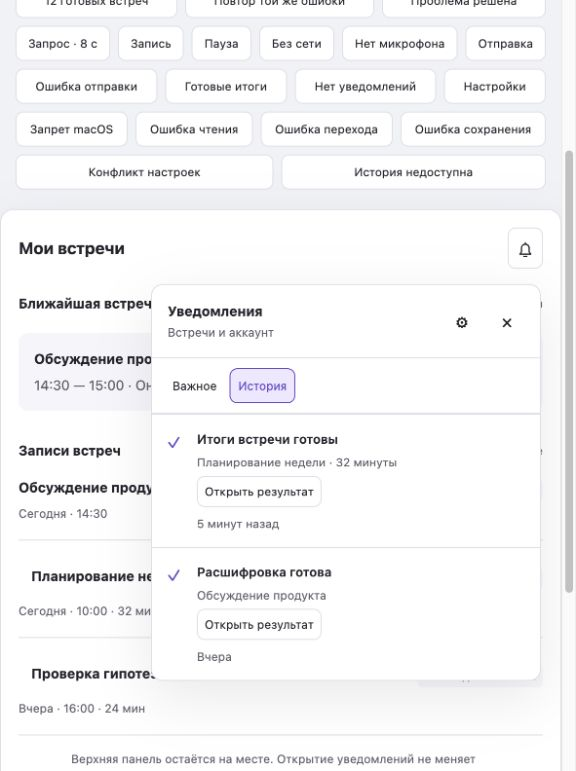
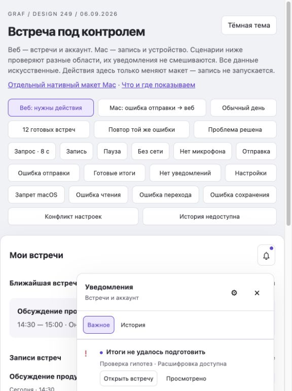
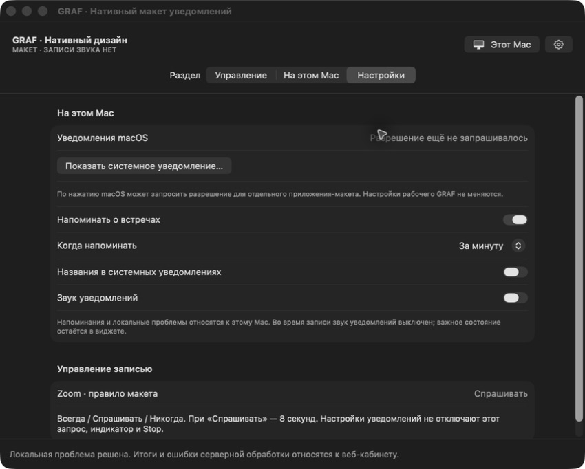
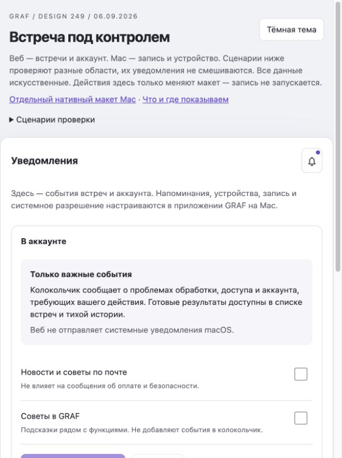
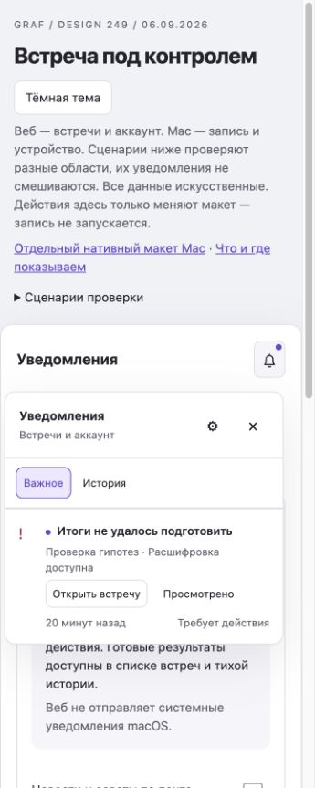

# Разные задачи уведомлений: Mac и веб

Актуальное решение после повторного исследования 2026-09-06. Уточняет прежние варианты review=2/3. Рабочее приложение не изменено; обновлены HTML и отдельный Swift-макет. Risk lane — high-risk UX; внедрение требует открытых reviewer-owned gates.

## Что проверено в Krisp заново

Один аккаунт, две действительно разные поверхности:

| Поверхность | Наблюдение в текущем сеансе |
|---|---|
| Установленный Krisp → Settings → Notifications | Upcoming meeting notifications; Meeting recap; Comments and mentions; On/Off state indicator; Device Setup Reminders |
| Самостоятельный браузер → app.krisp.ai/settings/notification | Только Comments and mentions; пояснение «Get emails about mentions and comments» |
| Установленный Krisp → Settings → App | Open links in desktop app; Show widget; Appearance; Launch at startup; Open Desktop app; Automatically install updates |
| Самостоятельный браузер → app.krisp.ai/settings/app | Open links in desktop app и Appearance; нет локальных startup/widget/update controls |
| Activity внутри установленного Krisp | Лента результатов, Only show unread, Updates, Mark all as read. Открытие панели не сняло прежнюю отметку. Содержимое конкретной встречи в evidence не сохранялось |

Вывод из наблюдения: Krisp действительно учитывает поверхность и её возможности. При этом он предлагает recap на Mac, поэтому строгий отказ GRAF от системных сообщений о результатах — наше продуктовое решение по запросу пользователя, а не якобы точное копирование Krisp. «Comments and mentions» здесь означает письма; наличие web push не подтверждено.

Исследование — обычная работа с интерфейсом и доступностью. Исходники/ASAR/приватные API не извлекались. В аккаунте всё ещё показано окончание trial; реальная новая запись и recap delivery не проверены. Tray popover Krisp не получен; поведение Focus, системных баннеров, приватных встреч и писем не объявляется проверенным. Настройки Krisp не менялись.

## Основная граница

**Приложение Mac: «Что происходит с записью и этим устройством сейчас?»**

**Веб-кабинет: «Что происходит с моими встречами, доступом и аккаунтом?»**

Операционная система macOS — канал доставки нативного приложения, а не третья лента. Встроенный веб-кабинет внутри окна Mac остаётся веб-поверхностью: его колокольчик содержит серверные события. Оконная рамка не меняет владельца события.

В нативной панели нет второго колокольчика с готовыми итогами и финансовыми событиями. Состояние отображается в панели управления и разделе «На этом Mac»: активные локальные проблемы, без счётчика непрочитанного и без «прочитать всё». Веб-колокольчик — «Важное / История», точка только у нового серверного события, требующего действия.

## Матрица содержания и доставки

| Событие | Владелец и место | Когда привлекать внимание | Текст → действие |
|---|---|---|---|
| Встреча скоро начнётся | Mac, календарь | Одно актуальное напоминание по включённой настройке; подавить, если пользователь уже на встрече | «Встреча начнётся через минуту» → «Подключиться». Не запускает запись |
| Предложение автозаписи | Mac, отдельная NSPanel | Только текущий режим 214 «Спрашивать», 8 секунд; без зависимости от OS permission | Явный отсчёт → «Записать» / «Не записывать» / «Запомнить выбор» |
| Старт, пауза, Stop | Mac, постоянный статус/виджет | Непрерывно видно фактическое состояние; отдельные success notifications не нужны | «Идёт запись · 12:34» → «Пауза» / «Остановить» |
| Источник звука потерян / доступ к устройству отсутствует | Mac, текущая панель | Немедленный видимый статус с действием; одно уведомление ОС при разрешении, без обхода Focus | «Микрофон не записывается» → «Проверить микрофон». Состояние системного звука отдельно |
| Мало места / запись остановилась из-за диска | Mac, текущая панель | Фактическая критическая проблема; не скрывается optional-настройками | Фактическая сохранность фрагментов → текущий экран локальной записи/места |
| Кратко нет сети, локальная запись исправна | Mac, текущий статус | Без отдельного баннера и без web-колокольчика | «Нет связи. Запись продолжается» только при подтверждённой локальной записи |
| Локальная отправка требует пользователя | Mac, «На этом Mac» и текущая очередь | Только после достоверного action-required; один инцидент. Не каждая автоматическая попытка | «Запись не отправлена» + сохранность по факту → «Открыть локальную запись» |
| Запись передана серверу | Mac завершает локальную ответственность | Тихо обновить отправку; убрать решённую локальную проблему | «Отправлено»; переход «Открыть встречу» по желанию |
| Ожидание / прогресс обработки | Веб, строка встречи | Без колокольчика, таймера выдуманной ошибки и системного баннера | «Обрабатывается» |
| Итоги / расшифровка готовы | Веб, список и тихая история | Без точки и системного баннера, независимо от открытости Mac | «Итоги готовы» → «Открыть результат» |
| Итоги не удалось подготовить | Веб, «Важное» + строка встречи | Один сигнал после terminal failure, если получатель может действовать | «Расшифровка доступна» → «Открыть встречу» → существующее восстановление |
| Речь не распознана / обработка окончательно не выполнена | Веб, «Важное» | Достоверный terminal, не retry/тишина на живом микрофоне | Фактическая причина → воспроизведение/другой файл/поддерживаемый повтор на экране встречи |
| Адресное предоставление доступа | Веб, «Поделились со мной» + тихая история | Без точки по умолчанию, только реальный поддержанный producer | «С вами поделились встречей» → проверить права и открыть |
| Упоминание / комментарий | Веб, только если функция реально поддерживается | Лишь адресное и требующее ответа; не изобретать producer в этой фиче | Открыть конкретный контекст; письма только по отдельной существующей настройке |
| Оплата / безопасность / доступ требуют действия | Веб, аккаунт/пространство | Только получателю с полномочиями и конкретным действием | Существующий проверенный текст → нужный экран |
| Успешный платёж, чек | Существующий финансовый канал | Не новая точка; обязательная доставка сохраняется | Документы в оплате и прежние письма |
| Интеграция календаря отозвана | Веб, настройки интеграции | Один подтверждённый вопрос владельцу подключения | «Подключите календарь снова» → настройки. Mac тихо показывает недоступность календаря, без второго сообщения того же аккаунтного сбоя |
| Истёк вход | Каждая поверхность показывает собственную недоступность | Не сохранять в историю требование войти в уже недоступный аккаунт | Веб → экран входа. Mac → локальный статус необходимости входа для отправки, Stop остаётся доступен |
| Обновление приложения | Mac, настройки/«Ещё» | Обычная доступность тихо в настройках; установка откладывается до завершения записи | Существующий механизм обновления; нет веб-карточки релиза |
| Советы/новости | Существующая справка/отдельная подписка | Не попадают ни в важную ленту, ни в локальные проблемы | Сохраняем прежние optional flags, не создаём новые разрешения |

## Как не дублировать

1. Сначала определяется смысл и владелец события; затем канал внутри этой области. Обнаружение серверной готовности в Mac-клиенте не превращает её в macOS notification.
2. Нативная локальная проблема никогда не загружается в web inbox, в том числе через trusted bridge. Веб не подтверждает локальную копию на другом устройстве.
3. На Mac одна локальная причина имеет стабильный incident ID. Повтор не добавляет карточку и не повторяет баннер. Просмотр не меняет health; подтверждённое восстановление снимает проблему. Новый подтверждённый инцидент может снова уведомить.
4. Веб — одна карточка результата/инцидента, revision только при значимом изменении. Успехи тихие. Просмотренная активная проблема остаётся доступной, но точка не возвращается от retry. Старый callback не переоткрывает решённую проблему.
5. Пока пользователь уже видит соответствующий статус, второй баннер Mac не показывается. Веб никогда не запускает toast/browser push/звук/мигание вкладки ради уведомления.
6. Нет попытки добиться всемирной exactly-once доставки между устройствами. У веба общий серверный read state, у локального инцидента — конкретный владелец и Mac. Системные сообщения видит только устройство-источник; напоминания — явно включённые устройства, без глобального выбора лидера в первой версии.
7. Разрешение macOS спрашивается по понятному действию в приложении. Отказ и Focus не обходятся; это не отключает постоянное управление записью. Названия во внешнем превью по умолчанию скрыты.

## Полный путь и переход ответственности

1. **Настройка.** В вебе — сообщения аккаунта и существующие письма/подсказки. На Mac — напоминания, внешний preview, звук, разрешение ОС и тест. Автозапись отдельно. Нет переключателя «готовность через macOS» ни в одной новой форме.
2. **Перед встречей.** Mac показывает одно актуальное напоминание. Веб может показывать расписание как содержимое страницы, без дублирующего уведомления.
3. **Запись.** Нативный виджет и Stop доступны при закрытом кабинете, потере сети и запрете OS notifications. Локальная ошибка исправляется на этом Mac.
4. **Отправка.** До подтверждённого принятия файла сервером ответственность у локальной очереди. При ошибке — открыть локальную запись. Успешное принятие снимает локальную проблему.
5. **Обработка.** Ответственность у серверного объекта встречи. Mac не продолжает показывать «ошибку отправки», если файл уже принят. Ошибка итогов не отправляет пользователя заново записывать/загружать звук без причины.
6. **Результат.** Пользователь открывает список встреч в браузере либо тот же кабинет внутри GRAF. Готовности не вызывают дополнительного системного сигнала. Исключения и доступные действия — в веб-колокольчике.
7. **Восстановление.** «Просмотрено» в вебе не решает проблему. Подтверждённый успех убирает её автоматически. На Mac вообще нет задачи «прочитать» локальный сбой: там только исправить актуальное состояние.
8. **Возврат/другой Mac/другая учётная запись.** Нет залпа старых баннеров. Локальные проблемы не путешествуют в другой Mac/аккаунт. Веб заново проверяет права. Пока проверка не успешна, состояние неизвестно, старый приватный контент не показывается.

## Настройки и совместимость

Веб: объяснение «Только важные события» без главного отключателя ошибок; существующие optional_email_enabled и optional_in_app_enabled с прежним смыслом. Не добавляем comments/mentions, пока отсутствует функция. Нет controls микрофона/OS sound/Focus/автозаписи.

Mac: напоминания (за 1 минуту / за 5 минут / в момент начала; отдельное включение), названия в системных уведомлениях, звук (по умолчанию выключен), фактическое разрешение ОС, синтетическая проверка. Нет account billing/results/sharing switches. «На этом Mac» — состояние и восстановление, не новая inbox-история.

Предлагавшиеся result_ready_enabled и read-all не были внедрены в продукт по исследованной базе: убраны из нового проектируемого контракта, а не удалены из пользовательской БД. Перед реализацией повторно проверить текущую схему и клиентов; если такие поля уже появились в другой ветке/релизе, требуется совместимый переход, без сброса явных настроек. Действующие optional flags, billing outbox, локальная очередь и decoder autoRecordTargetIds сохранены.

## Best practices и сознательные решения

[Apple HIG Notifications](https://developer.apple.com/design/human-interface-guidelines/notifications): timely/high-value, не повторять одно сообщение при отсутствии ответа, ненавязчиво обновлять открытый контекст, минимизировать приватный внешний контент. [W3C SC 4.1.3](https://www.w3.org/WAI/WCAG22/Understanding/status-messages.html): доступный статус без навязывания фокуса и чрезмерных объявлений. Строгое разделение Mac/web, отсутствие result-banner и состав важного — решения GRAF по пользовательскому запросу, а не универсальные нормы.

## Приёмка

- 12 серверных готовностей → 0 системных баннеров, 0 новых сигналов веб-колокольчика.
- Локальная ошибка отправки → 1 вопрос на Mac, 0 карточек/точек веб-колокольчика.
- Ошибка итогов → 1 важная серверная карточка, 0 локальных карточек Mac.
- Встроенный кабинет показывает ту же серверную ленту, без новой нативной копии.
- Повтор не создаёт нового сигнала; подтверждённое восстановление снимает только соответствующую проблему.
- Ошибка одной поверхности не блокирует доступные действия другой; Stop работает без сервера и OS permission.

Прототипы синтетические. Внедрение, реальные серверные гонки/доступы, VoiceOver, Focus, несколько устройств и доставка OS notification требуют отдельных проверок. Ничего из этого не считается выполненным на основании макета.

## Проверенные макеты после изменения

1. **Mac: локальная отправка — проверено.** Отдельный раздел «На этом Mac», без колокольчика итогов, счётчика чтения и финансовых событий. Переход к локальному объекту и снятие проблемы после синтетического успеха пройдены.

2. **Веб: локальное событие исключено — проверено.** В сценарии есть локальная ошибка, но колокольчик не зажёгся, в веб-истории только серверные результаты.

3. **Веб: ошибка серверной обработки — проверено.** Одна карточка в «Важном», конкретная встреча, доступная расшифровка и переход к восстановлению.

4. **Настройки Mac — проверено.** Разрешение ОС ещё не запрашивалось; напоминания, preview, звук; нет готовности итогов, биллинга и серверной истории.

5. **Настройки веба — проверено.** Только важные события и существующие optional письма/подсказки; нет системной готовности или локального управления разрешениями. На скриншоте верхняя часть формы; полный состав подтверждён DOM.

6. **Узкий экран — проверено на 360 px.** Важная карточка, закрытие и действия доступны; горизонтального переполнения нет. Escape возвращает фокус колокольчику. VoiceOver и 200% увеличение отдельно не проверены.

Валидация: 25 проверок HTML-правил и 7 native self-check; синтаксис, уникальность DOM ID, локальные ссылки. Связь двух реальных клиентов, авторизация, серверные транзакции и доставка ОС этим не доказаны. Все события макетов синтетические. Рабочие исходники GRAF и legacy не менялись.

Исходные снимки Krisp с идентификаторами аккаунта вынесены за пределы репозитория; в публичное evidence входят только синтетические макеты GRAF. Проверенные наблюдения сохранены текстом. N16/N17/N19 в первой версии остаются существующими контекстными состояниями; точная граница — producer-contract.md.
