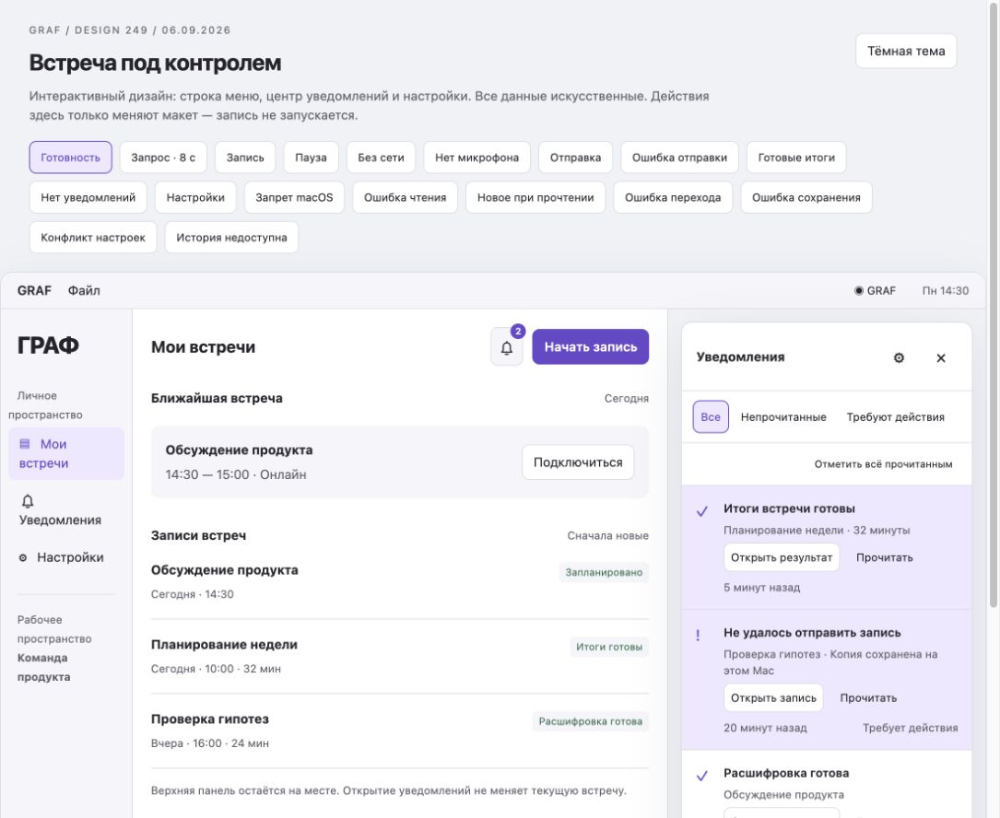
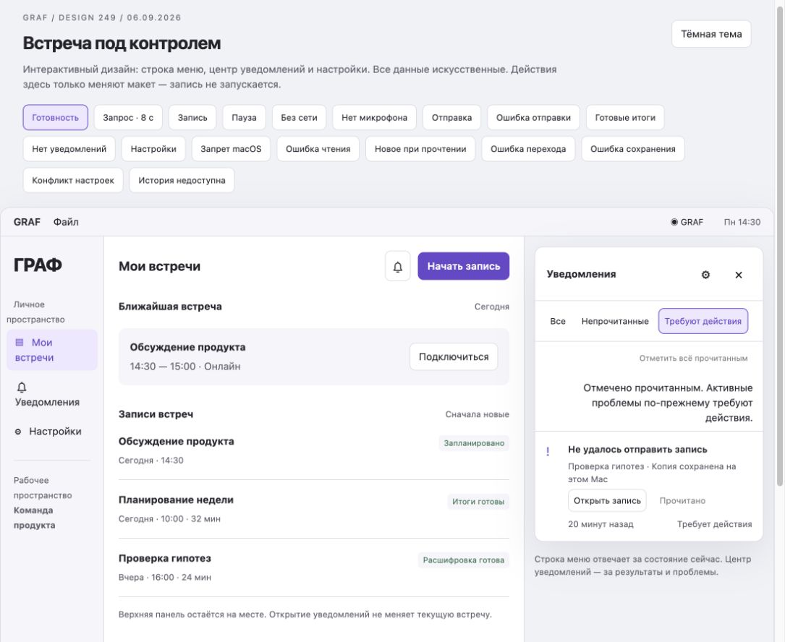
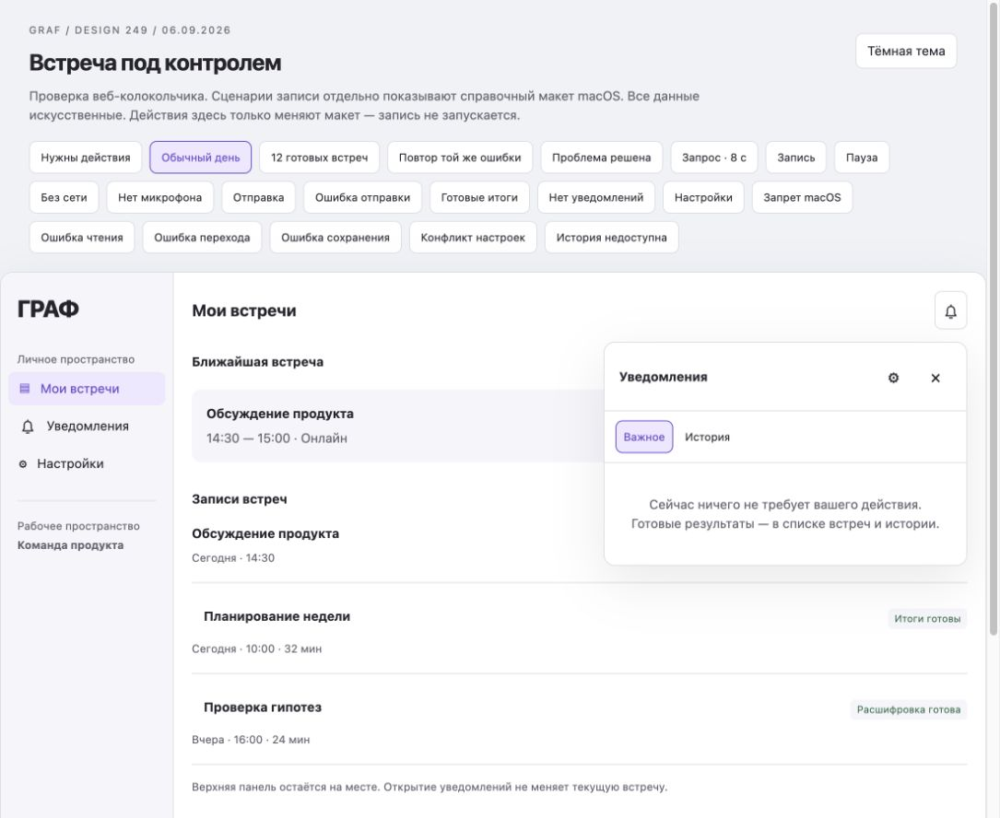
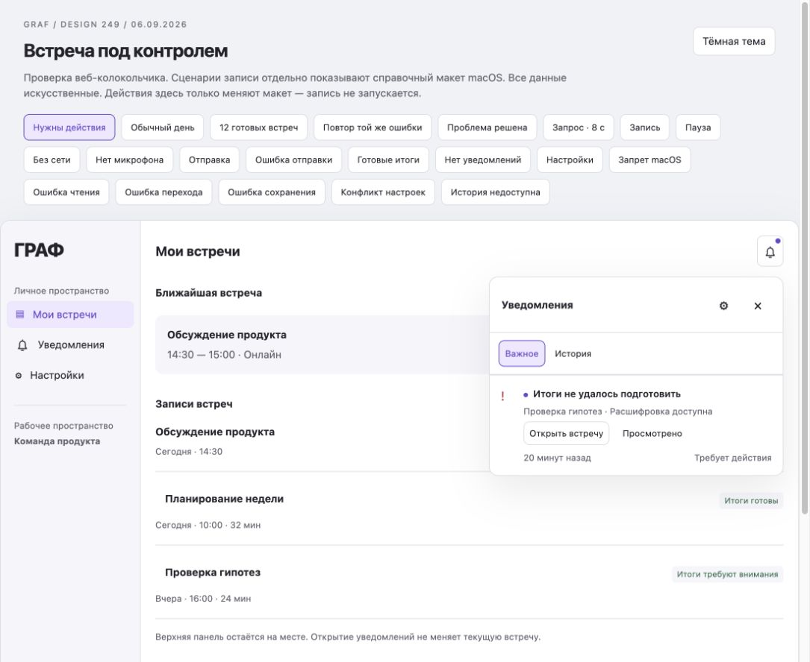
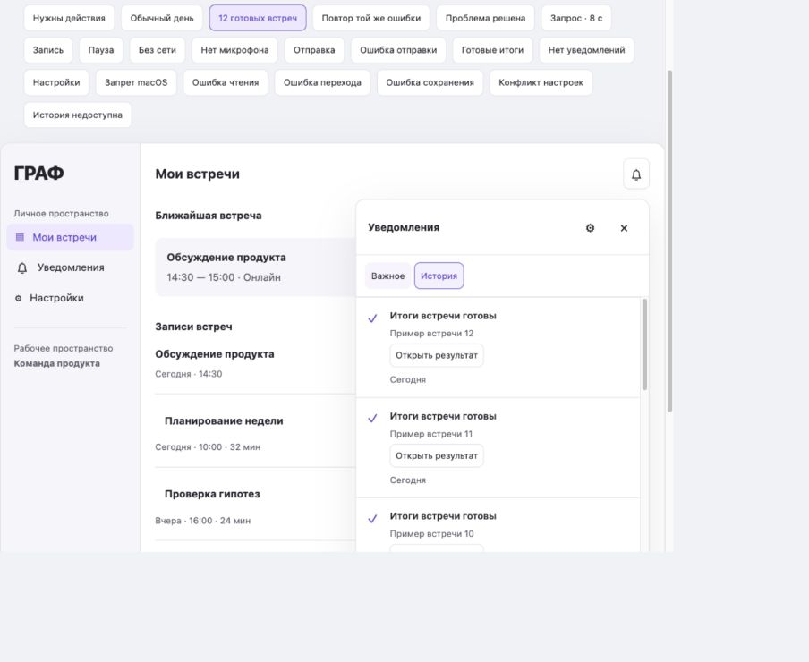
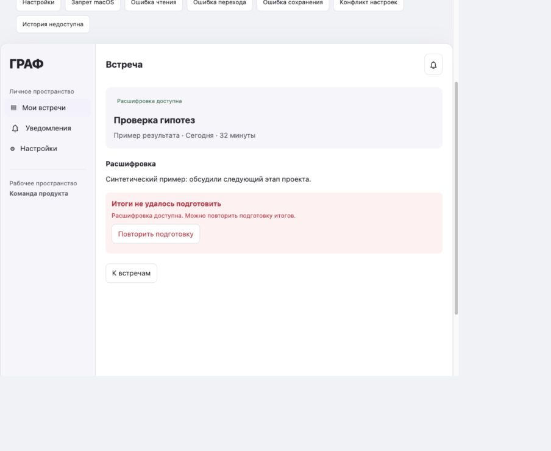
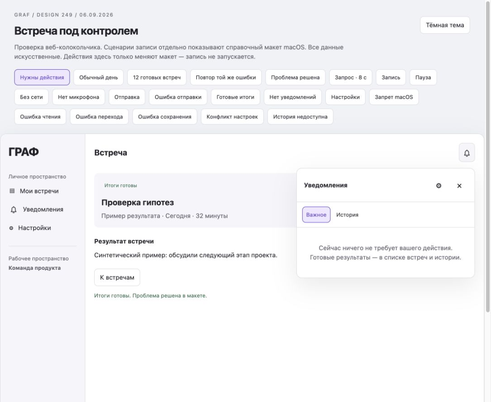
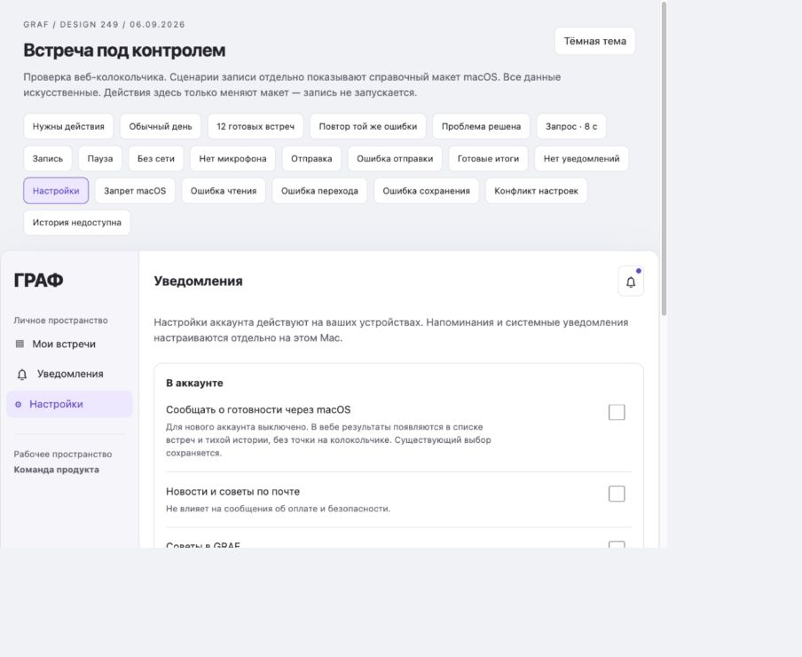

# Повторный аудит веб-колокольчика · 2026-09-06

История review=3. Категория «готовность через macOS» и общая нативная история далее отменены уточнением пользователя; актуальное содержание и настройки — [разделение поверхностей](surface-separation.md).

Проверена живая вкладка HTML-прототипа, затем изменён только дизайн в feature 249. Это не проверка внедрённого веб-колокольчика: в исследованных маршрутах и шаблонах продукта такой центр ещё не найден. Нативная macOS-часть остаётся основной для системной доставки и управления записью. Новый вариант веб-прототипа: `prototype.html?review=3`.

## Что было неудачно

1. Готовые итоги и ошибка отправки имели одинаковый фиолетовый фон. Общий счётчик «2» означал одновременно полезный результат и проблему. Пользователь не мог понять цену игнорирования.
2. «Отметить всё прочитанным» было самостоятельной заметной задачей. После нажатия счётчик исчезал, хотя проблема оставалась. Разделение прочтения и решения было технически верным, но визуально недостаточно ясным.
3. Готовность повторяла уже видимый результат в списке встреч. Число растёт пропорционально пользованию GRAF, создавая лишнюю обязанность читать сообщения.
4. Веб-карточка обещала «Копия сохранена на этом Mac». Самостоятельный браузер не может подтвердить локальную очередь нативного приложения.
5. Макет показывал обычный toast готовности вопреки более позднему контракту тишины в standalone web. Настройки смешивали веб и системные возможности.
6. В контракте были противоречивые правила показа старого содержимого при ошибке обновления. Приведены к одному: до проверки прав содержимое скрыто, состояние неизвестно, доступно повторение.

До изменения, одинаковое выделение результата и проблемы:

После массового прочтения ошибка оставалась при нулевом счётчике:

## Решение

Колокольчик показывает исключения, требующие действия именно этого пользователя. Это не журнал всех событий системы и не список задач «прочитать уведомления».

- Без общего числового счётчика. Маленькая точка — новое важное, которое требует действия и ещё не просмотрено.
- «Важное» открывается первым и содержит активные проблемы, в том числе просмотренные. «История» — спокойный второй раздел, без обязанности помечать обычные результаты прочитанными.
- Нет автоматического открытия панели, веб-баннеров, звуков, мигания заголовка вкладки, запроса разрешения браузерных уведомлений.
- Одна карточка на актуальный результат/инцидент. Повторная техническая доставка, попытка обработки и обновление страницы не возвращают точку.
- Открытие панели ничего не помечает прочитанным. Успешный переход либо «Просмотрено» подтверждает только конкретную показанную версию важного сообщения. Неудачный переход не гасит точку.
- После подтверждённого исправления проблема уходит из «Важного», независимо от просмотра. История получает «Решено», без нового сигнала.
- У обычного результата нет кнопки «Прочитать». Основной путь — открыть его из списка встреч. При открытом экране встречи результат обновляется прямо там.

## Что, кому и когда показывать

| Событие | Получатель / условие | Веб | macOS |
|---|---|---|---|
| Итоги / расшифровка готовы | Пользователь с актуальным доступом | Список встреч + тихая история, без точки | Для нового аккаунта системная категория выключена; после явного включения — по правилам канала, без повторов, с подавлением во время записи |
| Итоги не подготовлены, расшифровка доступна | Получатель, который может использовать расшифровку или повторить подготовку | «Важное» + точка; «Открыть встречу» | Допустимо одно уведомление по настройкам/ОС; контекст проблемы остаётся доступен |
| Терминальная ошибка / речь не распознана | Владелец или участник с реальным действием восстановления | «Важное», фактическое состояние и понятное действие | Нейтральный текст; открытие после проверки доступа |
| Временный сбой, штатный retry, очередь, прогресс | Действие пользователя не требуется | Только статус на экране объекта | Не отдельное уведомление |
| Микрофон/системный звук потерян во время записи | Пользователь текущего Mac | Браузер не придумывает локальное состояние | Постоянный нативный индикатор и доступное исправление/Stop; не зависят от optional notifications |
| Локальная отправка требует действия | Текущий владелец записи на данном Mac | Нет неподтверждённого обещания о локальной копии | Локальный инцидент с проверенной сохранностью и существующим восстановлением |
| Календарь требует повторного подключения | Владелец подключения, когда причина подтверждена | Контекст настроек, важное только при поддержанном достоверном событии | Один инцидент; не каждый опрос и не за каждый краткий сбой |
| Платёж требует вмешательства / безопасность / доступ | Только реально затронутый пользователь, для оплаты — ответственный с нужными правами | «Важное», если есть конкретное действие | По существующим обязательным правилам; письма и billing outbox сохраняются |
| Успешный платёж, чек | Адресат существующего финансового канала | Нет точки/нового обязательства в колокольчике; документ в оплате | Существующая доставка без изменений |
| С пользователем поделились встречей | Только реальный адресный grant и существующий достоверный producer | Тихая история и «Поделились со мной», без точки по умолчанию | Не вводить новый прерывающий канал ради этой фичи |
| Новости, советы, релизы | Отдельное явно выбранное общение | В колокольчик не попадают | Не часть обязательных уведомлений |
| Нет разрешения macOS | Пользователь открыл настройки | Пояснение, настройки доступны на Mac | Системный статус и переход в настройки; без повторного запроса на запуске |

Важность определяется последствиями и доступным действием, а не красным статусом на сервере. Событие не попадает в «Важное», если пользователь не может с ним ничего сделать. Обязательный статус записи при этом не скрывается.

## Полный путь пользователя

1. **Первое посещение — спокойно.** Колокольчик без точки, запроса browser permission нет. Не загружаем пачку старых успехов как новые события. Правило нового аккаунта не сбрасывает существующие false/true настройки.
2. **Обычная работа — спокойно.** Завершилось 12 встреч: результаты доступны в списке, в истории 12 записей, новых важных сигналов 0. Веб не пытается определить, идёт ли нативная запись, ради показа баннера: веб-баннеров нет.
3. **Возникла реальная проблема — нужна одна реакция.** Например: «Итоги не удалось подготовить» / «Проверка гипотез · Расшифровка доступна». Точка ведёт в «Важное»; кнопка «Открыть встречу» ведёт к доступному результату и восстановлению. Проблема также видна в строке встречи.
4. **Пользователь ознакомился — без повторного давления.** Точка снимается только после сохранённого просмотра данной версии. Карточка остаётся с подписью «Просмотрено · Требует действия». Повтор того же сбоя не возвращает точку, даже после перезапуска клиента.
5. **Пользователь исправляет — в контексте объекта.** Открывает встречу, видит сохранённую расшифровку и «Повторить подготовку». Кнопка не запускает новую запись. Во время работы кнопка повторного запуска недоступна. Реальная реализация использует существующий механизм обработки, проверяет права и текущий статус.
6. **Исправлено — вопрос исчезает сам.** После подтверждения доменного успеха «Важное» пустеет, история обновляется без нового баннера/точки. Закрывать уведомление вручную не требуется. Новая ошибка после реально завершённого восстановления может стать новым важным событием.
7. **Возврат после отсутствия — актуальное состояние.** Нет пачки пропущенных всплывающих сообщений; показываются только текущие проблемы. Истёкшие напоминания не доставляются. Отозванный доступ убирает содержимое и действие; смена пользователя/пространства не показывает старые данные.
8. **Настройки — понятные границы.** Веб объясняет системную категорию готовности; настройки разрешения, звука, названий и напоминаний принадлежат Mac. Автозапись, 8 секунд и Stop не зависят от отключения обычных уведомлений.

## Проверки и ограничения

Прототип содержит отдельные сценарии обычного дня, пачки результатов, важного события, повтора, разрешения, недоступности истории, ошибок перехода/сохранения просмотра. Проверки чистых правил запускаются командой `python3 specs/249-notification-control-design/validate_prototype.py`.

Доступность: смысл точки передаётся в имени колокольчика; у проблем есть текст, а не только цвет; фокус видим, Escape возвращает его, явные результаты действий используют `role=status`. Не объявляем каждую готовность через live region. Скриншоты и DOM не доказывают полноценную совместимость с VoiceOver, работу увеличения 200%, системный Focus или масштабирование текста — это отдельная приёмка продукта.

Нативный `native-preview` предшествует повторному веб-аудиту: его центр и настройки пока не отражают все новые правила внимания. Системный баннер macOS в этой проверке не отправлялся. Макет восстановления синтетический, API/реальные встречи не изменяются. Серверные гонки, права, сохранение прочтения между устройствами, фактическая доставка ОС и review gates не считаются проверенными этим макетом.

## Основания для решения

- [Apple Human Interface Guidelines — Notifications](https://developer.apple.com/design/human-interface-guidelines/notifications): своевременная ценная информация; не повторять одно и то же из-за отсутствия ответа; когда приложение впереди, обновлять доступный контекст ненавязчиво; ограничивать чувствительный контент. Точка внутри GRAF — наше продуктовое решение, не предписание Apple.
- [W3C WCAG 2.2 — Understanding 4.1.3 Status Messages](https://www.w3.org/WAI/WCAG22/Understanding/status-messages.html): важный статус доступен без принудительного перевода фокуса; чрезмерные объявления создают шум; не использовать assertive/alert для неважных сообщений. Критерий не требует создавать дополнительные уведомления.
- Поведение установленного Krisp зафиксировано отдельно в [исследовании](research.md). Ограничения trial и недоступного popover сохраняются; предположения о его скрытой реализации не используются как подтверждённые факты.

Приёмочный критерий предложения: **12 успешных встреч = 0 веб-баннеров и 0 новых важных сигналов; одна новая actionable-проблема = одна карточка и одна точка; повтор = 0 новых сигналов; подтверждённое исправление = 0 действий по очистке.** Конкретные ограничения времени и срок истории — предложения GRAF, не универсальные нормы.

## Проверенные экраны нового варианта

Обычный день: полезные результаты доступны, точка отсутствует, «Важное» не требует разбора.

Новая проблема: одно важное сообщение, конкретная встреча, доступная расшифровка, один основной переход. В строке встречи также есть состояние «Итоги требуют внимания».

Двенадцать готовностей: история содержит результаты без общего счётчика и кнопок чтения. На снимке видна верхняя часть прокручиваемой истории; все 12 карточек подтверждены DOM.

Восстановление: на экране встречи остаётся расшифровка и доступна повторная подготовка. Точка после успешного перехода снята; ошибка ещё не считается решённой.

После успешного восстановления: результат готов, «Важное» пусто. Сообщение об успехе — ответ на явное действие в текущем экране, не новая карточка/баннер.

Настройки: категория системной готовности выключена для нового аккаунта. Нижняя часть формы и пояснение о локальных настройках проверены по DOM; на снимке видна верхняя часть.

Дополнительные проверки по DOM: отказ открытия/сохранения просмотра сохраняет новое важное; повтор той же ошибки даёт «Просмотрено · Требует действия» без точки; недоступность истории даёт неизвестное состояние и повторение; Escape после открытия колокольчиком возвращает фокус к нему. Сценарии сна, другой учётной записи, реальной потери прав и доставки macOS здесь описаны как требования, а не пройдённые проверки.
