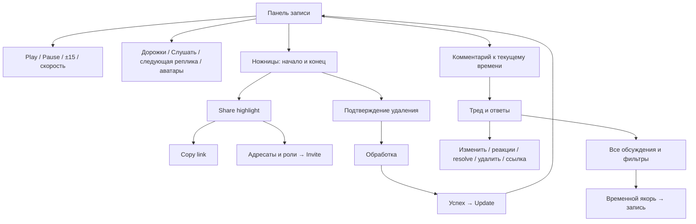

# Панель Krisp: описание для реализации F256

Дата повторной проверки: **2026-09-08**. Основной образец: тёмная тема Krisp
3.15.6 и app.krisp.ai с доступом Advanced. Дополнительно: светлая тема,
узкие окна, установленное приложение и искусственный диалог двух голосов.

Это описание **наблюдаемого образца**, а не отчёт о готовом GRAF. Его можно
использовать для реализации и сравнения без восстановления деталей из переписки.
Статусы и ограничения ниже являются частью описания: неподтверждённые свойства
не разрешается считать совпадающими по умолчанию.

## 1. Как читать пакет

| Документ | Назначение |
|---|---|
| Этот файл | Единая точка входа: устройство, параметры, состояния, переходы, приёмка |
| [reference-contract.json](reference-contract.json) | Значения оформления и идентификаторы органов управления для автоматического сравнения |
| [reference-matrix.md](reference-matrix.md) | Покрытие каждого действия и оставшиеся проверки |
| [recheck-log.md](recheck-log.md) | Результаты повторной проверки, исправления прежних предположений |
| [research.md](research.md) | Полная история наблюдений и ограниченного исследования внутреннего устройства |
| [backend-research.md](backend-research.md) | Реальные точки интеграции GRAF и недостающие серверные возможности |
| [spec.md](spec.md) | Требования к GRAF; предложения GRAF не являются фактами об устройстве Krisp |

Метки доказательств: **UI** — действие выполнено через интерфейс; **DOM** —
измерено отображаемое состояние/CSS; **CODE** — вывод по прочитанному обработчику;
**TARGET** — требование к независимой реализации GRAF; **OPEN** — не установлено.

## 2. Граница и информационная архитектура

Входит нижняя панель и переходы из неё: проигрыватель, временная шкала,
дорожки/карусель спикеров, выбор прослушивания, диапазон, Share/Invite,
подтверждение удаления, обработка/Update, создание комментария, тред,
боковая панель и её фильтры, реакции, ответы, редактирование, resolve/reopen.

Не входит копирование всего кабинета, billing, самостоятельного редактора
заметок и каталога контактов. Выбор источника комментариев должен отражать
реально поддерживаемые GRAF источники; не создавать пустую имитацию Notes.

## 3. Компоновка и геометрия

Три группы на одной строке широкого окна:

1. Слева: дорожки, вертикальный разделитель, Слушать, ножницы, комментарий.
2. По центру: −15, Play/Pause, +15, следующая реплика, скорость.
3. Справа: активный спикер/волна и карусель аватаров.

Под строкой — общая шкала; текущая позиция слева, длительность справа.
Ниже — строки спикеров: маленький аватар слева от оси, имя над дорожкой,
процент справа. Список сортируется по убыванию доли речи. При изменении долей
после trim порядок меняется, а цвет остаётся связан с личностью.

Значения ниже в CSS px при масштабе 100%. Не переносить ширину родительской
страницы Krisp в GRAF; сохранять отношения и размеры самой панели.

| Токен | Значение | Применение / доказательство |
|---|---|---|
| `panel.control.size` | 32×32 | Основные кнопки; DOM |
| `panel.control.icon` | 20×20 | Видимая область SVG всех восьми кнопок с иконкой; DOM |
| `panel.control.padding` | 5 | Кнопки с иконкой; border 1 transparent |
| `panel.control.radius` | 50% | Круглая область наведения; скорость radius 20 |
| `panel.play.marginInline` | 8 | Отступы вокруг Play/Pause |
| `panel.controls.minHeight` | 44 | Измерено 44.5 с текущим содержимым |
| `panel.controls.paddingTop` | 12 | Верх строки управления |
| `panel.controls.marginBottom` | 8 | До общей шкалы |
| `panel.range.height` | 5 | Общая шкала |
| `panel.row.pitch` | 33 | Высота строки спикера |
| `panel.track.height/radius` | 5 / 5 | Основа и цветные фрагменты |
| `panel.segment.minVisualWidth` | 1 | CODE; не минимум 0.2% от всей записи |
| `panel.row.label` | 12 / 16, weight 400 | Имя и процент |
| `panel.row.avatar` | 20×20 | Аватар дорожки |
| `panel.carousel.avatar` | 30×30 | Аватар в группе справа |
| `panel.carousel.padding` | 1 | Внутренний контейнер, radius 20 |
| `panel.resize.hitHeight` | 12 | Область захвата верхней границы |
| `panel.speed.menu` | 308×40 | Padding 8, radius 8 |
| `panel.speed.item` | 52×24 | Font 12/16 weight 600, radius 6 |
| `panel.listen.menu` | width 220 | При двух спикерах height 172; padding 8px 0; radius 6 |
| `panel.trim.menu` | 247×151 | Padding 8px 0; radius 6 |
| `panel.trim.timeInput` | 68.5×30 | Native time, step 1; font 14/20 weight 500 |
| `panel.trim.action` | 245×32 | Share / Delete selection, font 14/20 weight 600 |
| `panel.trim.reset` | 24×24 | Крестик |
| `panel.comment.form` | width 360, initial height 38 | Radius 10; padding 6px 8px 6px 10px |
| `panel.comment.editor` | max-height 120 | Далее внутренний scroll; font 14/20 weight 500 |
| `panel.comment.send` | 24×24 | Radius 6, padding 3 |
| `panel.mention.item` | height 48 | Измеренный пункт списка; width 287 в просмотренной форме |
| `panel.share.dialog` | width 560, radius 16 | В текущем owner-only состоянии height 268; не фиксировать высоту при добавлении адресатов |
| `panel.tooltip` | font 12/16, padding 8, radius 4 | Проверено на Play |

Высота всей панели зависит от числа дорожек и ручного resize. Измерено:
две дорожки — 147.5; четыре — 213.5; две дорожки после завершённого collapse —
76.5. Не снимать размер в середине анимации: промежуточно было 96.2.

### Цвета и шрифт

| Токен | Dark | Light |
|---|---|---|
| `panel.canvas` | #1C1F20 | #FEFEFE |
| `panel.surface` | #242729 | #FEFEFE |
| `panel.text` | #F5F5F5 | #242729 |
| `panel.textMuted` | #9FA1A3 | #6C6E70 |
| `panel.trackEmpty` | #3A3D3F | #E5E5E6 |
| `panel.controlHover` | rgba(245,245,245,.10) | OPEN: отдельно не измерено |
| `panel.unselectedSpeaker.opacity` | 0.4 | Относится к строке целиком |

Пример цвета речи: #FE6257. Полный порядок палитры при всех возможных количествах
спикеров не установлен; использовать существующую согласованную палитру GRAF,
проверить все её цвета при визуальной приёмке. Нельзя назначать цвет по текущему
месту в сортировке. Шрифт образца Inter с fallback Arial/Helvetica/sans-serif;
использовать имеющийся лицензированный шрифт GRAF, не извлекать файл из Krisp.

## 4. Состояния и действия проигрывателя

| Элемент | Вход / событие | Результат образца | Примечание для реализации |
|---|---|---|---|
| Play/Pause | Click, Space вне ввода | Меняет фактическое проигрывание и значок | Один audio; отклонённый play() не изображать как Playing |
| −15 / +15 | Click, arrows вне ввода | Перемотка с ограничением границами | TARGET ровно 15; возможное двойное смещение в CODE не переносить |
| Next Speaker | Click, Shift+Right | Следующая временная запись с start > current | Не гарантирует смену человека; предыдущий переход — Shift+Left |
| Скорость | Click | Горизонтальное меню сверху | 0.75 / 1 / 1.25 / 1.5 / 2; текущая выделена |
| Скорость | Выбор | playbackRate существующего audio, меню закрывается | Сохранять время; не заменять циклической кнопкой |
| Конец | ended | Возврат к началу | Обновить одновременно шкалу и значок |
| Шкала | Drag/click | Seek в позицию | Шаг образца .01; каноническая шкала GRAF |
| Сегмент | Click | Начало первой связанной реплики, scroll, highlight 2 s | Клавиатура должна выбирать эту же реплику |
| Пустая дорожка | Click | Время по X-координате | Не путать с точным попаданием в сегмент |
| Аватар | Click | Следующая реплика этого человека, все спикеры, play | CODE; после последней реплики fallback OPEN |
| Слушать | Выбрать одного/нескольких | Снять All, начать playback, пропускать остальных | UI; строки остальных opacity .4 |
| Слушать | Снять последний выбор | Возврат к All | Не оставлять невозможное состояние «никого» |
| Дорожки | Toggle | Collapse/expand с переходом | Кнопки и общая шкала остаются |
| Resize | Drag верхней границы | Меняет видимую высоту списка | Точные min/max persistence OPEN; не выдумывать |

Паузы и перекрытия требуют объединения временных интервалов выбранных спикеров;
точная внутренняя стратегия Krisp не доказана. Для GRAF критерий — не повторять
звук при перекрытиях и не зацикливаться на границах. Не сравнивать бездумно
audio.currentTime и общую шкалу многосессионной записи: Krisp преобразует timebase.

## 5. Диапазон и Share

Ножницы раскрывают дорожки и включают две границы. Начало — текущая позиция,
конец — длительность; при входе в последнюю секунду начало сбрасывается в ноль
(CODE). Поля HH:MM:SS, ручки, крестик, Share и Delete selection доступны вместе.
Крестик выключает выделение. Открытие Share переносит обе границы в диалог.

Проверка обратного диапазона: start=20, end=10 нормализовался в 20–20;
**Share и Delete selection оставались enabled**. Отправка нулевого удаления не
выполнялась. TARGET GRAF: запрещать пустую операцию на клиенте и сервере.

Ключевая подсказка Share highlight:

> The recording will start from this point, but viewers can still access full meeting.

Это навигация внутри полной встречи, не отдельный защищённый клип. Copy link
показывает `Link copied to clipboard`; чтение browser clipboard вернуло пустую
строку — форма URL и реальное открытие ссылки получателем остаются OPEN.
Не считать URL-параметры границами полномочий и не расширять summary_only.

Invite открывает отдельный этап Send Invite. Выбранные адресаты отображаются
плашками. До отправки доступны роли:

| Роль Krisp | Точное пояснение | Подтверждение |
|---|---|---|
| Can edit | Edit, comment and share | UI; выбрана по умолчанию для нового адресата |
| Can comment | Comment and view | UI |
| Can view | AI Notes, transcript and recording | UI |
| Can view AI Notes | Can only view AI Notes, no edit access | UI |

Серверное исполнение прав второй личностью не проверено. Миграция старых GRAF
grants, модерация чужих сообщений и каналы уведомлений — решения GRAF, не
подтверждённые этими надписями. Старые grants нельзя молча повысить до editor.

## 6. Удаление: точные переходы

1. Delete selection → отдельный диалог `Delete selection`, пояснение
   `The selected section and its recording will be permanently deleted.
   This action cannot be undone.`, кнопки Dismiss / Delete.
2. Dismiss отменяет операцию. При повторном входе диапазон задаётся заново.
3. Delete → на время запроса кнопки disabled → обработка.
4. Состояние обработки: `✂️ Snip snip! Deleting your selection...` (CODE).
5. Завершение: `✅ All set! Your selection has been deleted.` и
   `Press 'Update' to see the changes applied.`; кнопка Update (UI).
6. Update перечитывает согласованные данные (UI).

Синтетический oracle: `[10,20)` удалён из ~46 s → ~36 s; второй спикер ~25→15 s;
доли 56/44→42/58, сортировка меняется. Комментарий 0 остаётся; внутри интервала
исчезает; последующий 38→28. Утверждение относится к доступному интерфейсу,
а не доказанному физическому purge всех хранилищ Krisp.

**Порог полного удаления:** CODE — остаток ≤10 s; UI подтверждён остаток около
9 s. При выборе 0–27 из ~36 s Krisp написал `You've selected the entire recording`
и предложил удалить **встречу** без notes. При наличии notes предупреждение
говорит об удалении transcript и recording. Эти диалоги просмотрены и отменены.
Равенство ровно 10.000 s и полный server outcome с notes — OPEN.

TARGET: GRAF не расширяет удаление молча. Объём и судьба комментариев/итогов
должны быть явными; retained Generation Call ledger / Langfuse / Temporal и
внешние копии остаются в существующих границах политики удаления.

**Уточнение FR-019:** [исследование кода и результата](trim-reverse-engineering.md)
подтвердило дословное сохранение оставшихся слов и сдвиг времён. TARGET —
сохранять текст и личности спикеров; автоматическая перерасшифровка с изменениями
не разрешена. Точный отбор пограничных слов и сохранение ручных исправлений
в Krisp ещё не проверены. Технический путь для неполных меток GRAF не завершён.
Значения36 s и42/58 выше относятся к первому удалению: последующее изменение
тестовой записи дало34.6935 s и45/55; оба состояния описаны в исследовании.

## 7. Комментарии и связанные переходы

- Открытие фиксирует текущий момент, фокусирует ввод; время кликабельно.
- Empty/пробелы: send disabled. Текст/emoji/упоминания, отправка справа.
- `@` показывает список адресатов; пункт 48 px. Доставка и ACL этих людей OPEN.
- Escape закрывает обычную форму; отдельное взаимодействие Escape с открытым
  mention/emoji picker требует проверки при реализации. Outside click отменяет,
  но активный вложенный picker не должен считаться выходом из формы (CODE).
- Сохранение показывает комментарий в треде, счётчик у реплики и боковую панель.
- Reply — отдельный inline ввод. Edit сохраняет изменение с отметкой `(edited)`.
- Реакция — emoji picker с Search, затем emoji и счётчик. Add 👍 проверен;
  повторное нажатие на собственную реакцию снимает её (UI). Несколько авторов/гонки — OPEN.
- Меню корня: Edit / Copy link / Delete. Удаление подтверждается
  `Would you like to delete this comment?`, Cancel / Delete.
- Удаление корня в synthetic убрало ответ и реакцию вместе с ним (UI).
- Resolve убирает тред из открытых. Фильтр Resolved возвращает его и ответы.
  Повторное нажатие той же кнопки у завершённого треда возвращает его в открытые (UI). Фильтр Resolved затем скрывает его, Show all open показывает.
- Sidebar: Source Notes/Transcript, Status Resolved, Person. Пустое состояние:
  `No discussions match your filters`, `Try adjusting your filters to see more`,
  `Show all open` возвращает открытые обсуждения (UI).

Не установлены: серверный предел текста, вложенность сверх ответа на корень,
права модерации второго пользователя, уведомления/почта, судьба частично
пересекающего диапазон треда. Не подставлять сюда произвольные «лимиты Krisp».

## 8. Адаптация и движение

- CSS образца показывает аватары через `.d-sm-flex` с **min-width 788 px**;
  это не стандартный Bootstrap breakpoint 576. DOM: 768 — скрыты, 991 — видны.
- У `.timeline` есть отдельное правило min-width 992 px; внешний кабинет также
  меняет боковую навигацию. Измерения нельзя сравнивать при разной ширине контента.
- При 390 px ранее наблюдалось перекрытие Comment/−15; в синтетическом диалоге
  повторный замер дал горизонтальное переполнение: panel width ~526 при viewport390.
  Оба результата — дефекты адаптации, а не два обязательных макета.
- В GRAF на узком окне допустим перенос групп; все действия и временные поля
  остаются доступны без горизонтального переполнения. Сравнивать 390/768/1440,
  границы 787/788 и 991/992, zoom200%, длинные русские подписи.
- Collapse: подписи `0.5s ease-out`, дорожки `margin-top 0.5s ease-out`, opacity
  `0.1s`; это измеренные переходы. Тайминги нельзя заменять случайной общей анимацией.
- Для дорожек, подписей и ручки в CSS есть prefers-reduced-motion: reduce → none.
  Hover-линия/скорость не требуют пружинной анимации.

## 9. Клавиатура и доступность: отличие цели от образца

В Krisp Space/arrows/Shift+arrows исключают inputs/textarea/contenteditable (CODE).
В настольной повторной проверке Escape **не закрыл** trim и speed menu; ранее
не закрывал Listen to. Крестик trim и выбор скорости закрывают соответствующее окно.

TARGET GRAF:

- Логичный Tab-порядок по группам слева направо, затем шкала и дорожки.
- Каждая icon button имеет доступное имя; Play/Pause отражает состояние.
- Меню: Enter/Space открыть, стрелки переместить выбор, Enter выбрать, Escape
  закрыть и вернуть фокус инициатору. Не перехватывать клавиши редактора текста.
- Шкала/resize получают keyboard эквивалент, aria-valuemin/max/now и читаемое время.
- Модальное подтверждение выше sidebar, focus trap и возврат фокуса после отмены.
- Disabled state сопровождается причиной; ошибки/обработка объявляются через
  status/live region. Цвет не является единственным признаком выбранного спикера.

## 10. Приёмка независимой реализации

Одна запись GRAF и один набор синтетических данных используются в web и GRAF Dev.
Сравнение ведётся по версии media/result, одинаковым viewport/zoom/theme/числу
спикеров, а не по произвольным двум снимкам разных записей.

| Проверка | Критерий |
|---|---|
| Геометрия | Основные размеры ±2 CSS px; переменная высота объясняется содержимым |
| Сегменты | Реальная пропорция длительности, без 0.2% минимума и белой inset обводки |
| Позиция | Синтетические маркеры ±100 ms; точные ±15 на границах |
| Audio state | Меню/rename не пересоздают audio; ошибки play/load видимы |
| Спикеры | Один/несколько/unknown/overlap/no speech; сортировка и цвет согласованы |
| Комментарии | Все переходы этого документа, версия якоря, отмена, пустой ввод, повтор POST |
| Диапазон | Нулевой/обратный/вне длительности/полный; stale version и повтор удаления |
| Права | Owner/editor/commenter/viewer/summary-only и отзыв во время открытой формы |
| Удаление | Старый source/export/Range URL недоступен; правдивые обработка/ошибка/retry |
| Доступность | Клавиатура, VoiceOver, reduced motion, 200%, нет перекрытия модальных слоёв |
| Происхождение | Независимый код, существующие/лицензированные иконки и шрифты |

Непройденная строка остаётся OPEN. «1 в 1» нельзя закрыть одним CSS-снимком,
отсутствием ошибок сборки или перечнем нарисованных кнопок.
