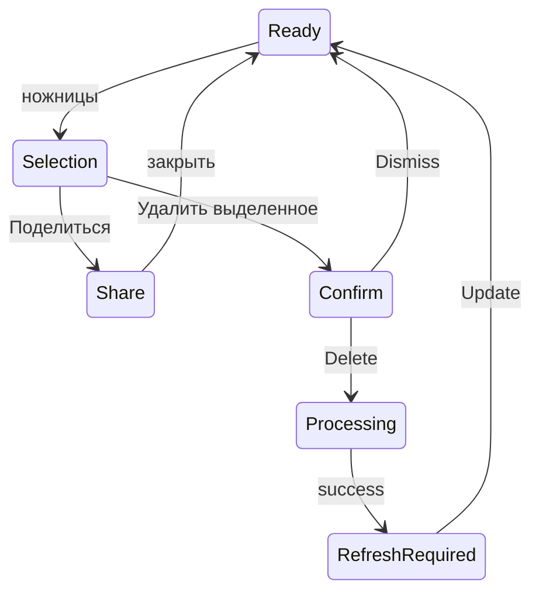

# Покрытие панели Krisp — F256

2026-09-08. Матрица исследования; ни одна строка не обозначает готовность GRAF.
Актуальная детализация: [handoff.md](handoff.md), [recheck-log.md](recheck-log.md).
База: установленный Krisp 3.15.6, авторизованный app.krisp.ai, затем Advanced.
Работа с изменением содержимого — только на созданных синтетических записях.

| Элемент / переход | Подтверждённое поведение образца | Доказательство | Что должно проверяться в GRAF |
|---|---|---|---|
| Дорожки | Collapse/expand, resize мышью, сортировка по доле речи | Desktop/web, DOM, обработчики | Клавиатурная ручка, высота, scroll, сохранение состояния |
| Слушать | Все/один/несколько, запуск, тусклые остальные, последний deselect возвращает всех | Desktop/web | Объединение перекрытий, пропуск невыбранного, no remaining speech |
| Escape в Слушать | Меню не закрывается | Desktop/web | Закрывать и возвращать фокус; документированный дефект образца |
| Назад/вперёд | ±15, tooltip с клавишами, ограничение длительностью | UI и обработчики | Точные ±15, поведение play/pause, края |
| Play/Pause | Значок меняется, Space вне ввода | UI и обработчики | Ошибка audio/autoplay, accessible name, конец |
| Следующий спикер | Следующая временная реплика, не обязательно другая личность | Доставленный обработчик | Последняя реплика, одинаковые start, Shift+arrows |
| Скорость | 0.75/1/1.25/1.5/2; горизонтальное меню, выбор закрывает | Web и audio.playbackRate | Не пересоздавать audio; позиция, меню, клавиатура |
| Аватар справа | Следующая реплика человека, сброс фильтра на всех, запуск | Доставленный обработчик | Нет следующей реплики, карусель, rename |
| Общая шкала | Позиция + длительность; шаг 0.01 | DOM | Точный timebase, загрузка, Range-запрос, 100 ms |
| Цветной фрагмент | Начало связанной реплики, scroll и highlight 2 s | Доставленный обработчик | Keyboard выбирает реплику, не середину записи |
| Пустой участок | Время по координате, общая hover-линия | UI/обработчики | Начало/конец, RTL не входит, 200% zoom |
| Ножницы | Раскрывают дорожки и диапазон; default current–duration | Web Advanced | Редакторские права, pending/deleted/stale, один спикер |
| Поля диапазона | Native time с секундным шагом; clamp | Живой ввод и Share | Пустое/обратное/вне длительности, точные ms, >24 h |
| Share highlight | Диалог показывает точные start/end, получатель может открыть всю встречу | Live tooltip | Навигационная версия ссылки; полный ACL, без публичного аудио |
| Copy link | Показан Link copied to clipboard; browser clipboard не вернул текст | Повторная UI-проверка | Подтвердить реальное копирование и открытие получателем |
| Invite | Отдельная форма, адреса, Can edit/comment/view/view AI Notes | UI без отправки | CSRF, роли, срок/отзыв; не создавать доступ при копировании |
| Partial Delete | Dismiss/Delete, processing → success → Update | Реальное synthetic `[10,20)` | Idempotency, race, ошибка/retry, cleanup, source revision |
| Update | 46→36 s, второй speaker 25→15 s, изменены слова/проценты | Синтетический DOM после операции | Согласованность audio/transcript/итогов/экспорта |
| Остаток <10 s | При 0–27 из ~36 s говорит «entire recording» и предлагает удалить встречу | Live confirmation, отменено | Не расширять диапазон молча; явное отдельное полное удаление |
| Комментарий | Фиксирует время, input focus, empty disabled, Escape отменяет | Desktop/web | Ошибка сохранения, повтор POST, source/media identity |
| Сохранённый комментарий | Открывает тред/боковую панель; временной переход | Synthetic create/read | Версионность, просроченный доступ, фокус/return |
| Ответ | Inline Reply, сохраняется под корнем | Synthetic create | Parent ACL/meeting/revision, retry, root deletion |
| Изменить | Inline editor, save, отметка edited | Synthetic edit | Author/editor permissions, 409, escaping |
| Реакция | Emoji picker с Search; 👍 отображает счётчик 1 | Synthetic UI/create | Toggle проверен; в GRAF — уникальность user+emoji+comment, keyboard |
| Resolve | Убирает из открытых, доступно через Resolved | Synthetic resolve/filter | Reopen проверен; в GRAF — race, права; без удаления содержимого |
| Фильтры | Source Notes/Transcript, Status Resolved, Person | Live sidebar | Только реально существующие источники, пустое состояние |
| Удалить комментарий | Confirmation; корень, ответ и реакция исчезли | Synthetic deletion | Физическая очистка и запрет stale reply |
| Комментарии после trim | Before=0 сохраняется, inside исчез, after38→28 | Synthetic before/after | Пересекающий диапазон тред и replies, уведомления/links |
| Упоминания | Picker есть в форме и обработчиках; чужим людям ничего не отправлялось | UI/code only | Допущенные адресаты, без расширения ACL, доставка/отзыв |
| Один спикер | Скрыта вся левая группа | Synthetic one speaker + condition | Сохранить доступ к trim/comments как обоснованное отклонение |
| Темы/узкое окно | Dark/light; 390 px перекрывает controls, sidebar может закрыть Share | DOM/screens | Без перекрытия, focus trap, VoiceOver, reduced motion |

## Фактическая цепочка удаления

Error/retry после серверного сбоя по живому образцу не подтверждены: схема их
не выдумывает. Достоверные failure/recovery состояния GRAF обязательны отдельно.

## Граница сопоставления

Копируется состав и поведение панели, не чужой код/иконки/шрифты и не тарифные
ограничения. Полнота включает связанный тред комментария и форму доступа;
редактор самостоятельных заметок, весь каталог контактов и billing не входят.
Не подтверждены физический purge Krisp, backend idempotency, права второй
личности и фактическая доставка упоминаний. Ни успешный UI, ни просмотр кода
не доказывают эти свойства.
