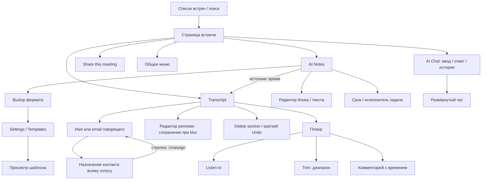

# F257 — передача страницы итогов в реализацию

Дата фиксации: 2026-09-08. Источники: обычный интерфейс Krisp 3.15.6 на macOS, авторизованный веб Krisp после покупки Advanced, измерения отображаемого DOM. Реестр доказательств: [reference-audit.md](reference-audit.md), R01–R52. Это описание наблюдаемого интерфейса; исходники, ресурсы приложения, закрытые API и внутренние алгоритмы не извлекались.

## Как пользоваться материалом

Начать с композиции и таблицы элементов ниже; перед программированием читать [spec.md](spec.md), [plan.md](plan.md), [contracts/ui.md](contracts/ui.md) и [tasks.md](tasks.md). Для каждого действия различать: **П** — результат проверен; **Ф** — проверена форма/меню, конечная операция не выполнена; **Н** — неизвестно. Визуальное наличие кнопки не означает проверку её результата.

Пользователь просит изучить всю страницу, но явно ограничил реализацию: **«Только страница и уже доступные функции GRAF»**. Поэтому исследование включает редакторы, AI Chat, задачи и папки, а F257 их не добавляет. «1 в 1» в принятом объёме означает близкое воспроизведение композиции, геометрии и взаимодействий существующих функций, с перечисленными отклонениями. Этот документ не обещает полный функциональный клон Krisp.

## 1. Композиция и информационная архитектура

На экране постоянно есть боковая навигация продукта. Справа от неё расположена область встречи. В её верхней служебной строке находятся Back слева и Connect, Share, вертикальный overflow справа. В центре области встречи — узкая колонка: название, строка метаданных, переключатели AI Notes/Transcript, затем документ. Основное содержание прокручивается под верхней областью; название, метаданные и вкладки остаются сверху. Редактор не заключён в большую карточку.

В строке метаданных: дата/время, число приглашённых, значки меток и папки. Длительность в исследованной готовой встрече видна в плеере, её нет отдельным крупным полем у названия. На строке вкладок справа — Copy и RU. Формат открывается отдельной частью пилюли AI Notes: значок текущего формата и стрелка. Чат свёрнут в поле справа снизу; при открытии располагается справа поверх свободного поля, при разворачивании — в центре с затемнением фона.

На AI Notes документ начинается с блоков метаданных, затем разделитель, Key Points, Action Items и Outline. Это результат конкретного выбранного шаблона, а не неизменяемая структура всех встреч. На Transcript цветная метка голоса и время стоят над текстом реплики. Нижний плеер фиксирован и меняет высоту при раскрытии дорожек. Плавающий ввод чата поднимается над ним.

Стрелка описывает доступный переход, а не обязательный запуск конечной операции. Новые узлы вне GRAF не становятся задачами реализации F257.

## 2. Измеренная геометрия веба

Единицы — CSS px. База: viewport **1800×915**, scale=1, тёмная тема, панель продукта **200 px**, чат и меню закрыты. Предыдущая высота 859 дала ту же верхнюю геометрию. Измерения получены из boundingClientRect/getComputedStyle видимого DOM. Координаты нельзя переносить как абсолютные позиции при другой ширине окна.

| Элемент | x / y | Ширина × высота | Стиль / расстояние |
|---|---|---|---|
| Боковая панель | 0 / 0 | 200 × 915 | Отдельная навигационная поверхность |
| Back | 224 / 8 | 32 × 32 | Radius 8, padding 5 |
| Connect | 1549.40 / 10 | 101.35 × 28 | Меняющаяся интеграция, radius 8 |
| Share | 1658.75 / 10 | 81.25 × 28 | Radius 8, padding 3px 9px |
| Overflow | 1748 / 10 | 28 × 28 | 24 px до правого края, radius 8 |
| Поле названия | 663 / 56 | 674 × 32 | 22/32, 700; внутренний left padding 4 |
| Дата/время | 663 / 92 | 110.41 × 24 | 12/16, 600; padding 3px 9px 3px 4px |
| Participants | 777.41 / 92 | 100.23 × 24 | 12/16, 600; 4 px от даты |
| Метки | 881.63 / 92 | 24 × 24 | Radius 6, padding 3 |
| Папка | 909.63 / 92 | 24 × 24 | 4 px от предыдущего значка |
| AI Notes | 665 / 128 | 77.52 × 28 | 14/20, 600; radius 20 слева |
| Формат + стрелка | 743.52 / 128 | 56 × 28 | Radius 20 справа; отдельный target |
| Transcript | 801.52 / 128 | 113.33 × 28 | 14/20, 600; radius 20 |
| Copy | 1203.41 / 128.75 | 68.48 × 24 | 12/16, 600; radius 6 |
| RU | 1282.34 / 130 | 54.66 × 24 | 12/16, 600; radius 6 |
| Колонка редактора AI Notes | 657.5 / 166 | 674 / по содержанию | Текст первого абзаца x663.5, y171, width664 |
| Текст итогов | — | — | 16/28, обычный вес400; выделенные подписи700 |
| Заголовок раздела | — | — | 20/24, вес700 |
| Текст реплики, обычный вид | 677.5 / зависит от секции | 646 / по числу строк | 16/28; роль presentation у отображаемого текста |
| Текст реплики, редактирование | 677.5 / 266 в проверке | 646 × 56 для двух строк | Рамка вокруг поля; высота определяется текстом |

Дополнение2026-09-09 к вертикальной опоре Transcript: на синтетической встрече при1800×859 публичное дерево доступности macOS показывает AXWebArea origin0/217, title663/56/674×32, вкладкиy128/h28 и первую границу AX-текстаy198 (экранное415−217). Сообщение Reformat и меню закрыты, список в начале. Это отдельная AX-опора, не DOM y; расстояние от низа вкладок42px. DOM-ширина/типографика выше сохраняют собственную методику. Сопоставление с GRAF и принятая reviewer нормализация — [validation/ui-matrix.md](validation/ui-matrix.md).

Итог: центр колонки названия равен центру доступной области `(200 + 1800) / 2 = 1000`; ширина 674. Текстовый столбец AI Notes слегка смещён относительно поля названия. Это различие следует проверить на нормализованной синтетической встрече, а не маскировать масштабированием всего интерфейса. Геометрия блока с фактическим текстом не доказывает ограничение длины текста.

Плеер по снимку: в свёрнутом виде занимает нижние примерно76 px, в раскрытом с четырьмя голосами — примерно212 px. Панель AI Chat по снимку: около424×802, x1352/y16; развёрнутая — около960×835, x420/y40. Это **визуальные оценки**, не измерения DOM и не допуск SC-003.

## 3. Цвета, шрифт и ресурсные границы

Названия ниже — локальные роли для передачи, не извлечённая система токенов Krisp. В реализации сопоставить существующим переменным GRAF; не создавать второй набор глобальной темы.

| Роль | Наблюдённое значение | Уверенность / применение |
|---|---|---|
| Основной текст шапки | #F5F5F5 | DOM, title/Share/tab |
| Вторичный текст | #9FA1A3 | DOM, metadata/Copy/RU |
| Навигационная поверхность | #242729 | DOM, sidebar |
| Фон заполненной кнопки | #2E3133 | DOM, Back/Share |
| Тёмный фон Invite | #1C1F20 | DOM, кнопка боковой панели |
| Основной холст | #1C1F20 | DOM, фон body/html |
| Общая группа вкладок | #242729 | DOM, контейнер; radius20px |
| Активная вкладка | #474A4C | DOM, отдельная подложка134.52×28 под группой AI Notes/формат; дочерние button прозрачны |
| Источник / время | Фиолетовый | Визуально, точный цвет не измерен |
| Голоса | Фиолетовый, коралловый, жёлтый, серо-бежевый | Согласованы между меткой, полосой и шкалой; не означают участника календаря |
| Шрифт референса | Inter, sans-serif | DOM; файл шрифта не извлекался |
| Шрифт GRAF | Существующий системный стек | Явное отклонение; размер и межстрочный интервал сохраняют роли |

Значки GRAF должны быть собственными или уже разрешёнными. Не включать логотип Krisp, его аватары голосов, файлы шрифта, иллюстрации и значки интеграций. Функциональные надписи разрешено воспроизводить по constitution §VII, но интерфейс GRAF остаётся русским. Продолжительности анимаций/easing не измерялись; использовать действующий reduced-motion контракт GRAF.

## 4. Шапка, меню и состояния

| Элемент | Действие и состояние | Статус / GRAF |
|---|---|---|
| Back | Возврат к предыдущей поверхности; собственные Back/Forward/Reload также есть в оболочке macOS | П первичного прохода / действующий возврат |
| Название | Поле в шапке, сохранение Return/blur; временное значение было сохранено и восстановлено | П / existing expected_version, конфликт и отмена сохраняются |
| Дата | Выглядит как текстовая кнопка; повторный клик не дал видимой реакции | П отсутствия реакции в этом состоянии / не выдумывать календарь |
| Participants | Поповер приглашённых; три приглашённых и четыре голоса в исследованной встрече | П / не строить ложное соответствие |
| Метки | Поиск, Loading tags, No tags found | Ф / исключены |
| Папка | New folder открывает Create Folder. Иконка, имя, варианты названий, описание, видимость, Cancel/Create | Ф / исключена |
| Format picker | Личные шаблоны первыми, далее11 встроенных; отметка текущего. All templates и New template внизу | П списка/перехода / существующий каталог GRAF |
| Copy | Нажатие → Copied | П обратной связи, Н состава буфера / один existing export pipeline |
| RU | Язык расшифровки, а не язык интерфейса. Диалог повторной транскрибации; Regenerate disabled без изменения | Ф / не создавать новый путь генерации |
| Share | Add email/Invite, текущий доступ, режим ссылки, Copy Link | Ф / только действующая модель получателей GRAF |
| Режимы Share | Can edit; Can comment; Can view; Can view AI Notes | Ф / применять только реально поддержанные GRAF права |
| Connect | Название/значок интеграции меняются, наблюдались несколько поставщиков | Визуально / не добавлять отсутствующую интеграцию |
| Overflow AI Notes | Copy Link, Add to favorites, Save for later, Export transcript .txt, Download recording, Delete meeting | П состава / существующие действия GRAF |
| Overflow Transcript | Те же пункты плюс Find and replace Cmd+F | П состава / поиск с заменой исключён |
| Find and replace | Find, Replace with, Match case, Whole word, Replace/Replace all, крестик | Ф / исключён |
| Оценки | Thumbs up/down в конце итогов; в вебе встречался Transcript rating1–5 | Ф / не отправлены, не добавлять новый feedback |

Глобальное копирование ссылки, состав копирования документа и экспорт TXT — разные операции. Не объединять их под одним обработчиком без явного состава. У GRAF Copy выбирает `summary` для `outcomes`, `transcript` для `recording`; переход вкладки во время await не меняет захваченный состав. Все права, версии и no-store остаются существующими.

## 5. Редактор итогов — что именно наблюдалось

В готовом документе нет обязательной отдельной кнопки «Редактировать»: текст находится в блочном редакторе. При выделении слова появляется плавающая панель. Слева от активного блока появляются `+` и рукоятка меню/перетаскивания. Внутренняя структура документа допускает абзацы, заголовки, списки, задачи и источники. Постоянного Save для документа в наблюдаемом состоянии нет.

| Вход | Состав | Подтверждённый результат / предел |
|---|---|---|
| Выделить слово | Bold, Italic, Underline, Strike, align left/center/right, Colors, Nest/Unnest, Create link; две иконки без надёжного доступного имени | Панель открыта; форматирование исходного текста не применялось |
| Colors | Text и Background; Default, Gray, Brown, Red, Orange, Yellow, Green, Blue, Purple, Pink | Палитры открыты; значения цветов не извлекались |
| Create link | Edit URL | Форма открыта; URL не сохранялся |
| Меню обычного блока | Color, Copy, Duplicate, Delete | Меню проверено; удаление своего временного пустого блока выполнено |
| Меню содержательного раздела | Дополнительно Regenerate и Add comment | Только меню; генерация и отправка комментария не запускались |
| `+` / slash | Text; Heading1–4; Bullet, Numbered, Check, Toggle List; Quote; Code Block; Divider; Table; Action Item; Toggle Heading1–3; Emoji | Каталог открыт; создание временного Text и ввод проверены |
| Ввод и отмена | Cmd+Z убрал введённый временный текст, но оставил созданный пустой блок | Удаление пустого блока потребовало отдельного действия |
| Повторное открытие |10 исходных блоков; нормализованный текст совпал с baseline из памяти исследовательского сеанса | Восстановление итогов подтверждено; приватный baseline не сохранён в файлы |

Не доказаны: автоматическое сохранение каждого форматирования, максимальная вложенность, лимиты таблиц, drag-and-drop блоков, вставка HTML, разрешённые URL, конфликты параллельного редактирования, история версий и восстановление после длительного офлайна. Их нельзя реализовывать по догадке под видом поведения Krisp. Редактор исключён из F257; его внешний текстовый ритм нужен для оформления существующего протокола GRAF.

## 6. Action Items

Строка задачи: слева пустой круг состояния, далее текст и ссылка на время, справа компактная Due date и круглый значок человека. Длинный текст переносится; срок и исполнитель образуют отдельные элементы, а не часть текста. Кнопки становятся особенно заметны на активной строке.

- Due date открывает календарь с предыдущим/следующим месяцем, сеткой дней и Clear. В проверке открыт текущий месяц исследования. Значение не менялось.
- Значок человека открывает поиск контактов и Unassigned. Назначение не выполнялось, возможные уведомления не проверены.
- Переключение круга задачи и сохранение выполненности в этом повторном проходе не выполнялись. Не подменять это утверждением AI Chat о его возможностях.
- В GRAF отображаются существующие смысловые задачи/ответственные/сроки протокола F239. Новые интерактивные состояния и уведомления исключены.

## 7. Расшифровка и говорящие

Реплика состоит из цветного аватара, имени, времени и текстового тела с тонкой цветной линией слева. Время выделено отдельным цветом. При выборе/наведении на секцию справа появляются карандаш и корзина. Обычный и редактируемый текст имеют одинаковую типографическую роль; рамка редактора добавляет вертикальное пространство и сдвигает следующие реплики.

| Операция | Последовательность | Проверка сохранения / восстановления |
|---|---|---|
| Назначить имя | Метка говорящего → Type name or email → Create new speaker при новом вводе → выбрать созданный контакт | Изменились все видимые реплики данного голоса и распределение речи; отдельного выбора «только эта реплика» не найдено |
| Снять назначение | Метка говорящего → стрелка справа у текущей назначенной записи → Unassign | Вернулись Speaker1 и доля речи; повторное открытие подтвердило отсутствие тестового имени |
| Удалить контакт | Contacts → собственная тестовая запись → overflow → Delete contact → Cancel/Delete | Удалён только созданный исследованием контакт; запись исчезла из списка |
| Править реплику | Карандаш → поле contenteditable → ввод → click outside | Тестовый суффикс пережил перезагрузку; затем исходный текст возвращён, перезагрузка подтвердила точное исходное значение и отсутствие суффикса |
| Удалить секцию | Корзина → немедленное удаление → Section deleted successfully + короткий Undo | Подтверждение перед удалением отсутствовало. Undo исследователь не успел выполнить; удалённая секция осталась отсутствующей с последующим согласием пользователя |

**Три разных смысла:** Unassign снимает имя; Delete section удаляет фрагмент расшифровки; Delete contact удаляет запись адресной книги. Команда удалить весь распознанный голос не обнаружена. Назначение существующему другому акустическому голосу/объединение голосов также не доказано. Нельзя назвать глобальную смену подписи переносом одной реплики.

В GRAF сохранить действующую смену подписи голоса. Не выводить личность из совпадения с приглашённым. Поля, права и последствия удаления GRAF сохраняют собственную семантику.

## 8. Источники и плеер — совместимость с F256

Из AI Notes источник открывает Transcript с `start_at` в секундах, прокручивает к соответствующей секции и меняет позицию плеера. Проверенный источник **не запустил аудио**. Верх метки секции оказался частично под sticky-шапкой: это зарегистрированный дефект референса, в GRAF нужен корректный scroll margin. После обычного переключения вкладок в референсе наблюдался сброс, поэтому сохранение позиции между вкладками не является доказанным контрактом Krisp. GRAF сохраняет свой возврат к источнику.

| Элемент | Наблюдение | Предел |
|---|---|---|
| Timeline toggle | Одна общая полоса ↔ отдельная полоса каждого голоса с именем/долей | П обоих состояний |
| Listen to | Все голоса либо индивидуальные переключатели, badge количества; выбор одного запускает аудио | П выбора/восстановления; Escape не закрыл меню |
| Trim | Выделение диапазона и два HH:MM:SS, Share, Delete selection, крестик | Ф; удаление диапазона/публикация не выполнялись |
| Comment | Время + Add a comment + emoji + стрелка | Ф; отправка не выполнялась |
| Назад/вперёд | Значки15 секунд, tooltip Step backward [←], Step forward [→] | Подписи и значки наблюдены; точность шагов и клавиш в этом проходе не измерена |
| Play/Pause | Переключение наблюдалось при Listen to, затем пауза; tooltip [Space bar] | Не доказана глобальная доступность клавиши при фокусе в редакторе |
| Next Speaker | Отдельный значок, tooltip [⇧→] | Н конечного перехода |
| Скорость |0.75 /1 /1.25 /1.5 /2; выбранная отражается в подписи | П выбора1.5 и возврата1 |
| Карусель говорящих | Цветные аватары и стрелки справа | Видна; не приравнивать к Listen to |
| Шкала | Общий playhead, текущее/общее время, цветные интервалы | Перемещение меняло время; точность и синхронность измеряет F256 |

F257 не изменяет внутреннюю панель воспроизведения. Контракт стыка зафиксирован в contracts/ui.md: сохранить существующий mount, обработчики, source-navigation и запас прокрутки; не предполагать высоту будущей панели. Завершение F256 не блокирует начало F257. После интеграции панели повторить проверку перекрытия источника/фокуса/последней строки, не дублируя таймлайн, скорость, обрезку или фильтр.

## 9. AI Chat после покупки полного доступа

Вместо прежнего Upgrade доступен ввод. Свёрнутое поле → боковая панель. Пустое состояние: Ask anything about this meeting, Follow-up email/List action items. Внизу This meeting/All meetings, настройка поведения, многострочный ввод и стрелка отправки. В полном окне сохраняются те же элементы, фон страницы затемнён.

Один исследовательский запрос в This meeting прошёл Thinking → Worked for3s → ответ. У ответа есть Copy, Helpful/Not helpful, More actions и предложения продолжения. Chat history открывает группированный по дню список, выбор вернул сохранённый ответ. Открыт Personalize your AI Chat / Tell your AI how to behave с текстовым полем и Cancel/Save; отменён без изменения.

More actions содержит Send as email. Команда была нажата в первичном проходе, конечный эффект тогда не установлен. Повторная проверка Mail не показала окна нового письма и не доказывает отсутствие отправки. Команда не повторялась. All meetings присутствует, но запросы по другим встречам и выполнение моделью внешних действий не проверялись. Тексты заявлений модели не используются как доказательство функций.

## 10. Библиотека шаблонов

All templates ведёт в Settings/Templates. Сначала загрузочные карточки, затем My Templates, New template и11 встроенных карточек. У карточки: значок, имя, краткое описание, Private либо View only, при применимости Default, overflow.

Встроенные: Auto, Outline, Meeting Minutes, Project Sync, Weekly Team Meeting, 1 to1, Client Status Update, Training, Sales Call/Demo, Hiring, All Hands. Auto отмечен default. Меню Auto: Duplicate. Другого встроенного: Duplicate, Set as a default. Личного: Duplicate, Set as a default, Delete.

Клик Auto открыл отдельную страницу с breadcrumbs, View only, автором и блоками структуры/инструкций. AX при этом пометил часть поля settable; это не доказательство возможности редактирования. Смена шаблона на реальной встрече, дублирование, смена default и удаление шаблонов не запускались. Состав и генерация личных форматов GRAF остаются своими.

## 11. Состояния GRAF, которые обязательны независимо от референса

| Состояние | Что сохранить в реализации | Приёмка |
|---|---|---|
| Готовый документ | Все смысловые разделы, задачи, сроки, неизвестные значения, источники F239/F181 | Ни один блок не теряется из-за нового оформления |
| Нет итогов / обработка | Настоящее состояние и действующее действие генерации | Не показывать фиктивный готовый результат |
| Повторная генерация | Старый результат до успешной публикации; pending/slow/error | Не возвращать устаревший accept/reject |
| Нет записи / Transcript | Понятная причина отсутствия, без работающей пустой кнопки | Права и состояние определяют действия |
| Копирование pending | Единый запрет повторного запроса; захваченный scope | Тест смены вкладки во время await |
| Копирование failed | Видимый статус, доступный обычный экспорт | Clipboard unavailable не теряет доступ к выгрузке |
| Конфликт названия | Сохранение черновика, действующий expected_version | Конфликт не затирает чужую редакцию |
| Отзыв доступа / replacement | Удалить или скрыть всю устаревшую приватную поверхность | Ни один перенесённый trigger не переживает main replacement |
| Share/Delete | Собственные получатели и правдивые последствия GRAF | Не заимствовать чужие обещания очистки или публичные права |

## 12. Доступность, узкие окна и движение

Широкая геометрия выше дополнена реальными измерениями AI Notes (R49/R50):

| Viewport | Sidebar | AI Notes x / Copy x / RU x | Результат |
|---|---|---|---|
| 390×844 | Скрыт | 20 / 278.30 / 357.22 | RU шириной54.66 выходит до411.88; scrollWidth390 не отражает обрезание |
| 768×844 | Скрыт | 20 / 616.41 / 695.34 | Измеренные верхние действия внутри viewport |
| 1024×844 | Виден | 277 / 815.41 / 894.34 | Измеренные верхние действия внутри viewport |
| 1440×900 | Виден | 485 / 1023.41 / 1102.34 | Измеренные верхние действия внутри viewport |

У всех этих измерений scale=1, вкладки y128. Меню закрыты; это не проверка всех состояний и не точное определение breakpoint. Попытка увеличения до200% не изменила фактический viewport/DPR, поэтому PASS отсутствует (R51). Исходные1800×915/DPR2/scale1 восстановлены. Светлая тема и screen reader Krisp не проверены. Требования ниже — собственный обязательный контракт GRAF; обрезание RU не воспроизводится:

- Максимальная ширина колонки674; на≤640 поля16; min-width:0 у flex/grid. Длинные названия/слова переносятся без горизонтальной прокрутки всей страницы.
- При200% и на390 px действия доступны, группы переносятся; меню ограничены шириной/высотой viewport. Закреплённая шапка/плеер не закрывают фокус и последнюю строку.
- Порядок фокуса: возврат → действия встречи → название → доступные метаданные → вкладки/формат → Copy → содержимое → плеер. В DOM не вкладывать picker в role=tab.
- Вкладки сохраняют действующие Home/End/стрелки, tabindex, aria-selected/controls. Меню/диалоги закрываются Escape, возвращают фокус trigger; при необходимости удерживают фокус внутри диалога.
- Target≥28 px, coarse pointer≥44 px, видимый focus≥2 px, контраст WCAG2.2 AA. Исходные24px иконки допускают расширенную невидимую область нажатия.
- Цвет голоса дублируется именем/номером. Состояние копирования и ошибки объявляются доступным status. Переход к источнику не зависит только от цвета.
- Соблюдать no-JS, VoiceOver, reduced motion, светлую/тёмную тему, forced colors. Дефекты Escape у меток/Listen to и перекрытие источника шапкой не копировать.

## 13. Матрица готовности и оставшиеся пробелы

| Область | Сейчас известно | Что не объявлять проверенным |
|---|---|---|
| Широкий веб / основная композиция | Измерены title/metadata/tabs/copy/текст; зарегистрированы52 наблюдения | Pixel-match GRAF до реализации |
| Установленный Krisp | Первичный осмотр, metadata-only устройство; R52 повторно подтвердил AI Notes через список и снимок1335×768 | Нормализованные CSS desktop; повторный переход к Transcript: инструмент отклонил изменившуюся поверхность |
| Редакторы | Меню, временный ввод/восстановление Notes, сохранение blur/reload Transcript | Все типы блоков, formatting persistence, undo конфликтов |
| Говорящие | Создание/назначение всему голосу, Unassign, удаление своего контакта | Перенос одной реплики/удаление всего голоса/merge |
| Платные функции | Ответ чата, история/expand/settings, формы задач/папок | Отправка/интеграции/уведомления/поведение всех новых функций |
| Responsive / темы | R49/R50: AI Notes390/768/1024/1440, ограничение RU; собственные требования GRAF заданы | Все состояния на этих размерах, светлая тема,200%, screen reader PASS |
| Конечные операции | Подтверждённые циклы описаны отдельно | Приглашение, изменение доступа, регенерация, удаление встречи/диапазона, отправка комментария, скачанный файл |
| Остаточное изменение | Удалённая ранее секция остаётся с согласия пользователя | Нельзя назвать всю исходную расшифровку восстановленной |

Исследование принятого объёма завершено: неизвестные конечные операции исключённых функций остаются неизвестными. Для доступных GRAF действий опорой служат наблюдённая композиция/меню и сохранение собственного исполняемого контракта (reference-audit §Явные отклонения, contracts/ui.md). T001 закрывается по независимому принятию этого результата; T002 — после окончательного review/analyze и issue sync. Актуальная отметка находится в tasks.md. Закрытие GitHub issues подготовки отдельно ждёт опубликованных PR/SHA/governance-fast по tracker-policy и не подменяется локальной готовностью.

Приёмка1:1 требует отдельного сравнения на синтетических данных в вебе и единственном GRAF Dev. Измерения привязать к точномуSHA и ширине продукта; результат каждого сценария записать в validation/ui-matrix.md. SC-003 и остальные проверки реализации принадлежат T008/T009. T001 не означает «абсолютно всё проверено».

## 14. Карта требования → работа → проверка

| Требования | Наблюдения / раздел передачи | Задачи | Проверка |
|---|---|---|---|
| FR-001/015/016/017 | R01–R52, §§1–10/13 | T001 | Реестр, независимое происхождение, границы неизвестного |
| FR-002/003/005/012/014 | §§1–3/11–12 | T003/T004/T008/T009 | Геометрия, полный документ, reflow, embedded |
| FR-006/007/008/009 | R04–R06/R15/R44–R45, §§4/8/10 | T005/T008/T009 | Формат/ожидание/ошибка/источник/возврат |
| FR-004/010/011 | R07/R09/R17/R19/R37, §§4/11 | T006/T007/T008/T009 | Rename conflict, scopes, access/revision/clipboard |
| FR-013/018 | §11, contracts/ui.md | T002/T003/T005–T010 | Replacement, recovery, права, reviewer/analysis/gates |
| FR-019 | §8 | T004/T008/T009 | Совместимость mount/scroll с F256 |
| SC-001–005 | §§2/11–14, quickstart.md | T001/T008/T009/T010 | Матрица соответствия и фактические проверки реализации |

## Дополнение 2026-09-09: выбор формата

Для реализации выбора формата действуют FR-020–024 и contracts/ui.md: строки значок/название/галочка, одна краткая подсказка назначения, ≤4 быстрых пункта, All/Back внутри той же немодальной панели, остальные форматы с прокруткой, ссылка управления личными форматами. Наблюдения R53/R54 и явная адаптация перехода заменяют прежнюю форму каталога GRAF; геометрия прочей страницы и исторические измерения выше не меняются.
