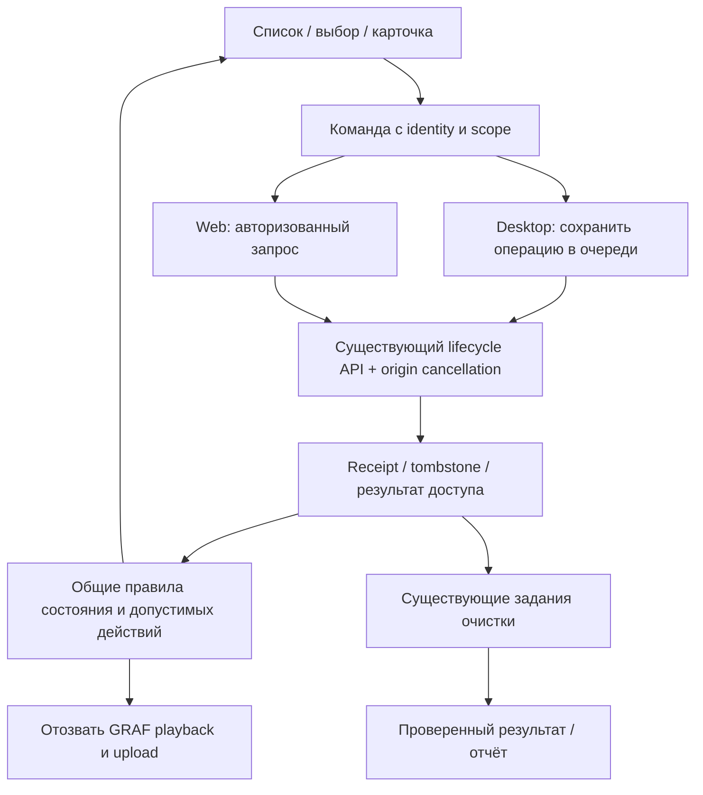

# Implementation Plan: Согласованная запись и удаление

**Branch**: `codex/262-recording-deletion-lifecycle` | **Date**: 2026-09-09 | **Spec**: [spec.md](spec.md)

## Summary

Рекомендуется полный рефакторинг границы жизненного цикла записи: одна пользовательская идентичность, одна нативная очередь долговечных команд, единые правила видимости/доступа и существующий серверный механизм удаления. Не переписывать запись аудио, транскрибацию, объектное хранилище и кабинет целиком.

Локальная копия никогда не восстанавливает серверную встречу по отсутствию строки в DOM. Подтверждённое удаление блокирует все операции сразу после получения; физическая очистка имеет отдельный результат. Проект включает две реальные серверные недостачи: отмену по исходному identity до завершения create и позднее подтверждение очистки вернувшегося устройства.

Текущий результат — проектные документы. Реализация, новые API, миграция и выпуск не выполнены.

## Technical Context

**Language/Version**: Существующие версии Swift/SwiftPM, JavaScript и Python из репозитория; версии среды не обновляются.
**Primary Dependencies**: SwiftUI/AppKit/WebKit/AVFoundation, FastAPI, SQLAlchemy, PostgreSQL, текущий HTMX и существующий scheduler. Новые внешние зависимости не нужны.
**Storage**: Расширение защищённого локального queue document; существующие Meeting/DeletionRequest/PurgeJournal/LocalPurgeTask; одна целевая таблица metadata-only origin cancellation.
**Testing**: Существующие XCTest, pytest/PostgreSQL и browser tests; реальная приёмка только в GRAF Dev.
**Risk / Validation Lane**: high-risk-feature — удаление, локальные файлы, доступ, очередь, пользовательский путь и серверный контракт. Сейчас только проектирование этого изменения.
**Release Gate**: no deploy на этапе проектирования; следующий выпуск — серверная совместимость/миграция, новый клиент, exact-SHA gates.
**Target Platform**: macOS GRAF Dev/public client и web cabinet, Linux server.
**Project Type**: native desktop со встроенным server-rendered cabinet.
**Performance Goals**: SC-002/003/006; пакеты по 100 origins, один цикл на scope, не более двух сетевых запросов одновременно. Сетевые/файловые операции не выполняются на UI thread или под долгой блокировкой очереди.
**Constraints**: capture/Stop сохранены; неизвестный результат не равен удалению; никакого purge по 403/404/DOM; приватные пути не передаются WebView; существующая политика retained observability неизменна.
**Scale/Scope**: до 100 записей на одну явную массовую команду; активные видимые/проигрываемые origins имеют приоритет проверки. Остальная история обрабатывается страницами без регулярного полного сканирования файлов.

## Constitution Check

До исследования и после проектирования проверены:

- Capture-first и ручной Stop: не меняются; active/saving исключены из delete с объяснением.
- Доступ/приватность: identity привязан к server/workspace/creator, capabilities не заменяют серверную авторизацию, native bridge не принимает файловые пути.
- Deletion truth: accepted отдельно от purge, report различает сервер, устройства, backup и внешние ограничения. Generation Call, Langfuse и Temporal не удаляются этой фичей.
- Отсутствие восстановления по устаревшему состоянию: durable intent/tombstone, barrier при callback, origin cancel и existing deletion_epoch.
- Дизайн: существующие стили/компоненты и accessibility; никаких новых сторонних ассетов. Один понятный пользовательский объект, без переписывания server renderer в SPA.
- Процесс: specify + clarify + plan подготовлены; reviewer-owned checklist и последующие implement/release gates не заявляются пройденными.

Нарушений конституции в выбранном проекте не выявлено. Это авторская проверка документов, не независимая приёмка реализации.

## Архитектура

Общие правила означают один явный контракт и один native policy над существующей custody projection. Swift и JS не получают собственные конкурирующие машины удаления: JS использует выданные capabilities/identity/generation, сервер остаётся авторитетом прав и принятия. Проверять native/web согласованность одинаковыми таблицами сценариев, не вводя универсальный rule engine.

## Этапы рефакторинга

### 1. Зафиксировать инварианты и отрицательные проверки

В существующих тестовых наборах воспроизвести S02/S03, отсутствие запрета в localPlaybackURL, потерянный create/delete ответ, expired ACK и повреждение очереди. Проверка должна падать по наблюдаемому результату, а не по отсутствующему тексту функции. Прочитать все callers перед изменением общих helpers. Вынести изменение требований F053/F231 явно: исторические specs не переписывать, новую фичу указать как заменяющий контракт.

### 2. Сохраняемая identity и deletion operation

Расширить DesktopUploadQueueDocument операциями, в том числе для server-only записей без локального пакета. Хранить там единственный intent/receipt, а в item — подтверждённый owner scope, origin/meeting alias и необходимый generation/creation-attempt факт. Никаких фиктивных queue items с аудиополями для server-only удаления.

Execution scope исполнителя и identity создателя разделены: manager-delete по meeting_id не требует совпадения actor и creator. Два типа receipt (meeting_deletion/origin_cancellation) имеют разные результаты очистки: существующий серверный report/tasks в первом случае, серверный запрет создания + локальный результат текущего Mac во втором.

Один native метод принимает подтверждённый набор, сохраняет intent атомарно, блокирует действия и возвращает projection. Отдельный метод разрешает сетевой результат, не теряя deletion state при upload progress. Все open/send/retry/delete paths, включая fallback native views, используют общий lifecycle policy. Scope меняется — отложенные операции приостанавливаются, UI/плеер очищаются, поздний ответ прежнего scope отбрасывается.

### 3. Серверные инварианты и завершение очистки

Добавить owner-only origin cancellation, уникальный metadata-only marker и общий create/cancel transaction guard. Сохранить Meeting deletion_epoch, purge journal и existing deletion service. Проверить все create callers, unique constraints, RLS и оба порядка конкурентных операций. Сделать meeting-delete повторяемым через lifecycle authorization/receipt, не через обычный content resolver.

Расширить sync-state bounded batch adapter без отдельного сервиса состояния. Разрешить поздний verified ACK, добавить идемпотентное ensure-task для нового approved device. Не понижать acknowledged, не приравнивать expiry к доказанному удалению.

Свои origins согласовываются через origin lookup; server-only/чужие доступные встречи — по meeting_id через existing access/lifecycle resolver в том же цикле. Недоступность останавливает контент, но не запускает физическую очистку без подтверждённого удаления.

### 4. Планировщик и локальные файлы

Использовать существующий scheduler/coalescing, но deletion/purge запускать независимо от длинного upload. Сначала применить durable intent и серверное terminal state, затем upload reconciliation и подходящие upload jobs. Callback старой generation может дополнить известный identity, но не разрешить действия.

Отделить filesystem effect от сетевого ACK: закрыть собственные playback handles, проверить разрешение и безопасные реальные пути, удалить управляемые артефакты, перепроверить отсутствие/необратимость и затем подтвердить. Продолжать по остальным пакетам при единичном сбое, сохраняя результат каждого. Ошибки получения tasks, failed/expired tasks и ACK назначают retry; текущая логика «повтор только при thrown error» недостаточна.

### 5. Единый список, действия и управляемый preview

Заменить append-only merge по отсутствию server DOM на projection с identity aliases. Сначала выбрать одну запись, затем применить допустимые фильтры/порядок/подсчёт и selection. Не скрывать ошибки доступа локальной playable строкой. Для JS и no-JS preserve серверный fallback; для несовместимого старого desktop bridge не включать незаметно опасный merge.

Добавить одинаковые checkbox semantics для допустимых local/server rows, замороженную bulk selection и per-record results. Контекстное меню и экран удаления используют тот же исполнитель. Минимальный native local preview через AVFoundation заменяет NSWorkspace.open; это отдельная обязательная часть контроля удаления, не перенос серверного редактора/таймлайна в Swift.

Краткое сообщение исчезает само. Ссылка «Удаления» в существующем меню списка открывает компактный перечень доступных этому пользователю deletion reports и текущих native pending операций. Это индекс существующих отчётов, а не общий центр задач или корзина. Ошибки и pending доступны после перезапуска; подтверждённая запись не возвращается ради ссылки на отчёт. Индекс не раскрывает контент удалённых встреч.

### 6. Миграция, приёмка и выпуск

Выпустить additive серверный контракт/миграцию, затем новый клиент с capability negotiation. Сначала заблокировать показ неизвестных legacy origins, согласовать scope/identity/server truth, затем показать разрешённое и очистить доказанно удалённое. Для новых standalone local-only записей owner scope — известный локальный профиль пользователя Mac; серверная привязка выполняется явно при выборе workspace до первой отправки.

На старых клиентах новый server продолжает блокировать поздние create/upload/finalize; старый внешний player и старый local merge не объявляются исправленными до установки новой версии. Клиент без server capability сохраняет pending и показывает необходимость обновления сервера для небезопасно разрешимых случаев. Нельзя имитировать успешный origin cancel через 404.

Rollback: только на версию, понимающую новое сохранённое состояние. Если старый бинарник этого не умеет, сохранить совместимый безопасный клиент и откатить незатронутые компоненты; не отдавать v3 store старому приложению и не восстанавливать старый queue поверх новых tombstones. Установка пользователем неподдерживаемой старой версии вне GRAF не позволяет обещать локальную защиту.

## Validation Plan

- Обязательная матрица [scenarios.md](scenarios.md): 51 сценарий; команды и приёмка в [quickstart.md](quickstart.md).
- Особый приоритет: конкурентный cancel/create, late finalize, durable-before-effect, remote delete при смене scope, expiry→verified ACK, corrupted queue и отсутствие повторной публикации.
- Проверить не только скрытие строки, но реальные запреты на open/send/export/processing и отсутствие новых серверных объектов.
- Reviewer-owned requirements/security/UX checklist, tasks и analyze обязательны перед implement. Текущий requirements checklist не отмечен выполненным автором.
- GitHub `governance-fast` на точном PR SHA; frozen release candidate — один полный `release-full`. Для установленного Mac отдельный dev-harness + signed/notarized distribution и фактическая версия; публикация не равна установке.
- Никакие существующие production данные не удаляются в приёмке по предположению, что они «тестовые».

## Project Structure

### Documentation (this feature)

`spec.md`, `plan.md`, `research.md`, `data-model.md`, `scenarios.md`, `contracts/lifecycle.md`, `quickstart.md`, `checklists/requirements.md`.

### Source Code (repository root)

| Участок | Владение изменением |
|---|---|
| `apps/macos/Shared/Sources/Models/AudioModelCore.swift` | versioned identity/operation persistence |
| `apps/macos/RecApp/Sources/Upload/DesktopUploadQueueService.swift` | одна очередь команд, generation, safe purge, общая проверка действий |
| `apps/macos/RecApp/Sources/Upload/DesktopUploadCustodyProjection.swift` | переиспользовать и уточнить lifecycle projection |
| `apps/macos/RecApp/Sources/Upload/DesktopUploadClient.swift` | typed delete/receipt/state/ACK adapters |
| `apps/macos/RecApp/Sources/Cabinet/EmbeddedCabinetWebView.swift` и native fallback | bridge contract, projection/capabilities |
| `apps/macos/RecApp/App/TwoBrainRecApp.swift` | делегировать команды и trigger sync; убрать внешний local player |
| Небольшой новый native preview в существующем Cabinet subtree | AVFoundation playback session, минимальные controls, отзыв |
| `apps/server/src/twobrain_rec_server/cabinet/` | список, checkbox/bulk/feedback/report index и HTML fallback |
| `apps/server/src/twobrain_rec_server/ingest/meetings.py` | origin cancellation guard для всех create callers |
| `apps/server/src/twobrain_rec_server/ingest/desktop_sync.py` | reuse selector для bounded state lookup |
| `apps/server/src/twobrain_rec_server/deletion/` и API adapters | origin cancel, повтор receipt, late verified ACK, ensure-task |
| `apps/server/src/twobrain_rec_server/db/` | одна миграция marker и необходимые unique/RLS constraints |
| `apps/macos/Shared/Tests`, `apps/server/tests` | существующие тематические проверки и real runtime acceptance |

**Structure Decision**: Несколько небольших обязанностей на существующих границах. Выделять функции из больших cabinet.js/queue service только по этой области; не проводить посторонний косметический рефакторинг тысяч строк.

## Complexity Tracking

Нарушений конституции не выявлено. Обоснованные добавления: одна metadata-only таблица для реального cancel-before-create; сохраняемые native операции для offline/crash; bounded batch lookup для remote deletion; минимальный управляемый preview. Не добавляются новая брокерная инфраструктура, универсальная машина состояний, собственная БД на клиенте, новый UI framework, корзина или отдельная система хранения отчётов.
