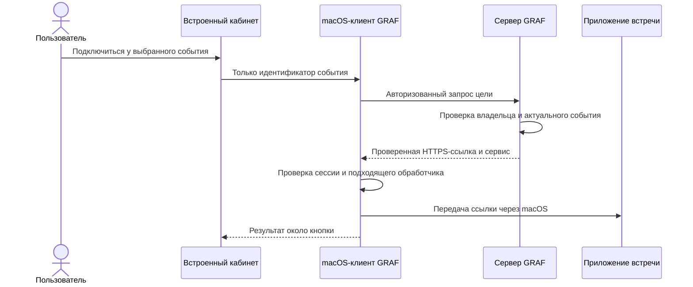

# F279 — проект поведения и технический разбор

Статус: **проект поведения**, детализация [plan.md](plan.md). Карточка серии выбрана как рабочее допущение в `spec.md / Clarifications`; пользовательский ответ не подменяется. Реализация требует последующих Spec Kit gates.

## Предлагаемый интерфейс

В обзоре одна строка на серию. Пример ниже синтетический:

```text
↻ Еженедельная встреча                     Подключиться
   Ближайшая: 29 сентября, 10:00–10:30
   Повторяющаяся · Все даты и записи →
```

При раскрытии — название, подтверждённое правило (если доступно), ближайший повтор и список дат. Будущие — по возрастанию; прошлые — последние сверху. Отдельные состояния: «Перенесена», «Отменена», «Нет доступной записи», «Данные могут быть устаревшими». Для завершённой серии — «Нет будущих встреч в доступном периоде», без выдуманного продолжения.

Каждая дата имеет собственное действие подключения и 0..N ссылок на записи. Кнопка на карточке серии относится к явно показанной дате; пользователь не должен гадать, на какой повтор он подключается. Несколько текущих событий одной серии показываются как выбор, а не молча сворачиваются до одного.

Дневное расписание остаётся расписанием дат, с пометкой серии и переходом в её историю. Это сознательное разделение: обзор отвечает «какие встречи», день — «когда». В таблице записей разные разговоры сохраняются отдельно, но получают переход к серии при достоверной связи.

Не показывать «12 встреч в серии», если загружено только 12 событий ограниченного окна. Допустимо «12 дат в загруженном периоде» и явное «Показать ещё». Рядом с границей истории — доступный период синхронизации, а не обещание всей истории провайдера.

## Подключение: поток обработки



1. Добавить отдельный JSON resolver цели подключения в `api/calendar.py`. Переиспользовать поиск доступного события и расшифровку из `/open`, усилить явную проверку отменённого состояния. Браузерный `/open` оставить совместимым и использовать тот же resolver.
2. Ответ содержит UUID события, семейство сервиса и HTTPS-ссылку; `Cache-Control: no-store`. Ссылка с паролем сохраняется для запуска без урезания query, но не попадает в HTML-атрибуты, журналы или отчёты.
3. В `rendering.py` отметить действие атрибутом с UUID. Делегированный обработчик переживает обновление HTML календарного блока. Встроенный клиент получает UUID через выделенный мост сообщений; обычный браузер сохраняет свой способ перехода.
4. Мост проверяет основную доверенную страницу, разрешённый маршрут, актуальность WebView/сессии, формат UUID и явное действие. Ни входной URL, ни iframe, ни произвольная схема не принимаются. После асинхронного ответа повторно проверить жизненный цикл и поколение сессии.
5. Использовать существующий авторизованный клиент GRAF, без переноса его заголовков/cookies во внешние запросы. JSON resolver не должен следовать внешнему redirect с авторизацией.
6. Общий native-сервис открытия для кабинета, меню и напоминаний проверяет URL и известные варианты запуска. Для подтверждённого приложения — документированный адрес/механизм запуска; при отсутствии приложения — исходный HTTPS в браузере. Не изобретать схемы по названию сервиса.
7. Открытие одного адреса завершает попытку. Если система приняла вызов, это только факт передачи ссылки, не утверждение об участии в звонке. Не запускать одновременно приложение и браузер.
8. Ошибки сети/404/401/отказа системы возвращаются рядом с действием. Сохраняются текущая страница и фокус. Повтор разрешается новым нажатием после завершения операции.

Точки изменений: `Cabinet/EmbeddedCabinetWebView.swift`, новый узкий мост `Cabinet/EmbeddedCabinetCalendarJoinBridge.swift`, общий opener в `Sources/Calendar/`, `Upload/DesktopUploadClient.swift`, `Calendar/CalendarTray.swift`, `Calendar/DesktopCalendarPromptActions.swift`; на сервере `api/calendar.py`, `api/schemas.py`, `cabinet/rendering.py`, собственный JS календарного действия.

## Серии: данные и чтение

Предпочтительно сначала проекция над имеющимися `CalendarEventSnapshot`, без новой независимо синхронизируемой копии календаря.

- Расширить типизированные ответы/представления: признак серии, непрозрачный ключ, доступная подпись правила, границы доступного периода. Старые клиенты должны игнорировать новые поля и продолжать получать экземпляры.
- Собирать карточки до ограничения числа видимых карточек. Страница из четырёх карточек не должна сначала обрезать до четырёх повторов одной серии.
- Пагинация карточек и пагинация дат серии различаются. Стабильный порядок: время представительного события + устойчивый ключ. Сервисная загрузка ограничена; бесконечные RRULE не разворачиваются без горизонта.
- Фильтры владельца, рабочего пространства, источника, выбранности календаря и приватности применяются до группировки и подсчёта. Доступ к группе не заменяет доступ к записи.
- Запрос истории возвращает только доступные повторения/записи. Счётчики не учитывают скрытые данные. Чужой ключ серии даёт безопасную недоступность, а не сведения о существовании.
- Первую версию ограничить уже доступным синхронизированным диапазоном и сохранёнными календарными контекстами записей. Не обещать неограниченную историю календаря и не расширять срок хранения молча.
- У старых записей возможна только прежняя связь по хешу без внешнего календаря. Надёжно дополнить её можно лишь из имеющихся данных. Неоднозначные записи остаются самостоятельными; выбор миграции закрепить в окончательном data-model.
- Индексы/миграция нужны только после проверки формы запроса и объяснения плана PostgreSQL на синтетических данных. Новая таблица серии не является исходным обязательным решением.

## Матрица случаев

| Случай | Ожидаемое поведение |
|---|---|
| Перенос одного повтора | Та же дата-экземпляр по исходной идентичности; новое фактическое время; без дубликата |
| Отмена одного повтора | Не становится целью подключения; остальные остаются |
| Изменение всех последующих у провайдера | Уважать новую provider identity; не склеивать разные серии по названию |
| Иная ссылка только у одной даты | Подключение использует ссылку этой даты |
| Одинаковый UID в разных календарях | Разные серии по составному ключу |
| Дубликат события в двух источниках | Существующая дедупликация события; не распространять совпадение на всю серию |
| DST / all-day / floating time | Сохранить исходную календарную семантику; отображение в выбранной зоне пользователя |
| Правило отсутствует | «Повторяющаяся», без вычисленной по догадке частоты |
| Удаление записи | Исчезает только доступный результат; другие даты не удаляются |
| Отключение календаря | Нет будущих карточек и подключения; сохранённые записи следуют действующей политике |
| Выход во время получения ссылки | Ответ устаревшей сессии не открывает приложение |
| Скрытое название/время | Не восстанавливать их из истории, aria-label или подсказки |

## Предлагаемая проверка

Подготовить синтетические серии: обычная недельная; переименованный и перенесённый повтор; отменённый повтор; два календаря с одинаковыми UID/названиями; DST; all-day; единственный загруженный экземпляр; несколько записей на дату; один закрытый результат; отключение источника во время запроса. Добавить отрицательные варианты URL и подмены сообщения моста.

Проверки серверного доступа и ссылок — рядом с `tests/integration/test_calendar_owner_content.py` и `test_calendar_provider_runtime.py`. Нормализация/исключения — `tests/unit/test_calendar_normalization.py`, `test_google_calendar_provider.py`. Проекции/группировка — существующие проверки `calendar_settings_view_models`, новые истории серий. macOS — тесты политики навигации, узкого моста и opener с внедряемыми обработчиками.

Сквозная приёмка — только `/Applications/GRAF Dev.app` после чтения `docs/agent-guidance/local-development.md` и обновления штатным dev-harness. Проверить целевое приложение, сохранение кабинета, текущую запись и отсутствие непредусмотренного старта. Каждый провайдер получает отдельный результат direct-app/browser-fallback/unverified; браузерная проверка не подменяет native-доказательство.

До кода: reviewer-owned UX/security checklist, tasks, analyze, issue sync и независимое ревью. До PR: focused tests и required exact-SHA `governance-fast`, `macos-pr`, `pr-metadata`; релиз требует своих отдельных разрешений и доказательств.
