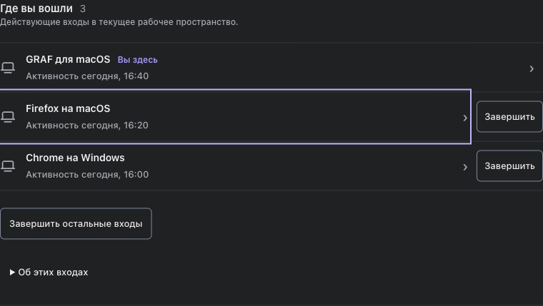
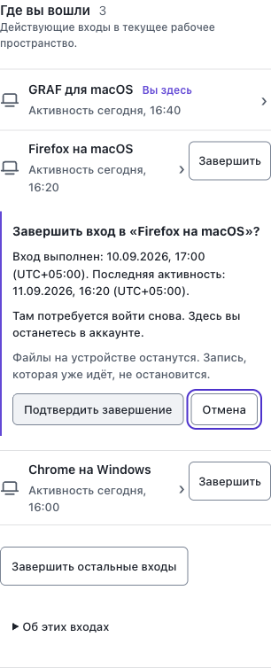

# Синтетические снимки F6794

Снимки созданы локально через реальный `render_settings_page`, CSS и JS ветки F6794. Все названия клиентов, даты и входы тестовые; реальные данные аккаунта и credentials отсутствуют. Общие значки взяты из существующего компонента GRAF. Сторонние изображения не копировались.

Широкий экран, тёмная тема:

Встроенный кабинет при ширине окна 390 px: подтверждение под выбранным входом и фокус на безопасной отмене.

Это evidence отображения браузерной разметки, а не снимок установленного GRAF Dev или рабочего аккаунта.
